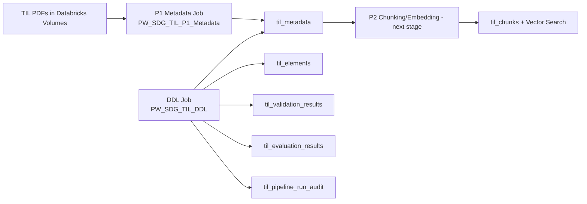

## TIL Extraction Pipeline (5-Min Demo)

### 1) Architecture and Flow



Flow summary:
- DDL job provisions all required Delta tables (idempotent, safe re-run).
- P1 metadata job discovers PDFs from configured volume paths, parses with Databricks parser, extracts/normalizes profile with LLM, and upserts to `til_metadata`.
- Rows are merged by `unique_key` (content-based idempotency), so reruns update consistently without duplicating.

### 2) Pieces Implemented (DDL + Metadata)

Implemented now:
- Job: `PW_SDG_TIL_DDL`
	- Notebook: `ddls/tils/nb_til_pipeline_ddl.py`
	- Creates 6 core tables for pipeline lifecycle.
- Job: `PW_SDG_TIL_P1_Metadata`
	- Notebook: `silver/src/etl/nb_sdg_til_metadata.py`
	- Discovers PDFs, extracts profile, writes status + profile JSON + audit fields.

Operational fix completed in workflow config:
- Updated metadata job parameter names to match notebook/config runtime keys:
	- `TIL_BATCH_SIZE` -> `TIL_P1_BATCH_SIZE`
	- `TIL_RETRY_MAX` -> `TIL_P1_MAX_RETRIES`
- This removes parameter drift and ensures run-time controls are actually picked up.

Quick demo run (dev):
- Run `PW_SDG_TIL_DDL` once.
- Run `PW_SDG_TIL_P1_Metadata` with:
	- `TIL_P1_MAX_PDFS=2` (or small number)
	- optional `TIL_P1_TARGET_PDF_NAMES=<name1.pdf,name2.pdf>`
- Show latest 10 rows from `til_metadata` ordered by `metadata_processed_ts`.

### 3) Key Fields and Tables

Core tables:
- `til_metadata`: document-level registry for P1 output and statuses.
- `til_elements`: optional granular extraction elements for traceability.
- `til_chunks`: retrieval chunks + embeddings (P2).
- `til_validation_results`: rule-level quality checks.
- `til_evaluation_results`: method-comparison metrics.
- `til_pipeline_run_audit`: run-level operational tracking.

`til_elements` in plain words:
- Purpose: stores fine-grained extracted pieces from a PDF (for example table blocks, section text, image/OCR snippets) so we can explain how a profile or chunk was derived.
- Why it exists: `til_metadata` gives document-level output, but not full extraction lineage. `til_elements` is the evidence layer for debugging, audits, and quality checks.
- When to use it:
- If a field in `parsed_profile_json` looks wrong and we need source traceability.
- If we want parser-quality analysis (for example, missing page extraction, weak OCR sections).
- If we need to inspect what content was available before chunking.
- Typical columns to show in demo:
- `document_id`, `element_id`, `element_type`
- `element_text`, `page_number`, `section_path`
- `source_method`, `parser_version`, `processed_ts`
- Population note: it is optional in current flow; DDL is ready and it can be filled by extraction steps when granular element capture is enabled.

Quick demo SQL for `til_elements`:

```sql
SELECT document_id,
	   element_id,
	   element_type,
	   page_number,
	   left(element_text, 200) AS element_preview,
	   source_method,
	   parser_version,
	   processed_ts
FROM vaid.ai_sot_field_service_report.til_elements
ORDER BY processed_ts DESC
LIMIT 20;
```

Most important fields for demo:
- Identity and idempotency:
	- `document_id`, `unique_key`, `source_path`, `source_hash`
- Matching and extraction:
	- `requested_til_number`, `matched_til_number`, `match_type`
	- `parsed_profile_json`, `raw_profile_json`, `profile_found`
- Quality and operations:
	- `extraction_confidence`, `metadata_status`, `error_message`
	- `run_id`, `metadata_processed_ts`

Useful status values in `metadata_status`:
- `completed`, `pdf_not_found`, `llm_parse_failed`, `failed`

### 5-Min Talk Track

1. 60 sec: explain architecture (DDL sets foundation, P1 writes metadata).
2. 90 sec: show implemented jobs + how to run a small batch safely.
3. 90 sec: open `til_metadata` and walk key fields + status outcomes.
4. 60 sec: close with next step (P2 chunking + retrieval index sync).
