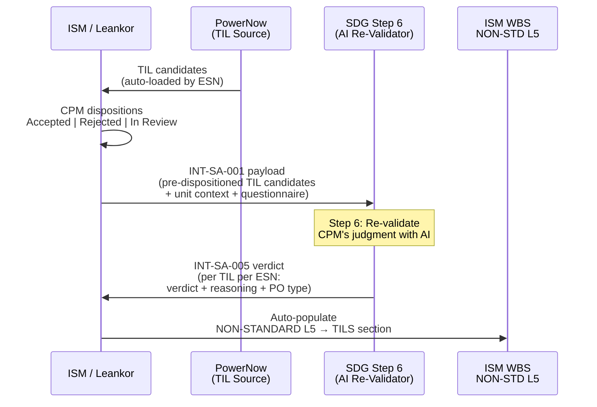
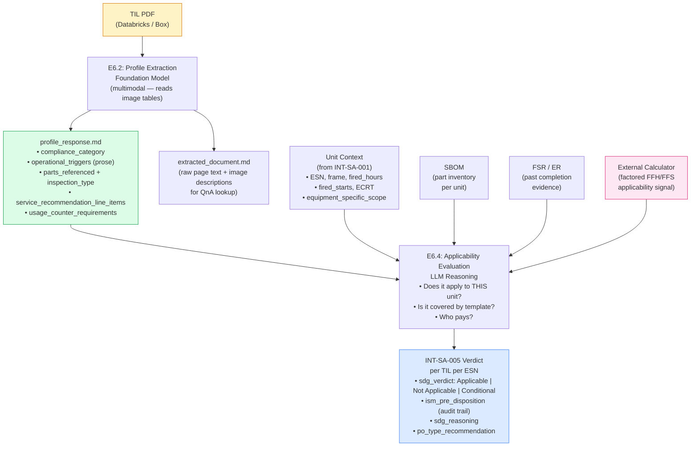
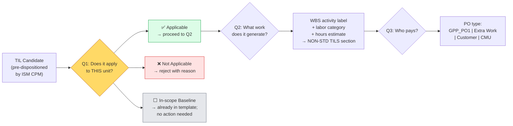
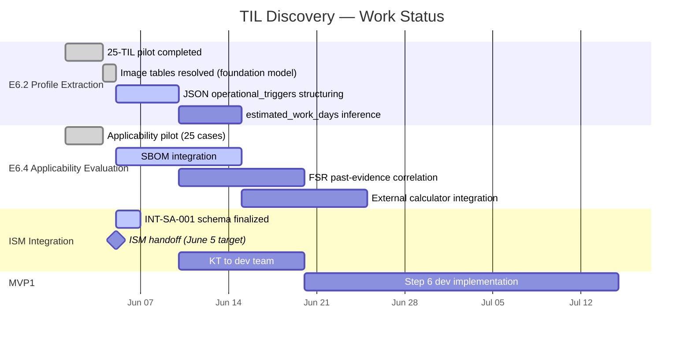

# TIL Discovery — Architecture Overview
**As of:** June 5, 2026 | **Audience:** DS, Dev, ISM Integration Teams

---

## 1. Where TIL Fits in the 9-Step Scoping Agent

```mermaid
flowchart LR
    subgraph ISM["ISM / Leankor (Steps 1–5)"]
        S1[Step 1\nUnit & Labor Config]
        S2[Step 2\nSafety]
        S3[Step 3\nQuestionnaire\nDiv of Responsibilities]
        S4[Step 4\nShift Schedule]
        S5[Step 5\nTemplate Selection\nWBS Locked]
    end

    subgraph SDG["SDG Scoping Agent (Steps 6–9)"]
        S6[Step 6\n🔑 TIL Applicability\nAI Re-Validation]
        S7[Step 7\nOSA Recommendations\nAI Re-Validation]
        S8[Step 8\nAuxiliaries\nContract Classification]
        S9[Step 9\nGap Analysis\nScope Aggregation]
    end

    subgraph OUT["ISM Output"]
        WBS[WBS NON-STANDARD L5\nTILS / OSA / AUX / CUSTOM]
    end

    S1 --> S2 --> S3 --> S4 --> S5
    S5 -->|INT-SA-001\nPayload| S6
    S6 --> S7 --> S8 --> S9
    S9 -->|INT-SA-005\nVerdicts| WBS

    style S6 fill:#ffd966,stroke:#b45309,color:#000
    style ISM fill:#dbeafe,stroke:#3b82f6
    style SDG fill:#dcfce7,stroke:#16a34a
```

**TIL is Step 6 — the first and most complex AI step.** It sets the tone for the entire SDG output. If TIL applicability is wrong, everything downstream (scope, cost, schedule) is wrong.

---

## 2. Why TIL Matters — Significance in Scoping

| Dimension | Why It Matters |
|---|---|
| **Volume** | 31 TILs per event (29 GT + 2 Gen); multiplied across hundreds of outages/year |
| **Time saved** | CPMs spend 5–10 hours/outage manually reviewing TIL PDFs today |
| **Risk** | Missing a Safety/Compliance TIL = regulatory or equipment damage exposure |
| **Schedule impact** | High-impact TILs (1937/1945) add 3+ days to outage critical path |
| **Commercial** | Wrong TIL disposition = wrong PO type = cost overrun or under-recovery |
| **JIS validation** | 4,011 of 7,007 real outage workscopes contain TIL references (57%) |

---

## 3. ISM ↔ SDG Integration: TIL Data Flow

**SDG's role is re-validation, not first decision.** ISM CPM pre-dispositions TILs first; SDG provides AI verification and reasoning as a safety check.

---

## 4. TIL Discovery Pipeline

---

## 5. The Three Questions Step 6 Must Answer

| Question | Experiment | Status (June 5) |
|---|---|---|
| **Q1: Does it apply?** | E6.2 + E6.4 | ✅ Pipeline working; JSON structuring of thresholds pending |
| **Q2: What work?** | E6.2 (prose extracted) | ⚠️ Prose extracted; WBS activity code mapping not yet done |
| **Q3: Who pays?** | None | ❌ Future work; deterministic rule post-MVP1 |

---

## 6. What Must Come OUT of TIL Profile Extraction

For Step 6 to work end-to-end, each TIL profile must produce these structured fields:

### 6.1 Applicability Signals (Q1 inputs)

| Field | Purpose | Current Status |
|---|---|---|
| `compliance_category` | Safety / Compliance / Alert / Maintenance — drives urgency and "nothing burger" filter | ✅ Extracted (Code S/C/A/M + text) |
| `operational_triggers` | FFH/FFS/ECRT thresholds → input to external calculator | ⚠️ In prose; **needs JSON structuring** |
| `part_numbers[].inspection_type_tag` | ECI / BI / FPI — validates unit capability via SBOM | ✅ Extracted per part per configuration |
| `usage_counter_requirements` | Flags which counters needed (operating_hours, starts, ECRT) | ✅ New field in June 4 extraction |
| `sbom_dependency_flag` | True/False — whether part lookup is required | ✅ Extracted |
| `baseline_equivalency` | Is this already in the standard template? ("nothing burger") | ❌ Not yet extracted — requires WBS cross-check |

### 6.2 Work Scope Signals (Q2 inputs)

| Field | Purpose | Current Status |
|---|---|---|
| `service_recommendation_line_items` | What to do (prose) | ✅ Extracted |
| `scope_of_work` | Resources / tooling required | ✅ Extracted |
| `estimated_work_days` | Schedule impact signal | ❌ Not extracted — needs inference from scope text |
| `wbs_activity_label` | ISM-compatible WBS activity name (e.g., "GT Wheel Dovetail EC Inspection") | ❌ Not in profile — use JIS workscope templates for known TILs |

### 6.3 Commercial Signals (Q3 inputs — future)

| Field | Purpose | Current Status |
|---|---|---|
| `compliance_category` | Safety/Compliance → GE obligation; Maintenance → customer-elected | ✅ Extracted |
| `contract_tier` | From INT-SA-001 unit context (CSA / T&M) | ✅ Arrives from ISM |

---

## 7. Current State (June 5, 2026)

---

## 8. Key Decisions & Constraints

| Decision | What It Means |
|---|---|
| **TIL profiles = static knowledge packs** | Not real-time PDF parsing in Step 6; pre-extracted profiles are ingested at run time |
| **Foundation model reads image tables** | No OCR pipeline needed; multimodal vision resolves the image-table extraction concern |
| **External calculator handles equations** | SDG Step 6 receives pre-computed applicability signal; does NOT solve FFH/FFS/ECRT equations |
| **ISM CPM pre-dispositions first** | SDG re-validates, not decides; ISM disposition stored in INT-SA-001 for audit trail |
| **JIS workscope labels = WBS templates** | For the top 8 JIS-validated TILs, use JIS workscope descriptions as the activity label (e.g., `"GT Wheel Dovetail EC Inspection"`) |
| **93% of JIS volume = 7 TILs** | Build the compressor bundle (1509/1638/1603/1907) + wheel pair (1937/1945) + 1724 first |
