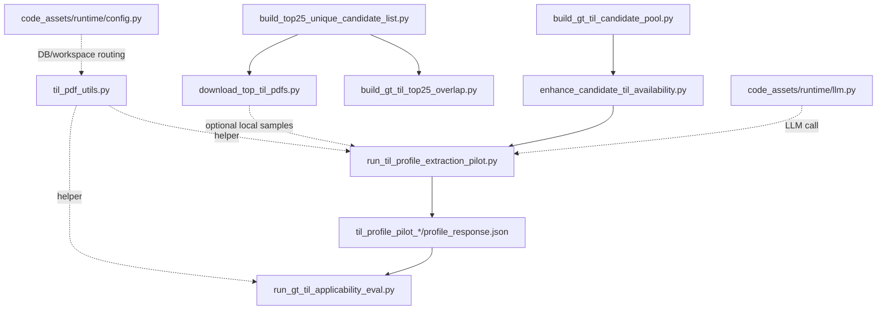

# TIL Profile Extraction Pipeline - Tool Specs

## Scope
This document describes the Step 6 experiment pipeline around TIL profile extraction, with focus on code paths currently used in practice.

Main entry:
- `code_assets/experiments/step6/run_til_profile_extraction_pilot.py`

Primary downstream consumer:
- `code_assets/experiments/step6/run_gt_til_applicability_eval.py`

## Pipeline Map (Active)

## Active Scripts and Contracts

### 1) `run_til_profile_extraction_pilot.py` (main extraction tool)
Purpose:
- Extract structured TIL profile JSON from TIL PDF content.
- Produce extraction artifacts usable by Step 6 applicability evaluation.

CLI contract:
- `--tils <list>`: requested TIL identifiers (ex: `1939-R1 1951`)
- `--method`: `foundation | pdfplumber | auto` (default `auto`)
- `--model`: optional override for profile extraction LLM model
- `--output-dir`: root output folder (default `docs/experiments/step6/til_profile_pilot`)
- `--system-prompt`: prompt template path
- `--max-text-chars`: max extracted text passed to LLM

Inputs:
- Requested TIL list.
- PDF sources from:
  - Databricks volume listing via `til_pdf_utils._list_til_pdfs`.
  - Local workspace sample PDFs under `LOCAL_TIL_SAMPLE_DIR`.
  - SQL fallback payloads from `TIL_PDF_FALLBACK_TABLE` (`u_til_pdf`) when volume copy fails.
- LLM prompt template from prompt file.

Outputs (per run folder `til_profile_pilot_YYYYMMDD_HHMMSS`):
- Per TIL folder:
  - `pdf_match.json` and `pdf_match.md`
  - `extracted_document.json` and `extracted_document.md`
  - `<method>_raw_extraction.json`
  - `profile_response.json` and `profile_response.md`
  - `error.json` if failed
- Run level:
  - `summary.csv`

Important methods:
- `build_pdf_catalog`: merges Databricks volume catalog + local sample PDF catalog.
- `pick_pdf_row`: exact TIL first, else base TIL latest revision.
- `download_pdf_bytes`: source-aware PDF retrieval; includes CLI -> Databricks Connect -> SQL fallback path.
- `extract_document`: foundation first in `auto`, fallback to pdfplumber on failure.
- `run_profile_extraction`: calls runtime LLM and parses JSON.
- `normalize_profile_schema`: ensures expected profile schema keys exist.

Tool/service calls:
- Foundation PDF extraction HTTP endpoint (`TIL_FOUNDATION_URL`).
- LiteLLM gateway via `code_assets/runtime/llm.py`.
- Databricks SQL via shared `query_rows` imported from applicability script.
- Databricks FS/Connect via `til_pdf_utils`.

---

### 2) `enhance_candidate_til_availability.py` (availability signal pre-check)
Purpose:
- Annotate candidate rows with live availability status in Databricks volume and SQL fallback.
- Provide a reliable pre-filter so profile extraction target set is correct.

CLI contract:
- `--candidate-csv` (required)
- `--applicability-csv` (optional supplement only)
- `--output-csv` (optional)

Inputs:
- Candidate pool CSV from `build_gt_til_candidate_pool.py`.
- Live Databricks volume scan and fallback SQL scan.
- Optional historical applicability CSV used only as a supplemental hint.

Outputs:
- `<candidate>_til_availability.csv`
- `<candidate>_til_availability.json`
- `<candidate>_til_availability_distinct_tils.csv`
- `<candidate>_til_availability_distinct_tils.json`

Important methods:
- `fetch_volume_catalog`
- `fetch_fallback_pdf_catalog`
- `annotate_candidates`

Current behavior note:
- This script now recomputes live availability even when `--applicability-csv` is passed.

---

### 3) `build_gt_til_candidate_pool.py` (upstream candidate generation)
Purpose:
- Generate Step 6 candidate rows from ground-truth event/ESN workbook and Databricks tables.

CLI contract:
- `--input-workbook`
- `--output-dir`
- `--output-stem`
- `--limit` (pilot mode)
- `--fsr-status-csv` (optional filter assist)

Inputs:
- Ground-truth workbook (`gt_esn_event_id.xlsx` default).
- Event, equipment, OSA, and TIL tables via Databricks SQL.

Outputs:
- Timestamped workbook and CSVs in `docs/experiments/step6/gt_candidate_pool`.
- Metadata JSON.

Why it matters to extraction:
- Defines the candidate TIL list that is checked for document/profile coverage.

---

### 4) `run_gt_til_applicability_eval.py` (downstream consumer)
Purpose:
- Execute Step 6 applicability evaluation using profile and/or document context.

CLI contract (relevant flags):
- `--candidate-csv`
- `--prompt-pack`
- `--til-context-mode` (`full_document | profile_only | profile_plus_document`)
- `--til-profile-dir` (points to pilot run root)
- `--til-document-method`

Inputs:
- Candidate CSV.
- Profile artifacts discovered by `build_til_profile_lookup` from `til_profile_pilot_*` directories.
- Document lookup from volume/sample/fallback.

Outputs:
- Run folder under `docs/experiments/step6/applicability/<stem>_<timestamp>`.
- `summary.csv`, `records.jsonl`, line-item CSVs, payload JSON, markdown companions.

Important methods tied to profile extraction:
- `build_til_profile_lookup`: scans `profile_response.json`, supports exact/base matching.
- `build_selected_til_profile_context`: controls included profile content in final prompt payload.
- `build_til_pdf_lookup` and fallback utilities: used when document text is required.

---

### 5) `til_pdf_utils.py` (shared PDF access and extraction helper)
Purpose:
- Central helper for listing/copying PDFs from Databricks volume and extracting text (pdfplumber/pypdf/OCR).

Used by:
- `run_til_profile_extraction_pilot.py`
- `run_gt_til_applicability_eval.py`
- `download_top_til_pdfs.py`

Important methods:
- `_list_til_pdfs`
- `_copy_volume_pdf_via_databricks_fs_cli`
- `_copy_volume_pdf_via_databricks_connect`
- `_extract_text_from_pdf_path`

---

### 6) `download_top_til_pdfs.py` (optional support utility)
Purpose:
- Download requested TIL PDFs to local sample folder for manual review and fallback testing.

Role:
- Not required for runtime pipeline execution.
- Useful for SME review, manual troubleshooting, and improving sample-local coverage.

---

### 7) Top-25 focused support scripts (experiment planning and validation)
Scripts:
- `build_top25_unique_candidate_list.py`
- `build_gt_til_top25_overlap.py`

Purpose:
- Build SME-aligned top-25 subsets and overlap slices for targeted review.

Role in pipeline:
- Upstream selection/reporting utilities, not required for generic extraction flow.

## Reference / Probe Scripts (Not Mainline)
- `til_filtering_probe.py`: SQL probe utility for filter behavior diagnostics.
- `probe_template_matches.py`: template match probe for a few event IDs.

These are diagnostic helpers and should not be treated as required production pipeline steps.

## Runtime Dependencies and Tool Calls

### Databricks / config layer
Files:
- `code_assets/runtime/config.py`

Relevant capabilities:
- Workspace candidate discovery from `.env` blocks (`get_databricks_workspace_candidates`).
- Scoped SQL connection with retries (`get_db_connection`).
- SSL verify helpers (`get_requests_verify_ssl`, `get_vector_search_verify_ssl`).

### LLM layer
Files:
- `code_assets/runtime/llm.py`

Relevant capabilities:
- `call_llm`: sends JSON-format request to LiteLLM gateway.
- `parse_llm_response`: robust JSON extraction from raw model output.

## End-to-End Contracts (What to Persist)

### Contract A: Profile extraction artifact contract
Required for downstream applicability lookup:
- Per TIL profile file at `.../til_profile_pilot_*/<til>/profile_response.json`
- Must include:
  - `requested_til`
  - `parsed_profile` object (or null if parse failed)
  - `raw_profile`

Optional but useful:
- `extracted_document.json` with extraction method, text length, tables.

### Contract B: Candidate availability contract
Required to drive complete extraction set:
- Candidate availability output from `enhance_candidate_til_availability.py`.
- Use `databricks_document_found` and `best_databricks_document_source` to determine extraction target set.

### Contract C: Applicability ingestion contract
`run_gt_til_applicability_eval.py` expects `--til-profile-dir` to point to either:
- A specific `til_profile_pilot_<timestamp>` directory, or
- A parent directory containing multiple `til_profile_pilot_*` runs.

Lookup behavior:
- Exact TIL match preferred.
- Base TIL latest revision fallback when exact not available.

## Experiment-Only vs Runtime Hardening Gaps

1. Access and permissions
- Volume access can fail due to cluster attach permissions.
- Current extraction retries CLI and Databricks Connect, then fallback SQL payload path.
- Production hardening should include explicit access-health checks before run start.

2. Coverage and scale
- Experiment runs used limited sample sizes (including SME top-25 workflows).
- As coverage scales, more edge cases will appear in naming/revision variants and bad PDFs.

3. Extraction robustness
- Foundation response shape and quality can vary.
- pdfplumber/pypdf/OCR fallback quality differs by document type.
- Need standardized quality metrics and acceptance thresholds for extracted text/profile fields.

4. Data source drift
- Volume, fallback table, and local sample sets can diverge.
- Need periodic reconciliation job and clear source-of-truth rules.

5. Schema and validation
- `normalize_profile_schema` sets defaults but does not fully enforce semantic validity.
- Add strict schema validation + error classification for missing critical fields.

6. Observability
- Current artifacts are good for experiments, but production should add:
  - structured run-level metrics
  - per-stage success/failure counters
  - standardized error taxonomy
  - health dashboards/alerts

## Practical Tips for Development Team
- Start debugging from `run_til_profile_extraction_pilot.py` and follow calls into `til_pdf_utils.py` and `runtime/llm.py`.
- For applicability impact, trace `build_til_profile_lookup` in `run_gt_til_applicability_eval.py`.
- Use availability annotation first to avoid stale extraction scope.
- Keep top-25 SME flow as a fast validation lane, not as the only quality signal.
- When testing profile backfills, verify both:
  - artifact existence (`profile_response.json`), and
  - downstream recognition in applicability `til_profile_found` counts.

## Suggested Development Hardening Backlog
1. Add a preflight command that validates Databricks volume, SQL fallback, and LiteLLM connectivity.
2. Add profile schema validation with severity levels (blocking vs warning fields).
3. Add deterministic run manifest for all requested TILs with stage-level status transitions.
4. Add retry policies with explicit error categories for volume copy, fallback query, extraction parse, and LLM parse.
5. Add golden-set regression tests (top-25 + expanded diverse set) with snapshot comparisons.
6. Add one canonical orchestration entrypoint that chains candidate availability -> extraction -> applicability rerun.

## Minimal Command Sequence (Current Workflow)
1. Build candidate pool
- `python code_assets/experiments/step6/build_gt_til_candidate_pool.py --input-workbook <path>`

2. Annotate availability
- `python code_assets/experiments/step6/enhance_candidate_til_availability.py --candidate-csv <candidate_csv>`

3. Run profile extraction
- `python code_assets/experiments/step6/run_til_profile_extraction_pilot.py --tils <til1> <til2> ... --method auto`

4. Run applicability with profile context
- `python code_assets/experiments/step6/run_gt_til_applicability_eval.py --candidate-csv <candidate_csv> --prompt-pack til_applicability_structured_v2026-06-01a --til-context-mode profile_only --til-profile-dir docs/experiments/step6/til_profile_pilot`
