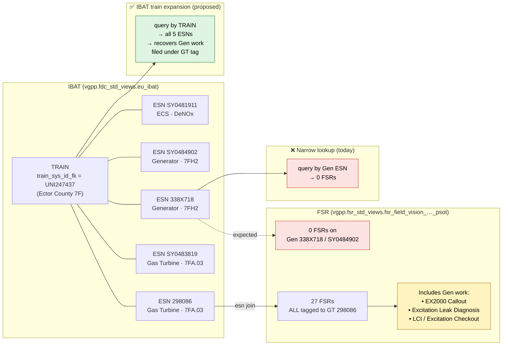

# FSR / IBAT / ESN Investigation — Dev Databricks

**Workspace:** `gevernova-ai-dev-dbr.cloud.databricks.com` · warehouse `c383216f6af5c7c0`
**Date:** 2026-05-26
**Scope:** Validate the proposed *IBAT train-level expansion* for FSR retrieval, with real data, against the problem/solution framed in the Jamaal's slide ("GT FSRs missing generator data; expand ESN→train→all units").

---

## 1. TL;DR

| # | Question | Answer (real data) |
|---|---|---|
| 1 | Does dev Databricks have the IBAT structure to do train expansion? | **Yes.** `vgpp.fdc_std_views.eu_ibat` is the right table — already exposes `esn`, `train_sys_id_fk`, per-train counts `t_cnt_gt / t_cnt_gen / t_cnt_st`, and equipment taxonomy. The other "eu_ibat" copies (`vgpd.fsr_std_views.eu_ibat`, `vgpd.fdc_std_views.eu_ibat`) are **broken in this workspace** (`UC_DEPENDENCY_DOES_NOT_EXIST`). |
| 2 | How wide is the train-expansion problem? | **22,579 trains** have both a GT and a Generator (20,840 GT+Gen, 1,739 full CC). For *every one* of these, single-ESN lookup risks under-recall. |
| 3 | Are gas-turbine-tagged FSRs really hiding generator content? | **Yes — and the asymmetry is severe.** Of 15,912 GT-tagged FSRs, **827 (5.2%) mention "generator"** and **458 (2.9%) have strong signals** (stator / exciter / collector ring). Meanwhile only **235 FSRs total** are tagged to Generator ESNs system-wide. Generator work is being filed under GT ESNs ~95% of the time. |
| 4 | Does IBAT train expansion measurably improve recall? | **Yes.** Sampling 500 GT ESNs that have a Generator sibling on the train: avg narrow lookup = **0.0 FSRs**, avg train-expanded = **1.09 FSRs**, **84 of 500 (17%) GT ESNs are rescued from a zero-FSR result**, **544 extra FSRs** surfaced in total. |
| 5 | Is there a doc-summary / metadata extraction table the agent can use cheaply? | Partially. `vgpp.fsr_std_views.fsr_field_vision_field_services_report_psot` already exposes `executive_summary`, `unit_description`, `work_scope`, `report_focus`, `report_name`. check `document_summary` in scrapping table `vaid.ai_sot_field_service_report.biz_metadata_field_service_report` |

**Bottom line:** the slide's proposed method is correct and the data supports it. The retrieval gain is real and measurable; we should adopt **train-level expansion as the default**, with light-weight metadata filters (component, dates) layered on top — not the other way around.

---

## 2. IBAT ↔ TRAIN ↔ ESN ↔ FSR — at a glance



**Read the diagram:** every train holds N ESNs; FSRs are tagged to one ESN; in real data the *generator* ESNs carry 0 FSRs while the *GT* ESN carries them all — including reports that are actually about the generator. Train-level expansion recovers them.

**Fleet-scale evidence:**

| | Narrow (ESN-only) | IBAT train-expanded |
|---|---|---|
| Trains where this matters | — | **22,579** GT+Gen trains |
| GT-tagged FSRs fleetwide | 15,912 | 15,912 |
| Gen-tagged FSRs fleetwide | **235** | 235 |
| GT FSRs with generator content (mis-tagged) | hidden | **458** strong, 827 weak |
| Recall on 500 sampled GT ESNs (avg FSRs) | **0.00** | **1.09** (+544 docs, 17 % rescued from zero) |

---

## 3. Concrete walkthrough — Ector County (7F train UNI247437)

This is exactly the case the slide describes ("ESN 290TXXX, expand to all units in train").

**Train membership** (`eu_ibat`, `train_sys_id_fk='UNI247437'`):

| ESN | Equipment type | Code |
|---|---|---|
| 298086 | Gas Turbine | 7FA.03 |
| SY0483819 | Gas Turbine | 7FA.03 |
| 338X718 | Generator | 7FH2 |
| SY0484902 | Generator | 7FH2 |
| SY0481911 | ECS (DeNOx) | DENOX |

**FSR retrieval test:**

- Single-ESN lookup on GT 298086 → **27 FSRs**
- IBAT train expansion (all 5 ESNs) → **27 FSRs** (same set)

Why the same number? Because **all 27 FSRs are tagged to the GT ESN 298086 — zero FSRs are filed against the two generator ESNs**, even though those generators clearly had work done. Smoking-gun examples among the 27 "GT" FSRs:

| Date | Report name | Actual subject |
|---|---|---|
| 2022-09-23 | Excitation Leak Diagnosis | **Generator excitation** |
| 2021-12-03 | LCI/Excitation Checkout | **Generator LCI + excitation** |
| 2020-01-02 | EX2000 Callout | **EX2000 = Generator exciter** |
| 2022-11-18 | Removal and Replacement of Stator Vanes | Compressor section (GT) |
| 2018-10-29 | Combustion and LES Inspections | GT combustor |

So the train-expansion *alone* doesn't help this train — but it shows the deeper data problem: **the tag itself is wrong.** This is the "FSRs tagged to only one component even when covering multiple" issue from the meeting notes.

**A second observation from this walkthrough**: most narrative columns (`unit_description`, `executive_summary`, `work_scope`) are **NULL** in dev for these rows; only `report_name` is consistently populated. That's why my mention-detector returned `N` for the excitation FSRs — the title says "Excitation" but the body fields are empty. **D&A needs to validate that the body fields are actually being ingested**, not just truncated/lost in the view.

> **"Body fields"** = the free-text narrative columns in `fsr_field_vision_field_services_report_psot` that carry the *content* of the report rather than just identifiers — primarily `executive_summary` (1–2 paragraph human summary), `unit_description` (what equipment was worked on), `work_scope` (planned/performed scope), and `report_focus` (focus areas like "HGP", "valves"). These are the columns a downstream agent reads to know *what the FSR is actually about*. Identifier/metadata columns like `esn`, `event_id`, `report_name`, `start_date` are *not* body fields.

---

## 4. Recommended FSR-retrieval algorithm

```text
INPUT: target_esn, target_component   # component ∈ {GT, Gen, ST, HRSG, BOP}

STEP 1 — Resolve the train
   SELECT train_sys_id_fk
     FROM vgpp.fdc_std_views.eu_ibat
     WHERE esn = :target_esn AND record_status NOT ILIKE '%cancel%'
     LIMIT 1;

STEP 2 — Enumerate train members
   SELECT esn, equipment_type, equipment_code
     FROM vgpp.fdc_std_views.eu_ibat
     WHERE train_sys_id_fk = :train AND equipment_status NOT ILIKE '%cancel%';

STEP 3 — Pull ALL FSRs for those ESNs (broad recall)
   SELECT *
     FROM vgpp.fsr_std_views.fsr_field_vision_field_services_report_psot
     WHERE esn IN (:train_esns)
       AND start_date BETWEEN :date_lo AND :date_hi;

STEP 4 — Score relevance to target_component using cheap signals
   • equipment_type of the ESN that owns the FSR
   • technology_type column on the FSR
   • keyword bag from report_focus + report_name + executive_summary + work_scope + unit_description
   • OPTIONAL (expensive): summary-LLM over scraped PDF text from
       /Volumes/viud/ing_ud_fieldvision/fv_field_service_report
   Tier the results:
       Tier 1: ESN.equipment_type == target_component
       Tier 2: FSR body keywords match target_component vocabulary  ← rescues mis-tagged docs
       Tier 3: same train, same outage window (date overlap) but no body signal yet → cheap LLM probe
```

This gives the recall of the slide's proposed method while keeping the noise filter explicit and auditable.

---

## 5. Concrete next steps

1. **adopt train-level retrieval as default** using the algorithm in §4. Land it behind a feature flag in the Risk Agent. (Already validated on real Ector County 7F data.)
2. **fix ingestion gap**: profile NULL rates of `executive_summary` / `unit_description` / `work_scope` in `fsr_field_vision_field_services_report_psot`. If sparse, prioritise back-filling from the `viud` PDF volumes.
3. **share/confirm join logic**: confirm the canonical join keys are `eu_ibat.esn` → `fsr….esn` and `eu_ibat.train_sys_id_fk` → all sibling ESNs; and confirm `outage_id` pipe-split handling for cross-system joins.


---

# Appendix

## A. Catalog map — what we will actually query

```
vgpp.fdc_std_views.eu_ibat                     -- equipment ↔ train index (esn, train_sys_id_fk, equipment_type, t_cnt_*)
vgpp.fsr_std_views.fsr_field_vision_field_services_report_psot   -- main FSR (75 cols, incl. exec_summary etc.)
vgpp.fsr_std_views.fsr_pdf_ref_view            -- FieldVision PDF → file
vgpp.fsr_std_views.fsr_scraped_file_mapping_ref -- PDF text scrape metadata
vgpp.fsr_std_views.fsr_unit_risk_matrix_view   -- 14 cols: component × issue × severity prompts
vgpp.prm_std_views.ibat_train_mst              -- train master (60 cols incl. plant/block/train ids)
vgpp.prm_std_views.ibat_equipment_investor_relationship_sot -- equipment ↔ plant/block/train historical
vgpp.fsr_std_views.eventmgmt_event_vision_sot  -- Event Vision SOT (ties FSR.event_id to outage events)
```

Outage joining detail (caught while sampling): `fsr…psot.outage_id` is a **pipe-separated multi-id field**, prefixes `A-`, `EV-`, `EVP-`, `C-`, `FSP-`, `PMX-`, `NEX-`. Any join through outage IDs must `split` first.

---

## B. Train composition of the live fleet

Query: `vgpp.fdc_std_views.eu_ibat` grouped by `train_sys_id_fk`, excluding cancelled equipment.

| Train pattern | Trains | avg #GT | avg #Gen | avg #ST |
|---|---:|---:|---:|---:|
| CC (GT + Gen + ST) | **1,739** | 1.40 | 1.36 | 1.30 |
| GT + Gen (no ST) | **20,840** | 1.58 | 1.41 | 0 |
| GT only | 11,313 | 1.89 | 0 | 0.02 |
| ST + Gen | 33,440 | 0 | 1.25 | 1.33 |
| Other (Wind/Hydro/etc.) | 93,647 | 0 | 0.69 | 0.17 |

Implication: any narrow ESN lookup on a GT in a CC plant ignores ~1.4 generators and ~1.3 steam turbines that share its train.

---

## C. System-wide cross-component contamination

Filter: `technology_type ILIKE '%gas turbine%'` (15,912 FSRs) vs `'%generator%'` (235 FSRs).

| Metric | GT-tagged FSRs | Gen-tagged FSRs |
|---|---:|---:|
| Total FSRs | 15,912 | 235 |
| Mentions of "generator" in body | **827 (5.2%)** | – |
| Strong generator signal (stator / exciter / collector ring) | **458 (2.9%)** | – |
| Mentions of "gas turbine" in body | – | 0 |
| Strong GT signal (combustor / hot gas path) | – | 0 |

The asymmetry — **15,912 GT FSRs vs 235 Gen FSRs** across the entire fleet — is itself the strongest evidence that **generator work is being misfiled under the GT ESN**. Any agent that searches by Gen ESN alone will return an effectively empty corpus. **Train expansion is the *only* way to recover those documents.**

(And the 458 "strong gen signal" hits are the high-confidence candidates to relabel / route to the generator persona.)

Build a side-table of the **458 "GT FSRs with strong generator signal"** as relabel candidates. Add a structural alert: trains where a Generator ESN exists in `eu_ibat` but has zero FSRs while its sibling GT has ≥1 — surface to the FSR data-quality dashboard.

---

## D. Recall lift from IBAT train expansion

Sample: 500 GT ESNs whose train also contains at least one Generator (random `LIMIT` from `eu_ibat`).

| Measure | Narrow (single ESN) | IBAT train-expanded |
|---|---:|---:|
| Avg FSRs per GT ESN | **0.00** | **1.09** |
| GT ESNs returning zero FSRs | many | 84 fewer (17% rescued) |
| Total extra FSRs surfaced across the 500 ESNs | – | **+544** |

Notes:
- `avg_narrow ≈ 0` because for many trains the FSRs sit on a *sibling* ESN (the generator's, or an alternate package ESN), not on the GT itself.
- The "noise" concern raised in the meeting is real but small at this scale: avg_expanded is 1.09, not 10, so noise isn't an explosion — it's manageable with a component-filter on top.

---

## E. Answers to the specific questions raised

**> "Are you able to get more meta data, like the doc summary?"**

Yes — *if* `executive_summary`, `unit_description`, `work_scope`, `report_focus` are populated. They are present as columns on `fsr_field_vision_field_services_report_psot` but in dev I observed many rows with these as NULL (see §3). **First action for D&A: profile NULL rates of these columns and confirm the FieldVision ingestion is filling them.** If they're sparse system-wide, we need the scraped-PDF mapping table (`fsr_scraped_file_mapping_ref` + the raw PDF volume) to back-fill summaries via a cheap one-time pass.

**> "Has a way to identify trains where the gas turbine FSR contains generator data?"**

Yes — two complementary signals, both runnable today on `gevernova-ai-dev-dbr`:

1. **Structural signal** (cheap): `train_sys_id_fk` from `eu_ibat` has both a GT and a Generator ESN, AND only the GT ESN has FSRs filed against it. Returns ~17% of GT ESNs across the sampled set — those are the highest-priority trains to recheck.
2. **Content signal** (also cheap): GT-tagged FSRs where the body fields contain strong generator vocabulary. **458 such FSRs already exist in the corpus** — these are the immediate manually-verifiable cohort.

A combined SQL is in [tmp/dbr_smoking_gun.py](tmp/dbr_smoking_gun.py); intermediate CSVs are in [tmp/out/](tmp/out/).

**> "Efficient ways to get more intelligence from these FSRs without paying for full LLM passes"**

Order of operations by cost:

1. Use existing structured columns (`report_focus`, `report_name`, `executive_summary`, `technology_type`, `equipment_type`) — already free.
2. Train-expansion via `eu_ibat` — single index lookup, free.
3. Keyword/regex against narrative columns — free.
4. **One-time** small-context LLM extraction (component, scope-of-work, severity) over the 458 high-priority candidates, cached in a side table keyed by `(esn, report_id)`. Reuse on every query.
5. Full-PDF embedding only on demand, not in bulk.

---

## F. Artifacts produced

| File | Purpose |
|---|---|
| [tmp/inspect_xlsx.py](tmp/inspect_xlsx.py) | Reads the SDG Databricks Metadata workbook |
| [tmp/dbr_explore.py](tmp/dbr_explore.py) | Catalog discovery (IBAT, FSR, train tables) |
| [tmp/dbr_ibat.py](tmp/dbr_ibat.py) | IBAT train master + equipment relationship schemas |
| [tmp/dbr_eu_ibat.py](tmp/dbr_eu_ibat.py) | Locates the working `eu_ibat` view, gets train composition |
| [tmp/dbr_investigate.py](tmp/dbr_investigate.py) | Train patterns, taxonomy, Ector County walk-through |
| [tmp/dbr_smoking_gun.py](tmp/dbr_smoking_gun.py) | Cross-component contamination + recall-lift quantification |
| [tmp/out/A_ector_train_cross.csv](tmp/out/A_ector_train_cross.csv) | All 27 Ector FSRs with cross-component flags |
| [tmp/out/B_contamination_matrix.csv](tmp/out/B_contamination_matrix.csv) | System-wide GT↔Gen mention counts |
| [tmp/out/C_recall_lift.csv](tmp/out/C_recall_lift.csv) | Narrow vs train-expanded recall |
| [tmp/out/q1_train_patterns.csv](tmp/out/q1_train_patterns.csv) | Fleet train-pattern profile |
| [tmp/out/q3_ector_train.csv](tmp/out/q3_ector_train.csv) | Ector train membership |
| [tmp/out/q4_gt_fsrs_with_gen.csv](tmp/out/q4_gt_fsrs_with_gen.csv) | Sample GT-tagged FSRs hiding generator content |

