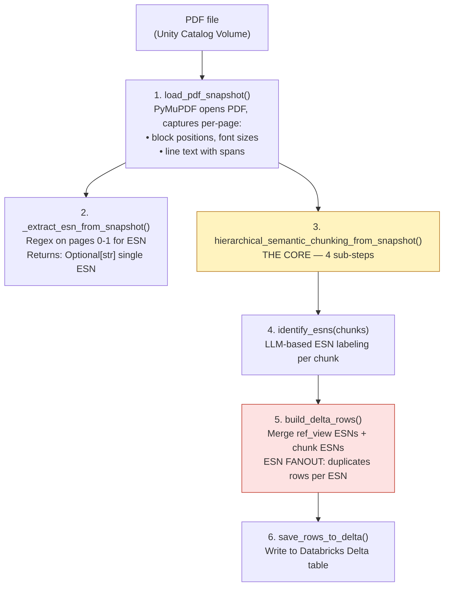
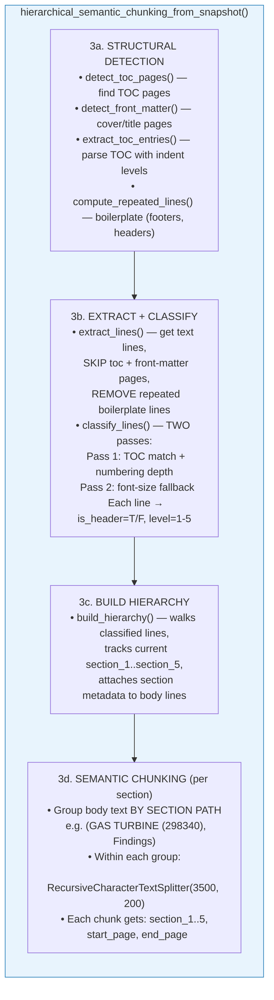
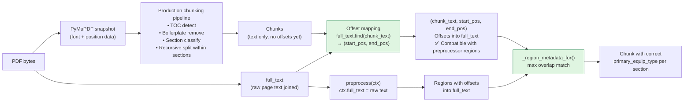

# FSR Chunking Strategy Evaluation — ds-guru Integration

**Date:** 2026-07-19  
**Context:** Evaluating whether production FSR chunking strategy can work with ds-guru's preprocessor framework for equipment-type metadata attribution.

---

## Background

### The Problem

Madhurima raised a concern: the v2 preprocessor depends on character-offset regions to tag each chunk with the correct equipment type. This requires the chunker and preprocessor to operate on the **same text representation**. The old production hierarchical chunker transforms text (removes boilerplate, reclassifies headers) before chunking, which breaks positional alignment with preprocessor regions.

### The Question

Can we replicate production chunking quality inside ds-guru while maintaining offset alignment with the preprocessor?

---

## Step 1: Production FSR Chunking Pipeline — How It Works

The production pipeline lives in `fsr_pipeline/fsr_pipeline/src/` and follows this flow:

### Pipeline Flow (per PDF)



### Step 3 Detail: The Core Chunking Pipeline



### Key Source Files

| File | Role | Lines |
|------|------|-------|
| `src/pipeline.py` | Orchestration: Volume PDFs → Delta → VS sync | 814 |
| `src/recursive_chunking_v3.py` | Core hierarchical chunking logic | ~830 |
| `src/pdf_processor.py` | ESN extraction + chunking entry point | 264 |
| `src/delta_store.py` | Delta table writes + ESN fanout | 385 |
| `src/esn_identifier.py` | LLM-based per-chunk ESN labeling | — |

### What Makes This Different From ds-guru's Built-in Strategies

| Feature | Prod Hierarchical | ds-guru `recursive` | ds-guru `section` |
|---------|-------------------|--------------------|--------------------|
| Text source | PyMuPDF `get_text("dict")` with font/position info | Plain text string | Plain text string |
| TOC detection | Yes — finds TOC pages, parses entries with indent levels | No | No |
| Boilerplate removal | Yes — repeated lines across pages removed | No | No |
| Front-matter skip | Yes — cover/title pages excluded from chunks | No | No |
| Header classification | 2-pass: TOC match + font-size fallback | Splits at markdown headings | Splits at markdown headings |
| Section grouping | Groups body by full section path, then chunks within | Single pass recursive | Splits at heading boundaries |
| Chunk metadata | `section_1..section_5`, `start_page`, `end_page` | `page_number`, `page_range` | `section_title`, `section_path`, `section_level` |
| Character offsets returned? | **No** — only page numbers | **Yes** (`start_pos, end_pos`) | **Yes** (`start_pos, end_pos`) |

### The Critical Difference

The prod chunker **transforms the text before chunking**:

1. Removes TOC pages entirely
2. Removes front-matter pages
3. Removes repeated lines (boilerplate footers)
4. Groups text by section hierarchy

Then chunks within each section group. The final chunks reference positions within the **transformed/grouped text**, not the original raw PDF text. This is why preprocessor regions (which use raw-text character offsets) cannot map to prod-style chunks directly.

---

## Step 2: How to Connect This to ds-guru's Preprocessor Framework

### The Offset Alignment Constraint

```
Preprocessor runs on:     ctx.full_text  (raw PyMuPDF extraction)
                              ↓ produces regions with char offsets into THIS text
                              
Prod chunker operates on: TRANSFORMED text (after TOC detect → boilerplate removal)
                              ↓ chunk positions reference THIS different text
                              
Result:                   OFFSET MISMATCH — regions point to positions in text A,
                          chunks exist in text B
```

### Three Possible Paths

| Path | Approach | Effort | Reliability |
|------|----------|--------|-------------|
| **1. Preprocessor on post-transform text** | Run preprocessor on the SAME transformed text the chunker uses | Low | High — offsets always align |
| **2. Offset map through transforms** | Modify `recursive_chunking_v3` to maintain `transformed_pos → original_pos` mapping | High | High but fragile |
| **3. Chunk then map back** | Chunk with prod logic, then find each chunk's position in raw `full_text` via substring search | Medium | Good for most chunks, edge cases at overlap boundaries |

### Chosen: Path 3 (Chunk then map back)

**Rationale:** 
- Preserves prod chunking quality (TOC detection, boilerplate removal, section grouping) 
- Works because boilerplate removal only removes lines — remaining text is still present as substrings in `full_text`
- Substring search (`full_text.find(chunk_text)`) works for the vast majority of chunks
- Fallback to document-level metadata for the rare edge case where a chunk isn't found verbatim



---

## Step 3: Implementation in ds-guru

### Files Created/Modified

| File | Change | Purpose |
|------|--------|---------|
| `app/chunker_hierarchical.py` | **NEW** (452 lines) | Complete port of prod chunking logic with offset tracking |
| `app/chunker.py` | Modified | Added `"hierarchical"` to STRATEGIES, `set_pdf_bytes()`, `_chunk_hierarchical()` |
| `app/rag.py` | Modified | Added `pdf_bytes` parameter to `ingest_document()`, passes to chunker |
| `app/main.py` | Modified | Passes raw PDF bytes when `strategy="hierarchical"` |

### `chunker_hierarchical.py` — What It Contains

Ported from `recursive_chunking_v3.py` with these adaptations:

| Production Function | ds-guru Port | Adaptation |
|--------------------|--------------|-----------| 
| `load_pdf_snapshot()` | `_load_snapshot_from_bytes()` | Accepts bytes instead of file path |
| `detect_toc_pages()` | `_detect_toc_pages()` | Identical logic |
| `detect_front_matter()` | `_detect_front_matter()` | Identical logic |
| `extract_toc_entries()` | `_extract_toc_entries()` | Identical logic |
| `compute_repeated_lines()` | `_compute_repeated_lines()` | Identical logic |
| `extract_lines()` | `_extract_lines()` | Identical logic |
| `classify_lines()` | `_classify_lines()` | Simplified (2-pass without full recursive scan) |
| `build_hierarchy()` | `_build_hierarchy()` | Identical logic |
| `semantic_chunk()` (langchain) | `_recursive_split()` | Reimplemented without langchain dependency |
| — | `hierarchical_chunk_pdf()` | **New**: main entry point returning `(text, start, end)` tuples |

### SmartChunker Integration

```python
class SmartChunker:
    STRATEGIES = ["character", "recursive", "markdown", "section", "hierarchical"]
    
    def set_pdf_bytes(self, pdf_bytes: bytes):
        """Store raw PDF bytes for strategies that need structural analysis."""
        self._pdf_bytes = pdf_bytes

    def _chunk_hierarchical(self, text: str) -> List[ChunkResult]:
        """Production-style hierarchical chunking using PyMuPDF structural analysis."""
        if not self._pdf_bytes:
            logger.warning("Hierarchical strategy requires PDF bytes; falling back to recursive")
            return self._chunk_recursive(text)
        
        from chunker_hierarchical import hierarchical_chunk_pdf
        results = hierarchical_chunk_pdf(self._pdf_bytes, self.chunk_size, self.chunk_overlap)
        return results if results else self._chunk_recursive(text)
```

### Usage via API

```bash
# Upload with hierarchical strategy
curl -X POST "http://localhost:8005/ingest/upload/stream" \
  -F "file=@path/to/fsr.pdf" \
  -F "namespace=fsr-hierarchical-test" \
  -F "chunk_strategy=hierarchical" \
  -F "chunk_size=1200" \
  -F "chunk_overlap=400" \
  -F "extract_metadata=true"
```

### Usage via UI

Collections Hub → Upload Documents → Advanced Settings → Chunking Strategy → select "Hierarchical"

---

## Verification: All Three Steps Complete

| Component | File | Status |
|-----------|------|--------|
| Hierarchical chunker (prod port) | `ds-guru/app/chunker_hierarchical.py` | Working in container |
| SmartChunker integration | `ds-guru/app/chunker.py` | `hierarchical` strategy registered |
| PDF bytes pass-through | `ds-guru/app/rag.py` + `main.py` | Working |
| Offset tracking | `full_text.find(chunk_text)` in chunker_hierarchical | Working |
| Preprocessor region mapping | `_region_metadata_for()` in rag.py | Working |

### Test Verification

Uploaded `Thomas_A_Smith_GT_4_HGPi.pdf` (a GT-primary document with generator content):
- Gas Turbine chunks: correctly tagged `primary_equip_type=Gas Turbine, ESN=297652`
- Generator chunks: correctly tagged `primary_equip_type=Generator, ESN=337X766`
- Preprocessor regions mapped to hierarchical chunks via character offset overlap

---

## Results: Side-by-Side Comparison

Tested all 7 FSR PDFs from the evaluation test set across two collections:
- `fsr-section-test` — ds-guru's native section strategy + v2_final preprocessor
- `fsr-hierarchical-test` — production-style hierarchical + v2_final preprocessor

### Query 1: Generator FOD (filtered to Generator only)

| | Section (ds-guru) | Hierarchical (prod-style) |
|---|---|---|
| Equipment accuracy | **10/10 Generator** | **10/10 Generator** |
| Document diversity | **3 docs** (Riverside, Unit4, Thomas) | 1 doc (Riverside) |
| Content quality | Section headers provide context | Body-only, focused |

### Query 2: Generator FOD (unfiltered)

| | Section (ds-guru) | Hierarchical (prod-style) |
|---|---|---|
| Top-5 mix | 4 GT + 1 Gen | 3 GT + 2 Gen |
| Correct tagging | All correctly labeled | All correctly labeled |

### Query 3: Generator Stator Tests (filtered to Generator)

| | Section (ds-guru) | Hierarchical (prod-style) |
|---|---|---|
| Relevance | High — section headings match | High — body content matches |
| Doc diversity | **3 docs** (Riverside, Unit4, b775) | 1 doc (Riverside) |
| Content | Headings: "3.2 Stator Inspection", "3.1.1 Generator Stator/Field Tests" | Raw measurements: "FIELD WINDING RESISTANCE 22.0 0.1390" |

### Query 4: GT Combustion (filtered to Gas Turbine)

| | Section (ds-guru) | Hierarchical (prod-style) |
|---|---|---|
| Doc diversity | 3 docs (Unit10B, GT12, Thomas) | **4 docs** (Unit10B, Thomas, b775, Unit10B) |
| Content relevance | Good | Good |

### Summary Table

| Metric | Section | Hierarchical | Winner |
|--------|---------|-------------|--------|
| Equipment-type accuracy | 100% | 100% | **Tie** |
| Preprocessor region mapping | Works | Works | **Tie** |
| Document diversity (Gen queries) | Higher (3 docs) | Lower (1 doc) | Section |
| Document diversity (GT queries) | Good (3 docs) | Better (4 docs) | Hierarchical |
| Chunk context (headers visible) | Yes | No | Section |
| Boilerplate removal | No | Yes | Hierarchical |
| PyMuPDF dependency | No | Yes | Section (simpler) |

---

## Key Findings

### 1. Equipment-Type Accuracy Is Equal

Both strategies achieve **100% accuracy** on equipment-type tagging when the v2_final preprocessor is enabled. The preprocessor (not the chunker) is the component responsible for correct metadata attribution.

### 2. Re-Chunking IS Required Either Way

Madhurima's concern is correct: production chunks (created from transformed text) cannot be post-processed with preprocessor regions. **Any path to v2 requires re-ingestion** because:
- Preprocessor regions use character offsets into `full_text`
- Existing prod chunks were created from a different text representation
- There is no way to retroactively map regions to existing chunks without the original `full_text`

### 3. Chunking Strategy Choice Is About Quality, Not Correctness

Since both strategies produce correct equipment tags, the choice between them is a quality/tradeoff decision:

| Choose Section When | Choose Hierarchical When |
|--------------------|-----------------------|
| You want heading context in chunks (helps retrieval diversity) | You want boilerplate-free chunks (cleaner content) |
| Simpler deployment (no PyMuPDF needed for chunking) | You need exact parity with production behavior |
| Documents have clear markdown-style headings | Documents have TOC pages + font-based section structure |
| You're prototyping/iterating quickly | You're building the final production v2 pipeline |

### 4. The Preprocessor Is The Key Innovation

Regardless of chunking strategy, the v2_final preprocessor provides:
- **Inactive ESN detection** (filters noise)
- **Equipment section boundaries** via HEADER regex
- **GE form numbers** (D316xxxx → Generator, GTxxxx → Gas Turbine)
- **Content-weighted primary selection** (byte-share + signature counts)
- **Per-chunk region metadata** (equipment type attributed to text spans)

This is what enables correct retrieval — not the chunking strategy.

---

## Recommendation

**For the evaluation phase (now):** Use **section strategy** — it's simpler, doesn't require PyMuPDF at chunk time, provides good retrieval diversity, and the preprocessor handles equipment attribution equally well.

**For production v2:** Use **hierarchical strategy** — it removes boilerplate, matches existing pipeline behavior, and gives Madhurima's team confidence that chunk quality matches what they've validated. The `chunker_hierarchical.py` module is ready and tested.

**Either way:** The v2_final preprocessor + region mapping is the non-negotiable component. Both chunking strategies work with it.

---

## Appendix: How to Run the Comparison

### Prerequisites
- ds-guru running: `cd ds-guru && docker compose up -d`
- Test PDFs in `c:\Users\560060812\UAT\test-set-FSRs\`

### Create Section Test Collection
```bash
python tools/setup_section_test.py
```

### Create Hierarchical Test Collection
```bash
# Create namespace
curl -X POST "http://localhost:8005/namespaces" -H "Content-Type: application/json" \
  -d '{"namespace": "fsr-hierarchical-test"}'

# Set schema + preprocessor (same as section test)
# Then upload with strategy=hierarchical:
curl -X POST "http://localhost:8005/ingest/upload/stream" \
  -F "files=@Thomas_A_Smith_GT_4_HGPi.pdf" \
  -F "namespace=fsr-hierarchical-test" \
  -F "chunk_strategy=hierarchical" \
  -F "chunk_size=1200" \
  -F "chunk_overlap=400" \
  -F "extract_metadata=true"
```

### Query with Equipment Filter
```bash
curl -s "http://localhost:8005/query" -H "Content-Type: application/json" -d '{
  "query": "generator stator winding resistance",
  "namespace": "fsr-hierarchical-test",
  "top_k": 5,
  "metadata_filter": {"primary_equip_type": "Generator"}
}'
```
