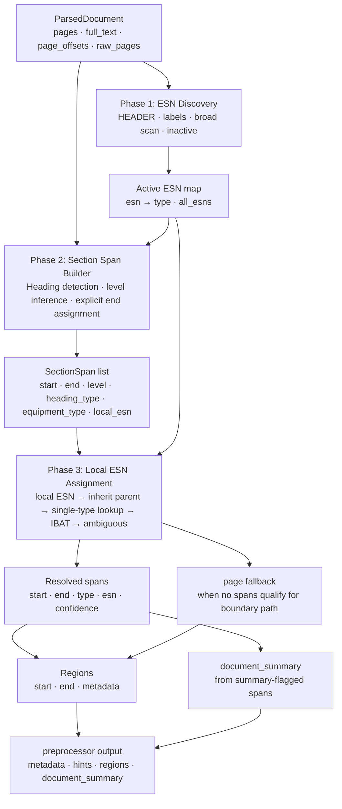
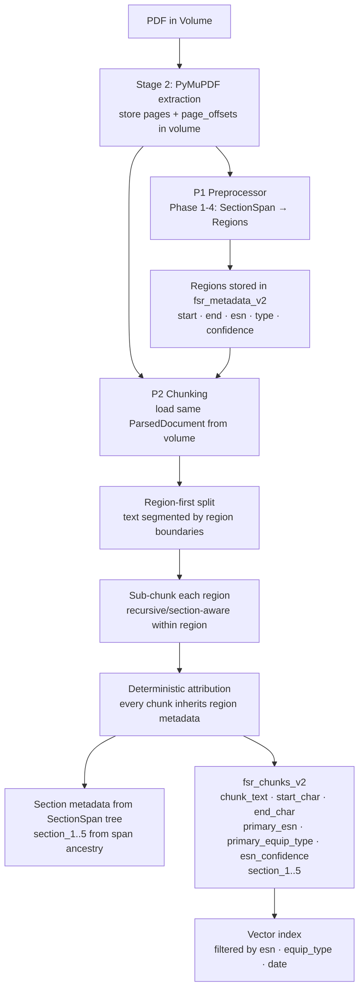

# FSR v2 Preprocessor — Proposed Design Changes

**Context:** Deep analysis of bugs 3, 4, and 6 from
`2-FSR-v2/this-week/bug-section/bug-3-4-6-section-analysis.md` and
preprocessor batch runs across 10 documents.
**Scope:** New ingestion strategy. Existing index will be retired and replaced.

---

## Root Cause Summary

Five structural problems in the current preprocessor drive all three bugs:

| # | Problem | Bugs it causes |
|---|---|---|
| 1 | Numbered-only section detection — unnumbered headings silently missed | 3 |
| 2 | Flat boundary list — no parent/child hierarchy, no flip-back model | 4.3 |
| 3 | Global single ESN anchor per type — all sections of the same type collapse to one ESN | 4.2, 6 |
| 4 | Boundary path uses distinct-type count, not ESN count — same-type multi-ESN falls to page fallback | 4.1 |
| 5 | Two separate section models (preprocessor boundaries vs TOC sections) — never joined | architecture debt |

---

## Proposed Architecture

Replace the current flat-boundary + dual-path model with a **three-phase section pipeline**:

```
Phase 1 — ESN/Equipment Discovery    (largely unchanged)
Phase 2 — Hierarchical Section Span Builder    (new)
Phase 3 — Local ESN Assignment with flip-back    (new)
Phase 4 — Region + Document Summary emit    (simplified + merged)
```



---

## Phase 1 — ESN Discovery (minimal changes)

Keep current logic for:
- HEADER pattern matching (ESN + SY number)
- GT_LABELS, GEN_LABELS, ST_LABELS, GENERIC_LABELS
- Broad ESN scan (3+ occurrences threshold)
- Inactive ESN detection
- active/inactive set building

Definitions used in this doc and implementation:
- `all_esns`: ESNs discovered from structured extraction signals (HEADER + explicit label patterns). This is the stricter, high-confidence set used as the base ESN inventory.
- `broad_esns`: expanded ESN set used for coverage/diagnostics. Starts from `all_esns`, then adds ESN-shaped tokens found repeatedly in body text (default: `>= 3` occurrences) even when not tied to structured labels.

**One change:** pass `raw_pages` into ctx so Phase 4 can access the unfiltered TOC pages.
Currently only `metadata_processor_v2` has them; they should be part of the preprocess context.

---

## Phase 2 — Hierarchical Section Span Builder (new)

### 2.1 Collect heading candidates from multiple sources

Each candidate carries: `(start_char, heading_text, equipment_type, local_esn, level, confidence)`

| Source | Pattern | Confidence | Level |
|---|---|---|---|
| Equipment header (HEADER) | `EQUIPMENT (ESN \| SY...)` | highest | **-1 (equipment_block)** |
| **Unnumbered all-caps heading (new)** | `^(GAS TURBINE\|GENERATOR\|STEAM TURBINE\|EXCITER)\s*$` | medium | **-1 (equipment_block)** |
| **Unnumbered titled heading (new)** | `^(Generator\|Gas Turbine\|Steam Turbine)\s+(?:Section\|Report\|Inspection)` | medium | **-1 (equipment_block)** |
| Numbered section header (SECTION_HDR) | `^\d+ GAS TURBINE$` | high | 0 (L0, within equipment block) |
| Numbered subsection (SUBSEC_GEN/GT) | `^\d+\.\d+ Generator...` | high | inferred from number depth (L1, L2, ...) |
| TOC-seeded boundary (new) | from TOC entries that match equipment names | medium | -1 or 0 depending on match type |

Level -1 (`equipment_block`) is the root anchor for a contiguous equipment section. All numbered headings (L0, L1, L2...) nest inside it. This separation means a numbered L0 heading never prematurely closes an equipment block.

**Unnumbered heading pattern (new, for bug 3):**
```python
UNNUMBERED_EQUIP_HDR = r'(?im)^(GAS\s+TURBINE|GENERATOR|STEAM\s+TURBINE|EXCITER)\s*$'
```
Gated by: line must start at column 0, no leading text, surrounded by newlines. Avoids matching within paragraph prose.

### 2.2 Infer section level from section number

```python
def _section_level(num_str: str) -> int:
    # "3" → 0, "3.1" → 1, "3.1.2" → 2
    return num_str.count('.')
```

Validate: reject if any segment > 2 digits (filters form numbers like 014.2.2 or 400.3.9).

Important: numeric depth is only a hint, not an authority. Level assignment must be context-aware:
- Never jump to top-level by default, even for numbered headings.
- Prefer the nearest open ancestor chain and only promote to top-level when there is explicit top-level evidence (for example HEADER/SECTION_HDR candidate with top-level confidence).
- If numbering and active hierarchy conflict, keep local hierarchy and flag `level_conflict=True` for audit.

### 2.3 Assign explicit end to each span

Currently end is inferred at region-build time as next boundary. Move this earlier:

For each heading, end = first subsequent heading at the **same or higher level** (lower level number).

With Option A levels:

```
GAS TURBINE (equipment_block, level=-1)  → ends at next level=-1 heading (another equipment block)
1 Summary              (L0)              → ends at next L0 or level=-1 heading
1.1 Site Personnel     (L1)              → ends at next L1, L0, or level=-1 heading
3.1.1 Piping...        (L2)              → ends at next L2, L1, L0, or level=-1 heading
```

Key property: a numbered L0 heading (`1 Summary`, `2 Technical`) never terminates an equipment block span. Only another `level=-1` heading does. This prevents premature closure when an unnumbered equipment header appears inside or adjacent to numbered sections.

This gives every section a real start + end before region building.

### 2.4 Deduplicate overlapping candidates

When two headings overlap (for example a HEADER match at char 500 and a SECTION_HDR at char 502), keep highest-confidence one. Tie: prefer HEADER > SECTION_HDR > SUBSEC > UNNUMBERED.

### 2.5 TOC seeding (new, replaces metadata_processor_v2 TOC path)

Parse TOC entries from raw_pages (same logic as current `_extract_toc_entries_from_pages`).
For each TOC entry:
- If it matches a summary pattern → mark span as `is_summary=True`
- Use TOC page number to provide a coarse start hint; full-text scan refines exact char position

This replaces the separate TOC path in `metadata_processor_v2` entirely.

Future (non-blocking): add TOC-pattern signals in metadata for appendix-heavy docs. Even before full appendix TOC parsing is implemented, emit document-level markers such as:
- `toc_pattern: "primary_toc" | "appendix_embedded_toc" | "mixed" | "none_detected"`
- `toc_signal_source: "main_body" | "appendix" | "both"`

---

## Phase 3 — Local ESN Assignment with flip-back (new)

### 3.1 ESN resolution order per span

For each resolved SectionSpan:

```
1. Explicit local ESN in heading text (from HEADER pattern on this span)
   → use directly, confidence = highest

2. Same equipment type as parent span, parent has a resolved ESN
   → inherit parent ESN, confidence = high

3. Equipment type changed from parent (cross-type subsection)
   a. Exactly one active ESN of this type → use it, confidence = high
  b. Multiple/zero active ESNs of this type → run IBAT-train lookup using current
    resolved turbine context, confidence = low
    - if IBAT returns exactly one non-SY ESN candidate → assign it
    - if IBAT returns none or more than one candidate → do not force ESN;
      mark ambiguous and set confidence = none for ESN

4. No equipment type (untyped heading or front-matter)
  → inherit parent if available; otherwise keep ESN empty (do not auto-promote to doc primary)
```

This directly fixes:
- Bug 4.2: same-type multi-ESN — each HEADER section gets its own local ESN from the heading, with IBAT-train fallback when local resolution is ambiguous
- Bug 6: wrong GEN ESN assignment — resolved from local heading first, not from body context frequency

### 3.2 Flip-back model

When a child span ends (its explicit end is set in Phase 2), the next sibling or parent resumes its own context automatically.

No explicit "flip-back" detection needed — hierarchy + explicit ends encode this structurally:

```
GAS TURBINE (297191)        start=X end=Y    level=-1  (equipment_block)
  1 Summary                 start=A end=B    level=0   parent=GAS TURBINE
  2 Generator Tests(336X827) start=B end=C   level=0   parent=GAS TURBINE
  3 Turbine Section          start=C end=Y   level=0   parent=GAS TURBINE → ESN=297191 again
```

When `2 Generator Tests` ends at char C, `3 Turbine Section` picks up at C with the turbine context. No code needs to detect the end — it's structural.

### 3.2A IBAT query contract (for review)

Use this in the Phase 3 step `single-type lookup -> IBAT -> ambiguous` when local/parent resolution does not produce a single ESN — i.e. when there are zero candidates or more than one candidate of the same equipment type.

#### Query 1: direct ESN lookup (existing pattern)

```sql
SELECT equipment_sys_id,
       equipment_sub_class AS equipment_class_code
FROM {IBAT_EQUIPMENT_TABLE}
WHERE UPPER(TRIM(equip_serial_number)) = UPPER(TRIM(:esn))
LIMIT 1
```

#### Query 2: type-constrained candidate lookup (fallback)

```sql
WITH candidates AS (
  SELECT UPPER(TRIM(equip_serial_number)) AS candidate_esn,
         UPPER(TRIM(equipment_type))      AS candidate_type,
         equipment_sys_id,
         equipment_sub_class              AS equipment_class_code
  FROM {IBAT_EQUIPMENT_TABLE}
  WHERE equip_serial_number IS NOT NULL
    AND TRIM(equip_serial_number) <> ''
)
SELECT candidate_esn,
       equipment_sys_id,
       equipment_class_code
FROM candidates
WHERE candidate_type = UPPER(TRIM(:target_equipment_type))
  AND candidate_esn NOT RLIKE '^SY[0-9]{7}$'
ORDER BY candidate_esn
```

#### Assignment rule from Query 2

- Exactly one candidate: assign ESN, set `esn_source="ibat_train"`, set `esn_confidence="low"`.
- Zero candidates: do not assign ESN, set `esn_confidence="none"`.
- More than one candidate: do not force ESN, set `esn_confidence="none"`, mark ambiguous.

Note: if/when a train-link column is confirmed in IBAT, add it as an additional filter in Query 2 while keeping the same assignment rule.

### 3.3 Boundary path eligibility fix (bug 4.1)

Replace current condition:

```python
# current — breaks for same-type multi-ESN
if len(distinct_types) >= 2:
    use_boundary_path()
else:
    use_page_fallback()
```

New condition:

```python
if spans and (len(distinct_types) >= 2 or len(active) > 1):
    use_boundary_path()
else:
    use_page_fallback()
```

When boundaries exist and any equipment type has more than one active ESN, use boundary path regardless of type count.

### 3.4 ESN-less section handling (bug 6, case 9)

When a section has a type but no resolvable ESN after all steps above:
- Emit region with `primary_equip_type` only (no `primary_esn` key) — same as current
- **New:** add `esn_confidence: "none"` flag in region metadata so downstream knows attribution is type-only
- These spans become candidates for LLM-based ESN inference in a later enrichment pass

---

## Phase 4 — Region + Document Summary emit (merged + simplified)

### 4.1 Regions

#### Full document coverage guarantee

Every character from 0 to the last character of the document must fall in exactly one region. Regions are always contiguous character spans — a region never skips characters.

| Interval | `region_source` | Who covers it |
|---|---|---|
| 0 → first section-header span start | `front_matter` | explicit synthetic region, always emitted |
| each resolved section span | `section_span` | one region per contiguous equipment/ESN block |
| uncovered gap between two spans | `gap_fallback` | explicit synthetic region with neighbor fallback |
| after last span → end of document | `trailing` | explicit synthetic region, always emitted |

Region scoping:
- A region is scoped to one ESN (not one equipment type). Equipment type follows from ESN.
- If ESN is unresolved, region carries equipment type only.
- If neither is resolved, region is `shared`.
- If the same ESN appears in non-contiguous parts of the document, those become separate regions both carrying that ESN — the gap between them gets its own region with separate attribution.
- Within one contiguous equipment block, if all child spans resolve to the same ESN, they are merged into one region.

From the resolved SectionSpan list:
- Each span with a non-empty metadata (type and/or ESN) → emit as region `{start, end, metadata}`
- Front-matter (chars 0 to first section-header span start) → emit explicit shared-unattributed region (no forced ESN)
- Gaps between spans (should be minimal with explicit ends) → emit explicit shared-unattributed region with provenance

Exact meaning of `shared`:
- `shared` means "not attributable to one equipment context at parse time".
- It does not mean "multi-equipment" and does not mean "no equipment exists in document".
- When multi-equipment evidence is explicit, mark that separately via provenance flags; do not overload `primary_equip_type` semantics.

### 4.2 Document summary (merged)

TOC-flagged spans (`is_summary=True`) contribute their text directly to `document_summary`.
No separate `_extract_document_summary_from_pages` call needed — text is extracted from the same full_text using the span's start/end.

### 4.3 metadata_processor_v2 becomes thin

After this change, `metadata_processor_v2.run()` reduces to:

```python
def run(parsed_doc):
    ctx = SimpleNamespace(
        pages=parsed_doc.pages,
        page_offsets=parsed_doc.page_offsets,
        full_text=parsed_doc.full_text,
        raw_pages=parsed_doc.raw_pages or parsed_doc.pages,  # new: pass raw pages
        fields=_FIELDS,
        filename=parsed_doc.filename,
    )
    return _preprocessor.preprocess(ctx)
    # document_summary is now populated inside preprocess via Phase 4
```

The TOC parsing, section text extraction, and summary generation all move into `preprocessor.py`.
`metadata_processor_v2.py` becomes a thin adapter (could eventually be removed).

---

## New Data Structures

### SectionSpan (internal)

```python
@dataclass
class SectionSpan:
    start: int
    end: int
    level: int                     # -1=equipment_block, 0=top numbered, 1=sub, 2=sub-sub
    heading_text: str
    heading_type: str              # HEADER | SECTION_HDR | SUBSEC | UNNUMBERED | TOC
    equipment_type: str | None     # Gas Turbine | Generator | Steam Turbine | Exciter | None
    local_esn: str | None          # ESN from heading itself
    resolved_esn: str | None       # after Phase 3 assignment
    esn_confidence: str            # highest | high | low | none
    esn_source: str                # local_header | parent_inherit | ibat_train | none
    parent_idx: int | None         # index in SectionSpan list
    is_summary: bool               # flagged from TOC
```

### Region (output — backward compatible)

```python
{
    "start": int,
    "end": int,
    "metadata": {
        "primary_esn": str,          # absent if esn_confidence="none"
        "primary_equip_type": str,
        "primary_technology_code": str,
        "esn_confidence": str,       # "highest" | "high" | "low" | "fallback" | "none"
        "esn_source": str,           # local_header | parent_inherit | ibat_train | neighbor_gap | doc_primary | none
        "equip_type_source": str,    # heading | parent_inherit | neighbor_consensus | doc_primary | none
        "region_source": str,        # section_span | front_matter | gap_fallback | trailing | synthetic
        "fallback_chain": list[str], # ordered attempts, e.g. ["local", "parent", "ibat_train", "none"]
    }
}
```

Adding provenance keys is a schema expansion and intentional. The metadata table should explicitly show origin for every assigned field, including fallback paths.

---

## What this fixes

| Bug | Current failure | Fix |
|---|---|---|
| Bug 3 | Unnumbered headers missed | Phase 2 adds UNNUMBERED_EQUIP_HDR pattern |
| Bug 4.1 | Same-type multi-ESN falls to page fallback | Boundary path condition uses ESN count |
| Bug 4.2 | All same-type sections collapse to global ESN anchor | Phase 3 local ESN resolution from heading |
| Bug 4.3 | No flip-back after generator subsection | Phase 2 explicit end + hierarchy encodes this structurally |
| Bug 6a | Wrong GEN ESN assigned from body context | Phase 3 local-first ESN resolution |
| Bug 6b | No generator ESN in doc, content unattributed | Phase 3 type-only region with confidence=none |
| Architecture | Two section models, separate TOC path | Single SectionSpan pipeline, metadata_processor_v2 thinned |
| Coverage | Chars before first boundary uncovered | Phase 4 front-matter region |

---

## What this does NOT fix (needs LLM)

- Case 9 type: generator content with no generator ESN and no generator vocabulary → ESN stays unresolved, confidence=none. LLM enrichment pass in Stage 4 should consume these spans and attempt type/ESN inference from text.
- Case 4: second GT ESN not labeled anywhere in the document text → no rule-based approach can find it.

These are flagged via `esn_confidence: "none"` and `esn_confidence: "low"` respectively, making them explicit inputs for the LLM flow rather than silent errors.

### Open item: Exciter ESN surfacing

- Current implementation behavior: Exciter is grouped into the Generator bucket during active-by-type ESN aggregation, so Exciter ESN may surface through `gen_esn`.
- Impact: top-level metadata cannot distinguish whether `gen_esn` came from Generator content or Exciter content.
- Proposed follow-up:
  - add a dedicated `exciter_esn` metadata field,
  - keep `gen_esn` strictly Generator-only,
  - update downstream metadata/chunk consumers that currently assume a combined Generator+Exciter bucket.

---

## Implementation Plan

| Step | What | Notes |
|---|---|---|
| 1 | Add `raw_pages` to preprocess ctx | 1-line change in metadata_processor_v2 |
| 2 | Add UNNUMBERED_EQUIP_HDR detection + tests on bug 3 docs | Start narrow, widen if needed |
| 3 | Build SectionSpan dataclass + Phase 2 span builder with explicit ends | Replace `boundaries = []` block |
| 4 | Implement Phase 3 local ESN assignment (local → inherit → single-type lookup → IBAT → ambiguous) | Replace SUBSEC boundary building |
| 5 | Fix boundary path condition (distinct_types OR multi-ESN) | 1-line condition change |
| 6 | Move TOC summary extraction into Phase 4, remove from metadata_processor_v2 | Delete `_extract_document_summary_from_pages` from v2 |
| 7 | Add `esn_confidence` to region metadata | Backward compatible |
| 8 | Run full batch against all 10 bug docs, compare region counts and metadata | Use existing notebook |
| 9 | Reingest new docs with updated preprocessor | Retire old index |

Steps 1–5 can be done and tested incrementally before touching the document summary logic.

---

## Validation Criteria

A successful new preprocessor should show:

| Case | Expected improvement |
|---|---|
| b1cdbc80 (case 5) | Regions >> 11; 338X827 appears as a region ESN |
| b7b347fd (case 9) | Either correct type attribution OR explicit `esn_confidence: "none"` |
| 5b688732 (case 2) | Regions >> 5 for a 415-page doc |
| fcb1511e / af693a98 (cases 6/7) | Region metadata sequence shows correct turbine context after generator subsection ends |
| 806975e9-062b-4da3-9ae7-5881a5daffd1_204049598-39387-297652-final_master_report | Missing-number subsection handling should preserve correct parent context (no unintended jump to top-level) |
| All docs | No region is wider than 50 pages on average (soft threshold) |

### Open validation item (requested by Xujin)

- Document: `806975e9-062b-4da3-9ae7-5881a5daffd1_204049598-39387-297652-final_master_report`
- Focus: missing-number subsection behavior.
- Pass criteria:
  - subsection spans without explicit numbering remain under the active equipment parent context;
  - no default top-level jump is introduced;
  - region output preserves expected ESN/equipment attribution sequence across that subsection block.
- Status: pending run and review.

---

## Parser Strategy: PyMuPDF + Volume-Stored Extraction

### Problem with current approach

- pypdf2 does not preserve positional coordinates — line breaks are reconstructed from character streams and can silently merge section heading lines, which is a direct contributor to bug 3.
- P1 (metadata) and P2 (chunking) both call `parse_pypdf2` independently. This works today because they call the same function, but any behavioral change to that function drifts P1 and P2 out of alignment.

### Proposed: extract once with PyMuPDF, store in volume, reuse

Add a dedicated extraction stage before P1 that runs once per document:

```
Stage 2 — PDF Extraction (new)
  parse_pymupdf(doc)  →  ParsedDocument
  persist to volume:  /Volumes/.../fsr_v2_parsed/{document_id}/parsed.json

Stage 3 — P1 Metadata (current, reads stored output)
  load ParsedDocument from volume
  runs preprocessor → regions, metadata, hints

Stage 5 — P2 Chunking (current, reads stored output)
  load ParsedDocument from volume
  no re-extraction, guaranteed same coordinate space as P1
```

### Why volume, not Delta table

- Delta string columns have a hard limit of 1 MB per cell (Parquet limit).
- FSR docs reach 450 KB+ of extracted text — close to the limit and risky at corpus scale.
- Delta is optimized for tabular queries, not large blob reads.
- Volume files have no size limit and are cheap to read sequentially.

### Volume layout

```
/Volumes/viud/ing_ud_fieldvision/fsr_v2_parsed/
  {document_id}/
    pymupdf_v1.0/
      parsed.json       ← pages array + page_offsets
```

Contents of `parsed.json`:
```json
{
  "document_id": "...",
  "parser": "pymupdf_v1.0",
  "pages": ["page 1 text", "page 2 text", ...],
  "page_offsets": [{"start": 0, "end": 953}, ...]
}
```

`full_text` is not stored — always reconstructed as `"\n".join(pages)` so it stays deterministic.

### Delta pointer table (lightweight)

A small Delta table stores only metadata about what was extracted:

```
document_id | parsed_volume_path | parser_version | parsed_at | page_count | char_count
```

P1 and P2 look up the path from this table, then read the file from the volume.

### Benefits

| Benefit | Detail |
|---|---|
| Better section detection | PyMuPDF reads glyph positions → line breaks preserved → SECTION_HDR and SUBSEC patterns match reliably |
| Parse-once performance | 400-page FSR docs currently parsed twice per ingestion; this halves extraction work |
| Guaranteed P1/P2 alignment | Both consume the same stored bytes — no function-drift risk |
| Parser migration path | Both `pymupdf_v1.0/` and `pypdf2_v1.0/` folders can coexist for comparison during transition |
| Easier re-extraction | Overwrite one volume file to re-parse a single document without re-running the full pipeline |

### What needs to change in code

| File | Change |
|---|---|
| `silver/src/etl/fsr_v2/parsing.py` | Add `parse_pymupdf()` returning the same `ParsedDocument` shape |
| New `silver/src/etl/fsr_v2/nb_fsr_v2_extraction.py` | Stage 2 notebook: runs extraction, writes volume file, updates pointer table |
| `silver/src/etl/nb_sdg_fsr_v2_metadata.py` | P1: load `ParsedDocument` from volume instead of calling `parse_pypdf2` |
| `gold/src/etl/fsr_v2/text_extraction.py` | P2: load `ParsedDocument` from volume instead of re-parsing |

---

## Chunking and Retrieval Relevancy

### How regions and chunks currently relate

After P1 produces regions (list of `{start, end, metadata}` char-offset spans stored in `fsr_metadata_v2.preprocessor_regions`), P2 chunking works like this:

1. Re-extract text from PDF (same parser, same coordinate space as P1)
2. Chunk the full text using a strategy (v1_hierarchical or recursive) → each chunk gets `(text, start_char, end_char)`
3. For each chunk: call `attribute_esn(start_char, regions, end_char)` from `common/fsr_v2/region_utils.py`
   - Finds the region with maximum character overlap with the chunk span
   - Assigns that region's `primary_esn` and `primary_equip_type` to the chunk
   - If no region overlaps: falls back to the **last region's metadata** (a silent wrong attribution)
4. Region metadata is the highest-priority layer in the 4-level merge cascade (upload < doc < section < region)

**Current problem:** this is post-hoc attribution. The chunker splits the text without knowing about regions, so chunks frequently straddle region boundaries. The max-overlap rule picks a winner, but a 4000-char chunk split across a GT→Generator boundary will be attributed to whichever side happens to be longer in that chunk.

### What about chunks that don't map to any region?

Two cases today:
1. **Chunk before the first region** (title/front-matter): no region covers it → `attribute_esn` finds no overlap → falls through to last-region fallback → wrong attribution
2. **Chunk in a gap between regions** (unregioned text): same problem

Both get silently mis-attributed. With the current preprocessor that leaves large gaps (e.g. case 5: chars 0–2110 uncovered, case 9: 94% of doc in one region with no ESN), this directly hurts retrieval precision.

---

### Proposed: Region-first chunking

Rather than chunk-then-attribute, flip the order: **split at region boundaries first, then sub-chunk each region independently**.

```
Current:
  full_text → [chunk, chunk, chunk, chunk] → attribute each chunk to a region

Proposed:
  full_text → [region_A text, region_B text, region_C text]
                    ↓               ↓               ↓
              [c1, c2, c3]   [c4, c5]        [c6, c7, c8]
              (all GT ESN)   (all GEN ESN)   (all GT ESN)
```

Every chunk inherits its region's `primary_esn` and `primary_equip_type` **deterministically** — no overlap calculation, no straddling ambiguity, no last-region fallback needed.

#### Implementation

```python
def chunk_by_regions(full_text, regions, chunker) -> list[ChunkResult]:
    for region in regions:
        segment = full_text[region["start"]:region["end"]]
        sub_chunks = chunker.chunk_text(segment)
        for text, rel_start, rel_end in sub_chunks:
            abs_start = region["start"] + rel_start
            abs_end = region["start"] + rel_end
            yield text, abs_start, abs_end, region["metadata"]
```

`region_utils.attribute_esn()` is no longer needed for normal flow — every chunk inherits from its region directly. It can be kept as a safety net for any edge case where synthetic region creation fails, but should not be on the normal attribution path.

#### Cross-region overlap rule

Do **not** carry `chunk_overlap` across region boundaries. A 200-char overlap between GT content and Generator content is noise, not context. Overlap only applies within the same region's sub-chunks.

---

### Handling unregioned text

With the full coverage guarantee in Phase 4.1, no text should be left without a region. This section defines the explicit rules for the synthetic regions that cover front-matter, gaps, and trailing text.

Synthetic region types emitted:

| Location | Attribution |
|---|---|
| Front-matter | Emit `region_source="front_matter"` with `primary_equip_type="shared"`, empty ESN, `esn_confidence="none"` |
| Gaps between regions (should be rare with new design) | Use nearest-neighbor fallback with confidence downgrade (rules below) |
| Trailing text | Emit explicit synthetic region; only assign doc-level ESN when policy allows and provenance records that fallback |

#### What is a "gap between regions"?

A gap is any uncovered character interval between two consecutive regions after sorting by `start_char`:

- `region_i.end_char < region_{i+1}.start_char`
- gap interval = `[region_i.end_char, region_{i+1}.start_char)`

Typical examples:
- separator lines or repeated page headers/footers between two section spans
- OCR noise line(s) not captured in either neighboring span
- short narrative bridge text between two explicit headings

#### Deterministic fallback strategy for gaps

For each gap interval, create a synthetic region first (`source="gap_fallback"`) and then assign metadata using this order:

1. If left and right neighbor regions have the same non-empty `primary_esn`, inherit that ESN and type.
2. Else if exactly one side has non-empty `primary_esn`, inherit that side.
3. Else if both sides have ESN but different values:
  - use character-distance tie-break (`distance_to_left_end` vs `distance_to_right_start`)
  - if tie, prefer left (stable deterministic behavior)
4. Else (neither side has ESN):
  - inherit `primary_equip_type` only if both sides agree on type
  - otherwise set `primary_equip_type="shared"` and `primary_esn` empty

Guardrails:
- Never bridge across a page jump larger than 1 page with neighbor inheritance; in that case use doc-level fallback.
- If `gap_len > 2000` chars, do not force neighbor ESN inheritance; treat as standalone unknown region unless doc-level ESN is very strong.
- If fallback was used, append full attempt history to `fallback_chain` and set `region_source="gap_fallback"`.

#### How `esn_confidence` is determined

Use explicit labels so downstream retrieval can filter or de-prioritize uncertain chunks:

| `esn_confidence` | Condition |
|---|---|
| `highest` | ESN matched directly from local ESN signature inside the region text |
| `high` | ESN inherited from parent SectionSpan with consistent child evidence |
| `low` | ESN assigned by nearest-neighbor gap fallback (rules 1-3 above) |
| `fallback` | ESN assigned from doc-level primary only (not local, not neighbor-validated) |
| `none` | No ESN assigned; only equipment type known or both unknown |

All synthetic/unregioned regions must carry both `region_source` and `esn_confidence` so provenance is auditable.

---

### Section metadata for chunks

Current section metadata (`section_1..section_5`) is derived from injected markdown heading markers (`##`, `###`) via `_inject_pdf_heading_markers` — the same heuristic that causes false section boundaries.

New design: derive `section_1..section_5` from the SectionSpan hierarchy that contains the chunk:

```
Chunk at char offset X is inside SectionSpan(start=A, end=B, level=0, heading_text="3.1 Generator Field Tests")
→ section_1 = equipment block heading ("GAS TURBINE", level=-1)
→ section_2 = this span heading ("3.1 Generator Field Tests", level=0)
→ section_3..5 = None (no deeper nesting)
```

This is more reliable than regex heading detection because:
- Source is the structured SectionSpan tree, not markdown marker patterns
- Heading text is deduped and validated during Phase 2 (TOC-filtered, confidence-gated)
- Level is structurally inferred from section numbers, not from `#` prefix depth

Implementation: when sub-chunking within a region, each SectionSpan carries its ancestry chain. The sub-chunk metadata builder reads `span.ancestors` to populate `section_1..5`.

---

### Chunking strategy within a region

Once text is segmented by region, the sub-chunking strategy within each region is decoupled from attribution. Recommended:

| Region size | Strategy |
|---|---|
| ≤ max_chunk_chars (3800 chars) | Keep as single chunk — no splitting needed |
| > chunk_size, structured sections present | Split at sub-section span boundaries within the region |
| > chunk_size, no sub-sections | Recursive split with sentence-aware overlap |

This replaces the current all-or-nothing strategy choice (one strategy for the whole document).

#### Concrete chunking policy (implementation defaults)

Use these defaults so behavior is deterministic across documents:

| Parameter | Default | Notes |
|---|---|---|
| `target_chunk_chars` | 2000 | Preferred chunk size for embedding quality |
| `max_chunk_chars` | 3800 | Hard cap; no chunk should exceed this |
| `min_chunk_chars` | 450 | Merge tiny fragments unless they are terminal sections |
| `overlap_chars` | 150 | Applied only inside the same region |
| `cross_region_overlap` | 0 | Must stay zero to avoid ESN contamination |

Split order inside a region:

1. If `region_len <= max_chunk_chars` → emit one chunk.
2. Else, split by child SectionSpan boundaries first (L1/L2 under the region).
3. For each piece still above `max_chunk_chars`, recursive split by:
   - paragraph (`\n\n`)
   - line (`\n`)
   - sentence (`(?<=[.!?])\s+`)
4. Merge neighboring tiny chunks (`< min_chunk_chars`) when metadata and section ancestry are identical.
5. Apply `overlap_chars` only between adjacent chunks from the same region and same section ancestry.

Pseudo-logic:

```python
def chunk_region(region_text, child_spans):
  if len(region_text) <= max_chunk_chars:
    return [region_text]

  pieces = split_by_child_spans(region_text, child_spans) or [region_text]
  chunks = []
  for p in pieces:
    if len(p) <= max_chunk_chars:
      chunks.append(p)
    else:
      chunks.extend(recursive_split(p, target=target_chunk_chars, cap=max_chunk_chars))

  chunks = merge_tiny_neighbors(chunks, min_chunk_chars)
  chunks = add_intra_region_overlap(chunks, overlap_chars)
  return chunks
```

Chunk attribution rule:
- Every emitted chunk inherits region metadata from its parent region directly (`primary_esn`, `primary_equip_type`, `esn_confidence`).
- No overlap-based ESN arbitration for regioned chunks.

Fallback for unregioned text:
- Create explicit synthetic regions for front-matter / gaps / trailing text before chunking so every chunk has deterministic provenance.

---

### Full design flow with chunking



---

### Retrieval accuracy impact

| Current failure | New design outcome |
|---|---|
| Chunk straddles GT/Generator boundary → one ESN wins by overlap, other ESN misses query | Region-first split eliminates boundary-straddling |
| Chunks in gaps/front-matter get last-region fallback ESN | Explicit shared front-matter/gap regions with provenance; no silent last-region carryover |
| section_1 values are TOC/form-number noise | section_1..5 from SectionSpan ancestry, validated at build time |
| 130K-char GT region (case 5) → many chunks all tagged to same ESN even if content is mixed | Smaller, more accurate regions → tighter chunk attribution |
| Generator content in doc with no gen_esn → mis-tagged as GT or unattributed | Explicit `esn_confidence: none` → retrievable, LLM can disambiguate |

### Validation criteria (retrieval layer)

In addition to the preprocessor-level validation criteria above:

| Check | Target |
|---|---|
| Chunks with `esn_confidence: fallback` or `none` | < 5% of chunks per document |
| Chunks that straddle two different region ESNs | 0% (enforced by region-first split) |
| `section_1` contains TOC/form-number noise | 0% (enforced by SectionSpan validation in Phase 2) |
| Average chunk ESN attribution accuracy on known-ground-truth docs | Compare against Xujin's expected ESN/page pairs |
| Query recall for cross-ESN documents (GT + Generator in same FSR) | Generator chunks retrievable by generator ESN, GT chunks by GT ESN |
