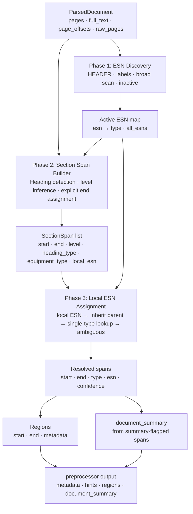

# FSR v2 Preprocessor — Proposed Design Changes

**Context:** Deep analysis of bugs 3, 4, and 6 from
`2-FSR-v2/this-week/bug-section/bug-3-4-6-section-analysis.md` and
preprocessor batch runs across 10 documents.
**Scope:** New ingestion strategy. Existing index will be retired and replaced.

---

## Root Cause Summary

Five structural problems in the current preprocessor drive all three bugs:

| # | Problem | Bugs it causes |
|---|---|---|
| 1 | Numbered-only section detection — unnumbered headings silently missed | 3 |
| 2 | Flat boundary list — no parent/child hierarchy, no flip-back model | 4.3 |
| 3 | Global single ESN anchor per type — all sections of the same type collapse to one ESN | 4.2, 6 |
| 4 | Boundary path uses distinct-type count, not ESN count — same-type multi-ESN falls to page fallback | 4.1 |
| 5 | Two separate section models (preprocessor boundaries vs TOC sections) — never joined | architecture debt |

---

## Proposed Architecture

Replace the current flat-boundary + dual-path model with a **three-phase section pipeline**:

```
Phase 1 — ESN/Equipment Discovery    (largely unchanged)
Phase 2 — Hierarchical Section Span Builder    (new)
Phase 3 — Local ESN Assignment with flip-back    (new)
Phase 4 — Region + Document Summary emit    (simplified + merged)
```



---

## Phase 1 — ESN Discovery (minimal changes)

Keep current logic for:
- HEADER pattern matching (ESN + SY number)
- GT_LABELS, GEN_LABELS, ST_LABELS, GENERIC_LABELS
- Broad ESN scan (3+ occurrences threshold)
- Inactive ESN detection
- active/inactive set building

**One change:** pass `raw_pages` into ctx so Phase 4 can access the unfiltered TOC pages.
Currently only `metadata_processor_v2` has them; they should be part of the preprocess context.

---

## Phase 2 — Hierarchical Section Span Builder (new)

### 2.1 Collect heading candidates from multiple sources

Each candidate carries: `(start_char, heading_text, equipment_type, local_esn, level, confidence)`

| Source | Pattern | Confidence | Level |
|---|---|---|---|
| Equipment header (HEADER) | `EQUIPMENT (ESN \| SY...)` | highest | 0 (top-level) |
| Numbered section header (SECTION_HDR) | `^\d+ GAS TURBINE$` | high | 0 |
| Numbered subsection (SUBSEC_GEN/GT) | `^\d+\.\d+ Generator...` | high | inferred from number depth |
| **Unnumbered all-caps heading (new)** | `^(GAS TURBINE\|GENERATOR\|STEAM TURBINE\|EXCITER)\s*$` | medium | 0 |
| **Unnumbered titled heading (new)** | `^(Generator\|Gas Turbine\|Steam Turbine)\s+(?:Section\|Report\|Inspection)` | medium | 0 |
| TOC-seeded boundary (new) | from TOC entries that match equipment names | medium | 0 |

**Unnumbered heading pattern (new, for bug 3):**
```python
UNNUMBERED_EQUIP_HDR = r'(?im)^(GAS\s+TURBINE|GENERATOR|STEAM\s+TURBINE|EXCITER)\s*$'
```
Gated by: line must start at column 0, no leading text, surrounded by newlines. Avoids matching within paragraph prose.

### 2.2 Infer section level from section number

```python
def _section_level(num_str: str) -> int:
    # "3" → 0, "3.1" → 1, "3.1.2" → 2
    return num_str.count('.')
```

Validate: reject if any segment > 2 digits (filters form numbers like 014.2.2 or 400.3.9).

**Unnumbered headings — level assignment:**
If a heading has no section number (unnumbered all-caps or titled heading from section 2.1), assign it level 0 — treat it the same as a top-level numbered section. This means it ends at the next level-0 heading and participates in the hierarchy exactly like `3 GAS TURBINE` would. Do not assign a special level or skip it — an unnumbered `GAS TURBINE` heading is structurally equivalent to `3 GAS TURBINE`.

### 2.3 Assign explicit end to each span

Currently end is inferred at region-build time as next boundary. Move this earlier:

For each heading, end = first subsequent heading at the **same or higher level** (lower level number).

```
3 GAS TURBINE         → ends at first next level-0 heading
3.1 Auxiliaries       → ends at first next level-0 or level-1 heading
3.1.1 Piping...       → ends at first next heading at level 0, 1, or 2
```

This gives every section a real start + end before region building.

### 2.4 Deduplicate overlapping candidates

When two headings overlap (for example a HEADER match at char 500 and a SECTION_HDR at char 502), keep highest-confidence one. Tie: prefer HEADER > SECTION_HDR > SUBSEC > UNNUMBERED.

### 2.5 TOC seeding (new, replaces metadata_processor_v2 TOC path)

Parse TOC entries from raw_pages (same logic as current `_extract_toc_entries_from_pages`).
For each TOC entry:
- If it matches a summary pattern → mark span as `is_summary=True`
- Use TOC page number to provide a coarse start hint; full-text scan refines exact char position

This replaces the separate TOC path in `metadata_processor_v2` entirely.

---

## Phase 3 — Local ESN Assignment with flip-back (new)

### 3.1 ESN resolution order per span

For each resolved SectionSpan:

```
1. Explicit local ESN in heading text (from HEADER pattern on this span)
   → use directly, confidence = highest

2. Same equipment type as parent span, parent has a resolved ESN
   → inherit parent ESN, confidence = high

3. Equipment type changed from parent (cross-type subsection)
   a. Exactly one active ESN of this type → use it, confidence = high
   b. Multiple active ESNs of this type → mark ambiguous, use global anchor as fallback
      with confidence = low (flag for LLM if needed)
      *Global anchor = the single representative ESN chosen per equipment type during Phase 1 (`gen_esn`, `gt_esn`, `st_esn`) — selected by title-page frequency and boundary hit count. It is not the IBAT train tool; it is just the most-seen ESN of that type in the document. This is the same anchor the current preprocessor always uses, but here it is only a low-confidence fallback, not the default.*

4. No equipment type (untyped heading or front-matter)
   → inherit parent or doc-level primary, confidence = inherited
```

This directly fixes:
- Bug 4.2: same-type multi-ESN — each HEADER section gets its own local ESN from the heading, not the global anchor
- Bug 6: wrong GEN ESN assignment — resolved from local heading first, not from body context frequency

### 3.2 Flip-back model

When a child span ends (its explicit end is set in Phase 2), the next sibling or parent resumes its own context automatically.

No explicit "flip-back" detection needed — hierarchy + explicit ends encode this structurally:

```
3 GAS TURBINE (297191)      start=X end=Y    level=0
  3.1 Generator (336X827)   start=A end=B    level=1   parent=GT section
  3.2 Turbine...            start=B end=C    level=1   parent=GT section → ESN=297191 again
```

When `3.1 Generator` ends at char B, `3.2 Turbine` picks up at B with the turbine context. No code needs to detect the end — it's structural.

### 3.3 Boundary path eligibility fix (bug 4.1)

**Terminology note — why "spans" instead of "boundaries":**
The current code uses `boundaries` as a flat list of `(char_pos, type, esn)` tuples — start-only markers with no end, no level, no confidence. The new design replaces these with `SectionSpan` objects that carry start, end, level, heading_type, local_esn, and confidence. Calling them "spans" avoids confusion with the old tuple structure and reflects that each entry now represents a full interval, not just a start position.
`spans` in the condition below refers to the `SectionSpan` list produced by Phase 2. It is non-empty when at least one heading of any kind was detected. If Phase 2 found nothing, this list is empty and we fall to page fallback regardless of ESN count.

Replace current condition:

```python
# current — breaks for same-type multi-ESN
if len(distinct_types) >= 2:
    use_boundary_path()
else:
    use_page_fallback()
```

New condition:

```python
# spans = SectionSpan list from Phase 2 (replaces old boundaries list)
if spans and (len(distinct_types) >= 2 or len(active) > 1):
    use_boundary_path()
else:
    use_page_fallback()
```

When at least one section heading was detected and either multiple equipment types or multiple active ESNs exist, use the span-based boundary path. Without the `spans` guard, an empty Phase 2 result would run boundary path and produce zero regions.

### 3.4 ESN-less section handling (bug 6, case 9)

When a section has a type but no resolvable ESN after all steps above:
- Emit region with `primary_equip_type` only (no `primary_esn` key) — same as current
- **New:** add `esn_confidence: "none"` flag in region metadata so downstream knows attribution is type-only
- These spans become candidates for LLM-based ESN inference in a later enrichment pass

---

## Phase 4 — Region + Document Summary emit (merged + simplified)

### 4.1 Regions

From the resolved SectionSpan list:
- Each span with a non-empty metadata (type and/or ESN) → emit as region `{start, end, metadata}`
- Front-matter (chars 0 to first span start) → emit as region with doc-level primary metadata if confident, else skip
- Gaps between spans (should be minimal with explicit ends) → emit as `{primary_equip_type: "shared"}` so nothing is silently dropped

### 4.2 Document summary (merged)

TOC-flagged spans (`is_summary=True`) contribute their text directly to `document_summary`.
No separate `_extract_document_summary_from_pages` call needed — text is extracted from the same full_text using the span's start/end.

### 4.3 metadata_processor_v2 becomes thin

After this change, `metadata_processor_v2.run()` reduces to:

```python
def run(parsed_doc):
    ctx = SimpleNamespace(
        pages=parsed_doc.pages,
        page_offsets=parsed_doc.page_offsets,
        full_text=parsed_doc.full_text,
        raw_pages=parsed_doc.raw_pages or parsed_doc.pages,  # new: pass raw pages
        fields=_FIELDS,
        filename=parsed_doc.filename,
    )
    return _preprocessor.preprocess(ctx)
    # document_summary is now populated inside preprocess via Phase 4
```

The TOC parsing, section text extraction, and summary generation all move into `preprocessor.py`.
`metadata_processor_v2.py` becomes a thin adapter (could eventually be removed).

---

## New Data Structures

### SectionSpan (internal)

```python
@dataclass
class SectionSpan:
    start: int
    end: int
    level: int                     # 0=top, 1=sub, 2=sub-sub
    heading_text: str
    heading_type: str              # HEADER | SECTION_HDR | SUBSEC | UNNUMBERED | TOC
    equipment_type: str | None     # Gas Turbine | Generator | Steam Turbine | Exciter | None
    local_esn: str | None          # ESN from heading itself
    resolved_esn: str | None       # after Phase 3 assignment
    esn_confidence: str            # highest | high | low | none
    parent_idx: int | None         # index in SectionSpan list
    is_summary: bool               # flagged from TOC
```

### Region (output — backward compatible)

```python
{
    "start": int,
    "end": int,
    "metadata": {
        "primary_esn": str,          # absent if esn_confidence="none"
        "primary_equip_type": str,
        "primary_technology_code": str,
        "esn_confidence": str,       # new: "highest" | "high" | "low" | "none"
    }
}
```

Adding `esn_confidence` is backward compatible (new key, existing consumers ignore it).

---

## What this fixes

| Bug | Current failure | Fix |
|---|---|---|
| Bug 3 | Unnumbered headers missed | Phase 2 adds UNNUMBERED_EQUIP_HDR pattern |
| Bug 4.1 | Same-type multi-ESN falls to page fallback | Boundary path condition uses ESN count |
| Bug 4.2 | All same-type sections collapse to global ESN anchor | Phase 3 local ESN resolution from heading |
| Bug 4.3 | No flip-back after generator subsection | Phase 2 explicit end + hierarchy encodes this structurally |
| Bug 6a | Wrong GEN ESN assigned from body context | Phase 3 local-first ESN resolution |
| Bug 6b | No generator ESN in doc, content unattributed | Phase 3 type-only region with confidence=none |
| Architecture | Two section models, separate TOC path | Single SectionSpan pipeline, metadata_processor_v2 thinned |
| Coverage | Chars before first boundary uncovered | Phase 4 front-matter region |

---

## What this does NOT fix (needs LLM)

- Case 9 type: generator content with no generator ESN and no generator vocabulary → ESN stays unresolved, confidence=none. LLM enrichment pass in Stage 4 should consume these spans and attempt type/ESN inference from text.
- Case 4: second GT ESN not labeled anywhere in the document text → no rule-based approach can find it.

These are flagged via `esn_confidence: "none"` and `esn_confidence: "low"` respectively, making them explicit inputs for the LLM flow rather than silent errors.

---

## Implementation Plan

| Step | What | Notes |
|---|---|---|
| 1 | Add `raw_pages` to preprocess ctx | 1-line change in metadata_processor_v2 |
| 2 | Add UNNUMBERED_EQUIP_HDR detection + tests on bug 3 docs | Start narrow, widen if needed |
| 3 | Build SectionSpan dataclass + Phase 2 span builder with explicit ends | Replace `boundaries = []` block |
| 4 | Implement Phase 3 local ESN assignment (local → inherit → lookup → ambiguous) | Replace SUBSEC boundary building |
| 5 | Fix boundary path condition (distinct_types OR multi-ESN) | 1-line condition change |
| 6 | Move TOC summary extraction into Phase 4, remove from metadata_processor_v2 | Delete `_extract_document_summary_from_pages` from v2 |
| 7 | Add `esn_confidence` to region metadata | Backward compatible |
| 8 | Run full batch against all 10 bug docs, compare region counts and metadata | Use existing notebook |
| 9 | Reingest new docs with updated preprocessor | Retire old index |

Steps 1–5 can be done and tested incrementally before touching the document summary logic.

---

## Validation Criteria

A successful new preprocessor should show:

| Case | Expected improvement |
|---|---|
| b1cdbc80 (case 5) | Regions >> 11; 338X827 appears as a region ESN |
| b7b347fd (case 9) | Either correct type attribution OR explicit `esn_confidence: "none"` |
| 5b688732 (case 2) | Regions >> 5 for a 415-page doc |
| fcb1511e / af693a98 (cases 6/7) | Region metadata sequence shows correct turbine context after generator subsection ends |
| All docs | No region is wider than 50 pages on average (soft threshold) |

---

## Parser Strategy: PyMuPDF + Volume-Stored Extraction

### Problem with current approach

- pypdf2 does not preserve positional coordinates — line breaks are reconstructed from character streams and can silently merge section heading lines, which is a direct contributor to bug 3.
- P1 (metadata) and P2 (chunking) both call `parse_pypdf2` independently. This works today because they call the same function, but any behavioral change to that function drifts P1 and P2 out of alignment.

### Proposed: extract once with PyMuPDF, store in volume, reuse

Add a dedicated extraction stage before P1 that runs once per document:

```
Stage 2 — PDF Extraction (new)
  parse_pymupdf(doc)  →  ParsedDocument
  persist to volume:  /Volumes/.../fsr_v2_parsed/{document_id}/parsed.json

Stage 3 — P1 Metadata (current, reads stored output)
  load ParsedDocument from volume
  runs preprocessor → regions, metadata, hints

Stage 5 — P2 Chunking (current, reads stored output)
  load ParsedDocument from volume
  no re-extraction, guaranteed same coordinate space as P1
```

### Why volume, not Delta table

- Delta string columns have a hard limit of 1 MB per cell (Parquet limit).
- FSR docs reach 450 KB+ of extracted text — close to the limit and risky at corpus scale.
- Delta is optimized for tabular queries, not large blob reads.
- Volume files have no size limit and are cheap to read sequentially.

### Volume layout

```
/Volumes/viud/ing_ud_fieldvision/fsr_v2_parsed/
  {document_id}/
    pymupdf_v1.0/
      parsed.json       ← pages array + page_offsets
```

Contents of `parsed.json`:
```json
{
  "document_id": "...",
  "parser": "pymupdf_v1.0",
  "pages": ["page 1 text", "page 2 text", ...],
  "page_offsets": [{"start": 0, "end": 953}, ...]
}
```

`full_text` is not stored — always reconstructed as `"\n".join(pages)` so it stays deterministic.

### Delta pointer table (lightweight)

A small Delta table stores only metadata about what was extracted:

```
document_id | parsed_volume_path | parser_version | parsed_at | page_count | char_count
```

P1 and P2 look up the path from this table, then read the file from the volume.

### Benefits

| Benefit | Detail |
|---|---|
| Better section detection | PyMuPDF reads glyph positions → line breaks preserved → SECTION_HDR and SUBSEC patterns match reliably |
| Parse-once performance | 400-page FSR docs currently parsed twice per ingestion; this halves extraction work |
| Guaranteed P1/P2 alignment | Both consume the same stored bytes — no function-drift risk |
| Parser migration path | Both `pymupdf_v1.0/` and `pypdf2_v1.0/` folders can coexist for comparison during transition |
| Easier re-extraction | Overwrite one volume file to re-parse a single document without re-running the full pipeline |

### What needs to change in code

| File | Change |
|---|---|
| `silver/src/etl/fsr_v2/parsing.py` | Add `parse_pymupdf()` returning the same `ParsedDocument` shape |
| New `silver/src/etl/fsr_v2/nb_fsr_v2_extraction.py` | Stage 2 notebook: runs extraction, writes volume file, updates pointer table |
| `silver/src/etl/nb_sdg_fsr_v2_metadata.py` | P1: load `ParsedDocument` from volume instead of calling `parse_pypdf2` |
| `gold/src/etl/fsr_v2/text_extraction.py` | P2: load `ParsedDocument` from volume instead of re-parsing |
