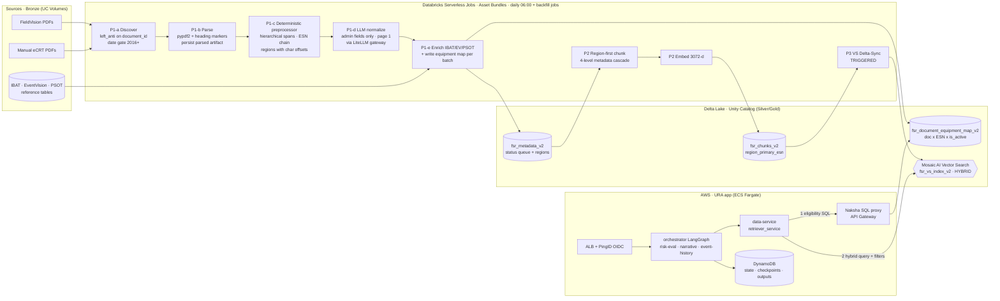
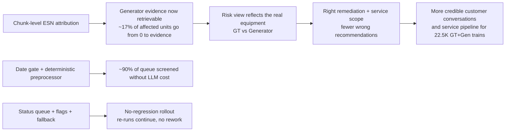

# GE Vernova — FSR v2 RAG Pipeline + URA Retrieval: Architecture Map

> Interview deep dive (Senior SA). One page: the map, then one row per stage with **Why · Alternative · Failure mode · Result**.

## The business problem (30-second version)

The URA risk analyser gives a per-unit (ESN) risk view. The risk view uses Field Service Report (FSR) evidence. That evidence feeds service recommendations and outage planning.

- **Missed evidence:** Generator work was filed under the Gas Turbine ESN about 95% of the time. Only 235 FSRs were tagged to Generator ESNs, while 827 GT-tagged FSRs mentioned generators. A Generator ESN query returned **zero FSRs** for about **17% of affected units**.
- **Wrong label:** Generator content labeled "Gas Turbine" led the LLM to name the wrong equipment and suggest the wrong fix. That hurts trust in front of the customer.
- **Scale:** 50K PDFs in the queue. About 22K are in scope (2016+). 22,579 trains have both a GT and a Generator, so every one of them was exposed.

**North-star decision:** ESN/equipment attribution moved from *document-level* to *chunk-level*, and it is **deterministic** (not LLM-guessed), so the equipment a chunk belongs to is decided locally for each chunk.

---

## The map

---

## Stage by stage

| # | Stage | **Why this choice** | **Alternative considered** | **Failure mode (seen or designed for)** | **Result** |
|---|---|---|---|---|---|
| 0 | **Platform: Databricks serverless + Delta + UC** | Data gravity: PDFs, IBAT, EventVision and PSOT already live in UC. Governance (grants, lineage) comes with it. No clusters to manage. | AWS-native: S3 + Step Functions + Lambda/Glue + OpenSearch. Rejected for this team because it copies governed data out of UC and adds a second security model. | Serverless driver memory and wall clock on big runs. | Runs capped at **5K docs (~17h)** instead of one 7-day run. A re-run *continues* instead of starting over. |
| 1 | **Queue = status columns on the Delta metadata table** (`pending → in_progress → completed/failed`, retry caps) | Idempotent `MERGE`. Backfill and incremental share **one code path**. The audit trail sits next to the data. | SQS or Step Functions state. Rejected: it's a second source of truth that has to be reconciled with the table. | BACKLOG mode starved DISCOVERY: failed docs that had used up their retries kept the backlog mode on. Also, `FORCE_RESET` is one flag away from wiping ~30h of work. | Retry cap plus `metadata_retry_count`. Destructive reset is now a separate job. Running the same work twice gives the same result. |
| 2 | **Date gate before any LLM call** | Cheapest filter comes first. About 90% of the queue is out of scope. | Process everything and filter at query time. That pays LLM + embedding cost on dead data. | Wrong date parse means a doc is wrongly excluded. | Screening **~2,195 docs/hr** vs **~217–359 docs/hr** through the LLM path. **0** pre-2016 violations. |
| 3 | **Parse once, persist the artifact** (pypdf2 + heading-marker injection) | P1 and P2 **must share the same text** because region char offsets are the contract between them. | Re-parse in P2 with a different parser (v1 did this: pdfplumber in P1, PyMuPDF in P2). | Parser drift makes offsets point at the wrong text, so chunks get the wrong ESN. We found this during implementation. | `parsed_volume_path` persisted. P2 loads the same artifact and only falls back to re-parsing when it is missing. |
| 4 | **Deterministic preprocessor owns ESN/equipment** (multi-signal headings → hierarchical spans → local ESN chain: header → parent → single-type → IBAT train → neighbor → doc) | Under 1 s/doc and zero token cost. **Auditable**: every region carries `esn_source`, `esn_confidence`, `fallback_chain`. The LLM cannot make up a serial number. | LLM per section or per page for ESN tagging. Rejected: cost grows with page count (docs run to 600+ pages), results vary run to run, and there's no provenance. | Unnumbered headings (`GENERATOR`) were missed. A flat boundary list had no "flip-back" to the parent section. One ESN per type collapsed same-type multi-unit docs. | Rewrote it as a **section-span hierarchy**. Flip-back comes from the structure, so no special detection is needed. Unresolved ESNs stay empty and are **not** promoted to the doc primary (precision over recall). |
| 5 | **LLM for admin fields only** (customer, event type, FSR #) with preprocessor hints injected as "known facts" | Use the LLM where text is messy and a mistake is cheap. Use deterministic code where a mistake is expensive. Page 1 only, 6K chars. | Full-doc LLM extraction (v1 style). | LiteLLM 5xx or throttling during backfill. LLM output contradicting the preprocessor. | Merge rule: **preprocessor overrides LLM** on overlapping fields. Tiered retry. Concurrency ramps up gradually (3 → 6). |
| 6 | **Equipment map table** (doc × ESN, `is_active`) written **per batch** | Vector filters can't join. A small SQL table answers "which docs mention ESN X, as primary *or* secondary?" | Put `active_esns[]` on every chunk and filter only in VS. That duplicates data and makes "is this doc ready?" hard to answer. | Writing the map at the end of the run left completed docs **without map rows** when a run was interrupted (84% map coverage). Those docs couldn't be found. | Moved to a per-batch `MERGE` with stale-row delete, plus a repair job and an hourly completed-vs-mapped check. |
| 7 | **Region-first chunking + 4-level cascade** (upload < doc < section < **region**) | A chunk never crosses equipment boundaries, so the region's ESN wins. | v1: fixed-size chunks tagged with the doc ESN (fan-out/duplication across ESNs). | Coverage gaps: front matter or a whole doc in one untagged region. | Synthetic gap regions give full coverage. `region_primary_esn` on each chunk. Chunks made for **~89%** of completed docs in QA, with a known backlog in progress. |
| 8 | **Embeddings 3072-d via LiteLLM** | Better recall on dense technical text. The gateway gives central keys, quotas and model swaps. | 1536-d: half the storage and cheaper. Worth an eval before scaling to the full corpus. | Query and index embedding models don't match, which silently ruins ranking. | Model and dimension are recorded on every chunk and are required when creating the index. |
| 9 | **Mosaic AI Vector Search, Delta-Sync, TRIGGERED** | The index follows the Delta table and uses UC permissions. No separate ETL into a vector DB. | Continuous sync costs more and isn't needed for 8–10 new docs/day. The other option was OpenSearch / pgvector. | TRIGGERED doesn't sync on its own, so the index goes stale if P3 is skipped. | Explicit P3 sync step. Stale-index risk goes onto the ops checklist. |
| 10 | **URA retrieval: SQL eligibility gate → HYBRID vector search** | Step 1 (SQL on map + status) only returns docs that are **fully ingested and active** for the ESN, including secondary ESNs. Step 2 filters `region_primary_esn = ESN AND document_id IN (...)`. HYBRID because serials and part numbers are *lexical* while symptoms are *semantic*. | Pure ANN with no gate: half-ingested docs would leak in. Pure keyword search: misses "oil ingress" ≈ "lube contamination". | Eligible doc but zero VS hits: there is **no** second call to the legacy index (by design). Dedup without overfetch can return fewer than `top_k`. | **Filter fidelity 1.0**, **doc recall 0.94** on the probe set, p95 ~1.8–4.2 s. The secondary-ESN path fixes the 17% zero-result units. |
| 11 | **Feature-flagged rollout** (`FSR_MULTI_ESN_APPLIED`, `FSR_LOOKBACK_SET`) with legacy fallback | No regression: if v2 has no docs for an ESN, the legacy index serves it. Flags let us flip back without a redeploy. | Big-bang cutover to the v2 index. | Two paths drift apart. The legacy path lacks the secondary-ESN guarantee. | v2 served where it's ready. Legacy is kept as a safety net until v2 coverage is complete. |
| 12 | **Precomputed issue-prompt embeddings** (catalog table). The Q&A agent embeds live. | The issue catalog is fixed, so the embedding call and its cost drop out of the hot path and results are repeatable. | Embed every request. | The catalog embedding model differs from the index model. A missing catalog row returns empty results. | Deterministic, cheaper retrieval for the risk heatmap. Free-form Q&A still works. |

---

## Tradeoffs I'd defend in the room

| Decision | Gave up | Got | Why it was right *for this problem* |
|---|---|---|---|
| Deterministic ESN attribution over LLM | Some recall on messy layouts | Auditability, zero hallucinated serials, <1 s/doc | A wrong serial is worse than a missing one. The output drives customer-facing recommendations. |
| Precision-first (leave ESN empty instead of guessing) | Unattributed "shared" chunks are hidden | Filter fidelity 1.0 | The eval showed adding shared regions did **not** improve doc recall and lowered filter fidelity to 0.85–0.98, so the change was held back based on data. |
| Two-step retrieval (SQL gate + VS) | One extra round trip | Readiness guarantee + secondary-ESN recall | Readiness has to be *correct*. Half-ingested docs must never show up as evidence. |
| Lakehouse-native over AWS-native data plane | AWS-native services for the data plane | One governance model, no data copies | The data already lives in UC. Moving it adds risk and cost with no clear gain. |
| Flags + legacy fallback | Two paths to run for a while | Zero-regression cutover | Uptime for the business matters more than architecture purity. |

---

## Infrastructure view

| Layer | Component | Notes / hardening |
|---|---|---|
| Ingest compute | Databricks serverless jobs (Asset Bundles, `dev`/`qa`/`prod` targets) | Daily incremental job at 06:00. Separate backfill jobs for P1 and P2 run in parallel (P1 `MERGE`s metadata columns, P2 `UPDATE`s chunk columns, so they don't conflict). DQ validation is a **separate job** so a data-quality failure doesn't turn ingestion red. |
| Storage | UC Volumes (bronze) → Delta Silver `ai_sot_*` → Gold `ai_std_con_*` | Chunk IDs are deterministic (`md5(doc_id+idx)`), so re-ingestion is a `MERGE`, not an append. |
| Retrieval | Mosaic AI Vector Search endpoint `pw-ser-sdg-vector-search` | HYBRID queries. TRIGGERED sync. |
| LLM | LiteLLM gateway | Central keys, quotas and model routing. Ingest and agents share it. |
| App | ECS Fargate services behind ALB with PingID OIDC. nginx routes to data-service and qna-agent. | The orchestrator (LangGraph) runs the risk-eval, narrative and event-history agents. DynamoDB (on-demand) holds execution state and checkpoints. |
| Network | data-service → Databricks through Naksha SQL proxy (API Gateway), plus the VS REST API | **Gaps I'd close:** move the workspace token to Secrets Manager or OAuth M2M, remove `verify=False` from the older VS call path, and switch the readiness SQL from `sql_literal` escaping to bound parameters. |
| Observability | `fsr_run_log` (P1 and P2 per batch), `fsr_data_quality_log` (39+ checks, `failure_category`) | Next: alert on completed docs without map rows, index staleness, and p95 retrieval latency. |

---

## Business value chain

**What I'd say:** "The main result wasn't a better embedding model. It was changing **where attribution happens**. Moving the ESN decision to the chunk made evidence show up for about 1 in 6 affected units that had none. It also stopped the wrong-equipment labels that were hurting trust in customer reviews."

---

## Honest gaps + next moves

1. **Page-level evidence hit is low (≈0.04)**. We get the right doc (0.94 recall) but often not the cited page. Next: re-ranker, overfetch then dedup, and a check on page attribution at chunk boundaries (several misses are off by one page).
2. **Shared regions**: the one-call OR filter is on hold until an eval shows it improves recall.
3. **Re-upload detection**: `file_last_modified` isn't tracked yet, so a PDF overwritten under the same ID keeps stale chunks.
4. **Eval set is small** (8 probes). Grow it with SME-labeled probes before tuning `top_k` or chunk size.

### If I rebuilt it AWS-native
S3 (raw PDFs) → Step Functions (with the status queue kept in DynamoDB or Aurora) → Textract layout plus the same deterministic preprocessor on Lambda/Fargate → Bedrock (Claude for admin fields, Titan/Cohere embeddings) → OpenSearch Serverless hybrid search (or Bedrock Knowledge Bases with metadata filters for a quick start) → Lake Formation for governance. **The design wouldn't change**: region-level attribution, a readiness gate, precision-first filters, and a flagged cutover. Only the services behind it would.
