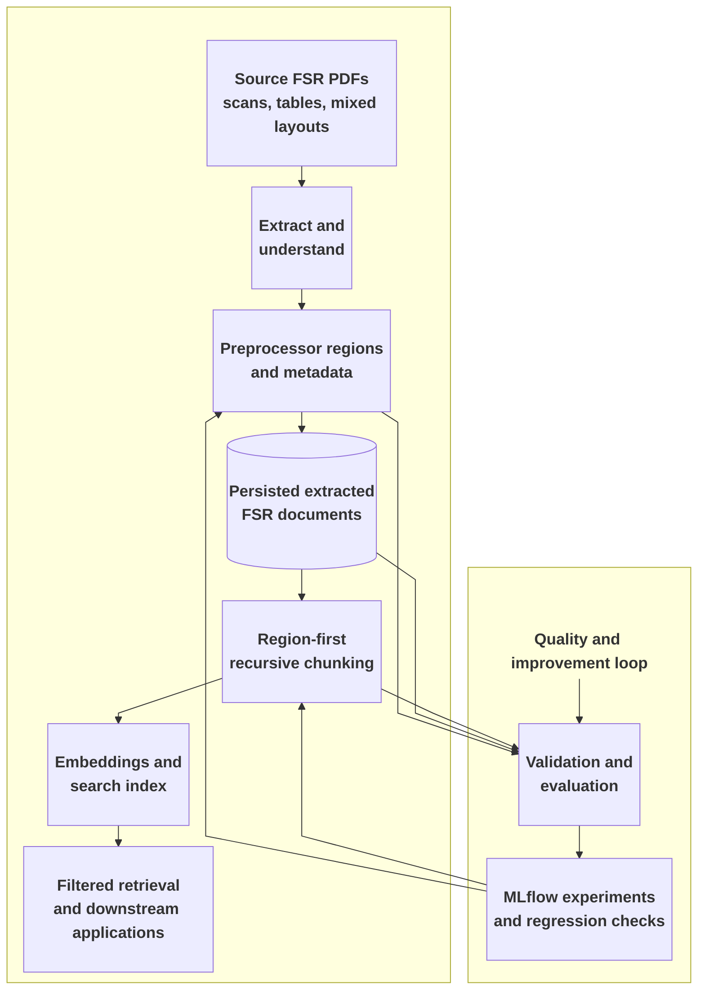

# FSR v2: From Complex Reports to Reusable Engineering Intelligence

## Slide 1 - The challenge: FSR documents are not simple documents

**Subtitle:** Reliable retrieval starts with understanding the structure and meaning of the source.

### The source material

- FSRs are long, heterogeneous documents assembled from many report types, layouts, scans, tables, summaries, and embedded sections.
- A single document may contain multiple equipment types, multiple ESNs, shared sections, and nested subsections.
- Important evidence is not always expressed consistently: the same equipment may appear in a heading, a table, a subsection title, or surrounding context.

### Problems we had to solve

- Section boundaries could be ambiguous, especially around shared sections such as QCP, PIPO, Coupling, and Alignment.
- Table content could be mistaken for a real section header and create an incorrect hierarchy level.
- A generic subsection such as `1 Turbine` could be incorrectly classified as Gas Turbine even when it appeared under a Steam Turbine header.
- Incorrect hierarchy or equipment classification could prevent ESN propagation and attach evidence to the wrong equipment.
- Embedded reports and appendices introduced edge cases that needed explicit scope and continued validation.

### The engineering response

FSR v2 treats preprocessing as a structured interpretation problem, not just text splitting. It separates document understanding, metadata extraction, normalization, and chunking so that each stage can be validated and improved independently.

**Speaker note:**
Use the Steam Turbine / `1 Turbine` example as the concrete story. The issue was not simply a bad label; a hierarchy mistake could create noisy evidence and affect downstream filtering and answers.

---

## Slide 2 - What improved: more accurate, reusable engineering evidence

**Subtitle:** FSR v2 improves evidence quality, preserves document context, and creates a stronger foundation for downstream use.

### More accurate evidence

- The new preprocessor improved QA implementation accuracy from the previous baseline and reduced noisy and missing evidence across validated ESN documents.
- It distinguishes Steam Turbine, Gas Turbine, Generator, and other equipment contexts more reliably.
- Deterministic fixes address difficult hierarchy, section, ESN, and equipment-type cases, and are checked against known regression cases.

### More useful metadata

- Extracted metadata enables stronger filtering and labeling for retrieval and downstream analysis.
- Equipment type, ESN context, section path, source, confidence, and processing status travel with the evidence.
- Preprocessor regions preserve document structure, making chunks more interpretable and easier to validate.

### Reusable extracted documents

- FSR extraction results are persisted instead of discarded after one processing step.
- The same extracted representation is reused by chunking, validation, and future consumers.
- Reuse supports replay and troubleshooting, and avoids reprocessing the original PDF for every downstream capability.

### Measured experimentation and continuous validation

- MLflow experiments and `sdg-evals` help the data science team compare approaches on larger datasets and make informed decisions.
- Validation artifacts turn difficult examples into regression cases, preventing old failures from returning quietly.
- Shared and ambiguous sections remain explicit follow-up work rather than hidden assumptions.

**Speaker note:**
The business value is dependable access to engineering history: faster and more precise filtering, less repeated document processing, more efficient experimentation, and a clearer path from a difficult PDF to trustworthy evidence.

---

## What's next: close the edge cases and validate end to end

- Measure embedded sub-reports, appendix sections, mid-document tables of contents, unnumbered headings, and repeated Generator sections to identify where deterministic rules are sufficient and where LLM assistance is needed.
- Complete the remaining deterministic preprocessor work: subsection flip-back, shared and ambiguous section handling, TOC verification, and IBAT validation of detected ESN equipment types.
- Evaluate LLM parsing and Textract/Databricks AI Parser performance against the same difficult documents.
- Validate that chunking preserves evidence, section paths, and ESN attribution, then check retrieval quality with targeted ESNs and larger retrieval K values.

**Speaker note:**
The next phase is about measuring the edge cases, finishing deterministic guardrails, and validating whether improvements carry through chunking and retrieval.

---

## Slide 3 - Conceptual architecture: one extracted representation, multiple uses

**Subtitle:** A metadata-first flow makes the document understandable, testable, and reusable end to end.

### How the pipeline works

- We identify the document regions and their context before splitting the text into chunks. This helps keep each chunk connected to the right equipment and section.
- The extracted FSR is persisted and reused for chunking, validation, analysis, and future applications, so the original document does not need to be processed again for every use.
- Equipment, ESN, section, and confidence metadata travel with each chunk. This gives downstream retrieval and analysis more useful information to work with.
- We use difficult documents and known bug cases as regression tests, and use evaluation datasets to track quality as the preprocessor changes.
- Deterministic rules handle the cases we understand well. MLflow experiments and model-assisted approaches help us measure and investigate the cases that remain ambiguous.

### Business outcome

A complex FSR becomes a reusable, searchable, and testable engineering asset. That supports faster investigation today and gives future applications a more reliable foundation.

**Speaker note:**
Keep this diagram conceptual. The important story is the progression from raw PDF to structured, persisted, validated evidence, then to multiple uses. Some architecture elements also existed in FSR v1; FSR v2 strengthens the preprocessing, persistence, metadata, and evaluation capabilities.

---

## Optional closing line

> The goal is not only to extract text from FSRs. It is to turn difficult engineering documents into evidence that teams can find, evaluate, reuse, and trust.

## Source notes

- `2-FSR-v2/bug-preprocessor/new-preprocessor-issues/issue`
- `2-FSR-v2/bug-preprocessor/new-preprocessor-issues/Xujin-reply`
- `2-FSR-v2/bug-preprocessor/new-preprocessor-issues/rca-plan.md`
- `2-FSR-v2/bug-preprocessor/redesign/proposed-design-changes.md`
- `2-FSR-v2/demo/demo-scratch-notes`
- `ai-arch/promo/eugene-track/arch-hive-slides-v2.md`
- `FSR/fsr-docs/1.+FSR+Pipeline+-+Scraping+++Chunking+–+Design.doc`
- `sdg-evals`
