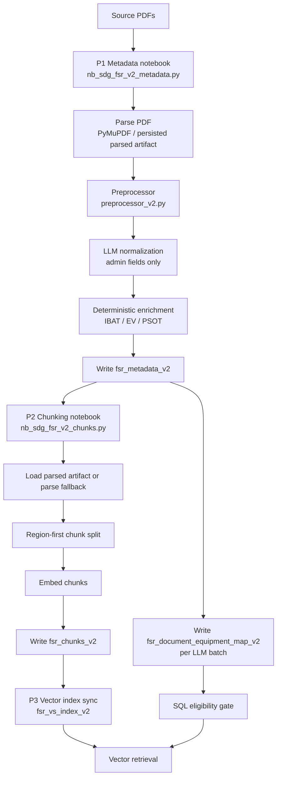

# FSR v2 Design

Last reconciled with code: 2026-09-15

Source of truth reviewed for this update:
- `pw_sdg_ai_ser_repo/common/fsr_v2/preprocessor_v2.py`
- `pw_sdg_ai_ser_repo/silver/src/etl/fsr_v2/metadata_processor.py`
- `pw_sdg_ai_ser_repo/silver/src/etl/nb_sdg_fsr_v2_metadata.py`
- `pw_sdg_ai_ser_repo/gold/src/etl/fsr_v2/chunking.py`
- `pw_sdg_ai_ser_repo/common/fsr_v2/config.py`
- `pw_sdg_ai_ser_repo/tests/fsr_v2/test_preprocessor_v2.py`

This document consolidates the previous design doc and the preprocessor redesign proposal into one place. It separates:
- what is implemented now,
- what changed during implementation,
- what remains as follow-up work.

---

## 1. Why FSR v2 exists

The v2 pipeline fixes the core retrieval failure in multi-equipment FSRs.

In v1, chunk attribution was effectively document-level. That created two bad outcomes:

1. Retrieval miss
   - A user queried a secondary ESN such as a Generator ESN, but the document or chunk was tagged only with the primary GT ESN.

2. Wrong equipment labeling
   - Generator content could be labeled as Gas Turbine because the document-level equipment context leaked across sections.

The v2 fix is to make ESN and equipment attribution region-based and chunk-local, using parser-aligned character offsets.

---

## 2. Current Implemented Architecture

As of the current code, the active v2 flow is:

### 2.1 P1 Metadata extraction

P1 is implemented in `silver/src/etl/nb_sdg_fsr_v2_metadata.py`.

High-level flow:
- discover candidate PDFs,
- parse the PDF text,
- run the deterministic preprocessor,
- run an LLM normalization pass for admin fields only,
- merge deterministic and LLM outputs with the preprocessor as authority,
- enrich from reference tables,
- write one metadata row per document,
- write document-to-equipment map rows per batch.

#### Queue and status contract

The queue contract is still central to the v2 design.

Document processing state is tracked on `fsr_metadata_v2` through:
- `metadata_status`
- `chunk_status`

Expected state values:
- `pending`
- `in_progress`
- `completed`
- `failed`

Expected flow:
- P1 metadata path: `pending -> in_progress -> completed|failed`
- P2 chunk path: `pending -> in_progress -> completed|failed`
- retries may move failed work back to `pending`

Operational rules:
- interrupted or partially processed documents must remain ineligible for retrieval,
- retry and restart behavior must be idempotent,
- error details, retry counts, and processing timestamps should remain part of the operational audit trail.

Important implementation detail:
- `silver/src/etl/fsr_v2/metadata_processor.py` is intentionally thin.
- The real section, span, region, TOC, summary, and ESN resolution logic lives in `common/fsr_v2/preprocessor_v2.py`.

### 2.2 P2 Chunking and embedding

P2 is implemented in `gold/src/etl/nb_sdg_fsr_v2_chunks.py` and `gold/src/etl/fsr_v2/chunking.py`.

High-level flow:
- claim completed metadata docs with pending or failed chunk status,
- load the persisted parsed artifact when available,
- otherwise fall back to PyMuPDF extraction,
- split text region-first using `preprocessor_regions`,
- recursively sub-chunk within each region,
- embed chunk text,
- write one chunk row per chunk with chunk-local ESN and equipment metadata.

This is not just a metadata patch on old chunks. The code now treats parser alignment between P1 and P2 as required for correctness.

### 2.3 P3 Vector index sync

The vector index is built from `fsr_chunks_v2` and stores the chunk embedding plus retrieval fields such as:
- `chunk_id`
- `document_id`
- `chunk_text`
- `primary_esn`
- `primary_equip_type`
- `active_esns`
- `report_date`
- `outage_start_date`
- `metadata`

---

## 3. Current Preprocessor Design

The previous redesign proposal is no longer just a proposal in broad terms. Most of the section-span model is already implemented in `common/fsr_v2/preprocessor_v2.py`.

### 3.1 Deterministic contract

The preprocessor is authoritative for:
- `primary_esn`
- `primary_equip_type`
- `primary_technology_code`
- `gt_esn`
- `gen_esn`
- `st_esn`
- `inactive_esns`
- `all_esns`
- outage and report dates
- `document_name`
- per-region attribution metadata

The LLM is not used to invent ESN or equipment attribution.

### 3.2 Section and heading detection

The active implementation collects heading candidates from multiple signals:
- `HEADER`
  - equipment header with ESN or SY context
  - highest confidence
  - treated as equipment block root
- `SECTION_HDR`
  - numbered equipment section headings
- `SUBSEC`
  - numbered subsections and keyword-based subsection patterns
- `UNNUMBERED`
  - bare all-caps equipment headings such as `GAS TURBINE` or `GENERATOR`
- `TOC`
  - table-of-contents seeded candidates and summary hints

This means the bug-3 style failure from numbered-only detection is already addressed in the current code and tests.

### 3.3 Hierarchical spans and flip-back behavior

The active code builds hierarchical `SectionSpan` objects before emitting final regions.

The effective model is:
- equipment-block root spans,
- numbered root sections,
- nested subsections,
- explicit end offsets based on following headings,
- parent-child structure used for context restoration.

That parent-child structure is what gives the system the flip-back behavior. When a child subsection ends, the next sibling or parent context resumes naturally instead of permanently leaking the child equipment context into the rest of the document.

### 3.4 ESN resolution order

The current implementation resolves ESN per span using a local-first deterministic chain. The code-level order is:

1. local header ESN
2. parent inheritance
3. single active ESN for the equipment type
4. IBAT train-scoped fallback
5. neighbor-gap fallback
6. document primary fallback
7. unresolved

Provenance is preserved in region metadata through fields such as:
- `esn_confidence`
- `esn_source`
- `equip_type_source`
- `fallback_chain`

This is more advanced than the older design doc, which still described only simple region overrides.

### 3.5 TOC and raw page usage

The active preprocessor uses both normalized page text and raw page text.

Current behavior:
- `raw_pages` is passed through the preprocess context,
- TOC entries are extracted from the first pages,
- TOC anchors help validate section candidates,
- page-aware fallback rescans raw pages when full-text formatting loses useful line breaks,
- document summary is emitted inside the preprocessor itself.

This means the earlier redesign goal of moving summary generation and TOC logic into the preprocessor has already been realized.

### 3.6 Region materialization and full coverage

The current implementation emits contiguous char-offset regions with metadata.

Key properties:
- regions are parser-aligned to the same text representation used by chunking,
- front matter, gaps, and trailing areas can be covered by synthetic regions,
- each region carries its own attribution metadata,
- region metadata includes section path and provenance fields,
- inactive ESNs are tracked and later excluded from `active_esns` in P2.

Representative region metadata fields now include:
- `primary_esn`
- `primary_equip_type`
- `primary_technology_code`
- `esn_confidence`
- `esn_source`
- `equip_type_source`
- `region_source`
- `section_path`
- `fallback_chain`

---

## 4. Data Assets and Contracts

### 4.1 `fsr_metadata_v2`

Document-level source of truth.

Important columns:
- `document_id`
- `pdf_name`
- `title`
- `primary_esn`
- `primary_equip_type`
- `primary_technology_code`
- `gt_esn`
- `gen_esn`
- `st_esn`
- `all_esns`
- `inactive_esns`
- `preprocessor_regions`
- `metadata_status`
- `chunk_status`
- `parsed_volume_path`

Notes:
- `preprocessor_regions` is stored as a JSON string and is the P1 to P2 attribution contract.
- `inactive_esns` is stored as a JSON array string.
- `pdf_name` is derived from merged metadata, with filename fallback.
- queue eligibility depends on the status fields, not just data presence in the row.

### 4.2 `fsr_document_equipment_map_v2`

Helper table used for document eligibility and ESN lookup.

Important columns:
- `document_id`
- `esn`
- `equip_type`
- `technology_code`
- `is_primary_esn`
- `is_active`
- `source_region_count`

Current write behavior:
- built from in-memory region data plus doc-level fallbacks,
- written per LLM batch, not at notebook end,
- stale rows for the batch documents are deleted during MERGE.

This changed because end-of-run materialization was leaving completed metadata rows without map rows when a run was interrupted.

### 4.3 `fsr_chunks_v2`

Chunk-level retrieval dataset.

Important columns:
- `chunk_id`
- `chunk_index`
- `document_id`
- `pdf_name`
- `page_number`
- `chunk_text`
- `region_primary_esn`
- `region_primary_equip_type`
- `active_esns`
- `report_date`
- `outage_start_date`
- `chunk_embedding`
- `embedding_dimension`
- `metadata`

The JSON `metadata` payload uses contract version:
- `fsr_v2_chunk_metadata_v2`

Current structure:
- `doc`
- `region`
- `section`
- `chunk_context`

### 4.4 `fsr_vs_index_v2`

Vector search index synced from chunks.

This is the final retrieval surface for chunk similarity search after SQL gating has already narrowed the candidate document set.

---

## 5. Chunk Attribution Design in P2

The chunk merge model in the current code is a four-level cascade.

Priority order:

1. upload metadata
2. document metadata
3. section metadata
4. region metadata

Later layers override earlier ones.

The highest-priority layer is always the best-matching preprocessor region.

### 5.1 Region-first split

Current chunking behavior:
- fill coverage gaps if needed,
- split the document by preprocessor regions first,
- recursively sub-split within each region to meet chunk-size targets,
- preserve absolute char offsets when emitting chunks.

This avoids the old v1 fan-out problem where one chunk could be duplicated across ESNs regardless of its local content.

### 5.2 Region attribution method knob

Two attribution methods are wired:
- `char_offset_max_overlap`
- `char_offset_start_char`

Default is `char_offset_max_overlap`.

### 5.3 Active ESN computation

`active_esns` is built from:
- region ESNs,
- document-level ESNs,
- minus the `inactive_esns` set.

That field is stored as an array on the chunk row to support downstream filtering.

---

## 6. Retrieval Behavior

### 6.1 Document eligibility gate

Document eligibility uses the equipment map plus metadata status fields.

The intended constraints are:
- requested ESN must exist in `fsr_document_equipment_map_v2`,
- `is_active = true`,
- `metadata_status = 'completed'`,
- `chunk_status = 'completed'`,
- outage date recency filters still apply.

This is how a secondary ESN on the same FSR becomes discoverable even when it is not the document primary ESN.

Documents left in `pending`, `in_progress`, or `failed` are not retrieval-eligible, even if some intermediate artifacts already exist.

### 6.2 Vector retrieval

Vector retrieval then queries the chunk index using chunk-local metadata, especially:
- `primary_esn`
- `primary_equip_type`

The intended high-precision path is to retrieve chunks whose local attribution matches the requested ESN. Fallback behavior can still use document eligibility plus unattributed chunks where needed, but the main v2 correctness path is chunk-local attribution.

---

## 7. Runtime Knobs Confirmed in Code

### 7.1 P1 metadata knobs

Confirmed in the metadata notebook and workflow config:
- `INPUT_MODE`
- `FSR_V2_PARSER_VERSION`
- `FSR_V2_METADATA_PROCESSOR_VERSION`
- `FSR_LLM_MODEL`
- `FSR_V2_P1_WORKERS`
- `FSR_V2_P1_MAX_RETRIES`
- `FSR_V2_P1_LLM_BATCH_SIZE`
- `FSR_V2_P1_SLICE_SIZE`
- `FSR_V2_P1_MAX_DOCS`
- `FSR_V2_P1_MAX_RUNTIME_MINUTES`
- `FSR_V2_DQ_LOW_TEXT_MIN_PAGES`
- `FSR_V2_DQ_LOW_TEXT_CHARS_PER_PAGE`
- `FSR_IBAT_TABLE`
- `FSR_EVENT_VISION_TABLE`
- `FSR_PSOT_TABLE`
- `FSR_PARSED_DOC_VOLUME_ROOT`

### 7.2 P2 chunking knobs

Confirmed in the chunking notebook and module:
- `FSR_CHUNK_SIZE`
- `FSR_CHUNK_OVERLAP`
- `FSR_MIN_CHUNK_SIZE`
- `FSR_P2_BATCH_SIZE`
- `FSR_P2_MAX_RETRIES`
- `FSR_P2_MAX_ITERATIONS`
- `FSR_EMBEDDING_MODEL`
- `FSR_EMBED_BATCH_SIZE`
- `FSR_P2_EMBED_CONCURRENCY`
- `FSR_EMBED_FAIL_THRESHOLD`
- `FSR_STALE_CLAIM_MINUTES`
- `FSR_MERGE_STRATEGY`
- `FSR_REGION_ATTRIBUTION_METHOD`
- `FSR_EMBEDDING_DIMENSION`

---

## 8. What From the Redesign Proposal Is Already Implemented

The earlier `proposed-design-changes.md` described a deterministic redesign. Most of its core ideas are already in production code.

Implemented now:
- unnumbered equipment heading detection,
- hierarchical span building,
- parent-context restoration and flip-back behavior,
- local-first ESN resolution,
- type-constrained IBAT fallback,
- TOC-assisted candidate validation,
- raw-page-aware fallback scanning,
- provenance metadata on regions,
- document summary emission from the preprocessor,
- metadata-processor thin adapter pattern,
- region-first chunking,
- per-batch equipment-map writes.

This means the design doc should no longer describe those items as future state.

---

## 9. Remaining Follow-up Work

The redesign proposal still contains a few useful follow-ups that are not fully closed in the active pipeline.

### 9.1 Remaining open items

1. Embedding dimension guardrail
   - Dimension is stored per chunk, but stronger fail-fast validation can still be tightened.

2. Re-ingestion conflict handling beyond normal MERGE semantics
   - Current behavior handles rewrites through MERGE and batch cleanup, but there is no special conflict-policy layer beyond that.

3. Additional appendix-heavy TOC patterns
   - Core TOC support exists, but more appendix and mixed-TOC heuristics may still help specific docs.

4. Explicit downstream handling for unresolved regions
   - The preprocessor already marks low-confidence and unresolved attribution; downstream consumers can make more systematic use of that signal.

5. Exciter-specific metadata separation
   - If downstream logic needs Generator and Exciter to stay separate at top-level metadata, add a dedicated `exciter_esn` contract instead of using a shared bucket.

### 9.2 Non-goals for deterministic preprocessing

The preprocessor should still not guess an ESN when the evidence is ambiguous.

Cases that may remain unresolved without later enrichment:
- no local ESN and multiple valid candidates of the same type,
- second same-type ESN never surfaced in document text,
- text with too little equipment evidence to support deterministic attribution.

Those cases should stay explicit through confidence and provenance metadata rather than being silently forced.

---

## 10. Implementation Notes That Changed the Original Rollout Plan

The earlier rollout idea assumed:
- metadata-only fixes could be enough as an immediate phase,
- parser alignment and re-chunking could wait.

Implementation proved otherwise.

What the code now reflects:
- `preprocessor_regions` are defined in the P1 text coordinate space,
- chunk attribution is only trustworthy when P2 uses the same parse representation,
- therefore parser-aligned chunking and embedding are part of the actual v2 correctness path, not a later optional cleanup.

This is the main reason the current implementation moved from a document-metadata patch plan to a full parser-aligned chunking design.

---

## 11. Validation Anchors

The active unit-test suite already covers several of the redesign goals.

Examples confirmed in `tests/fsr_v2/test_preprocessor_v2.py`:
- unnumbered equipment heading detection,
- hierarchy end-offset handling,
- flip-back behavior,
- generator-vs-turbine subsection typing,
- doc-inventory-assisted typing when explicit header context is missing,
- thin-adapter behavior for `metadata_processor.py`.

For any future preprocessor change, these are the minimum invariants to preserve:
- region boundaries remain parser-aligned,
- parent context restores correctly after child subsections,
- same-type multi-ESN docs do not collapse to one global ESN anchor,
- unresolved spans remain explicit instead of guessed,
- chunk-local attribution remains the retrieval-facing contract.

---

## 12. Summary

FSR v2 is now a deterministic, parser-aligned, region-first ingestion design.

The most important current truths are:
- the real preprocessor logic lives in `common/fsr_v2/preprocessor_v2.py`,
- P1 writes both metadata and equipment-map rows as part of the durable pipeline,
- P2 uses region-first chunking and chunk-local attribution,
- the redesign proposal has been substantially implemented already,
- remaining work is mostly guardrails and follow-up refinement, not a new architectural rewrite.
