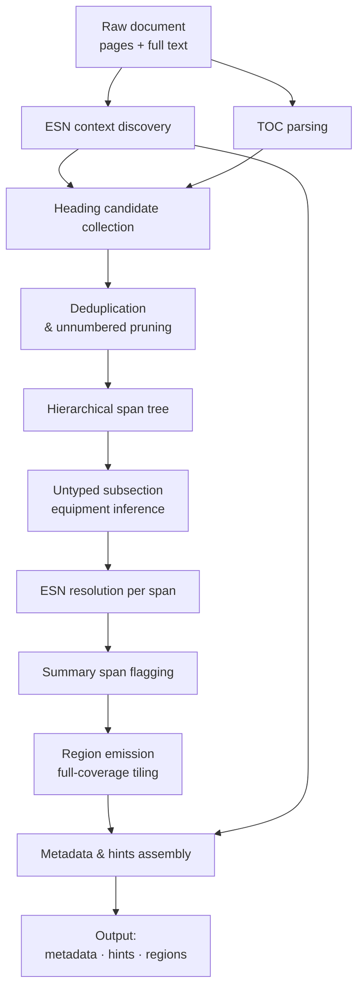
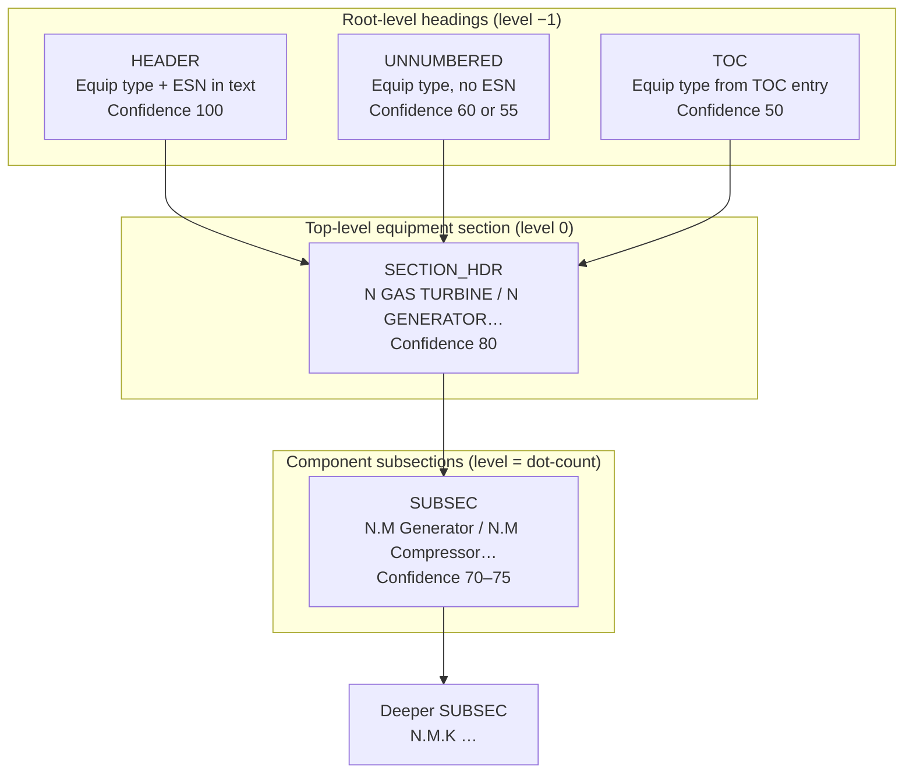

# FSR Preprocessor v2 — Rule Catalog

*Audience: FSR reviewers and QA who know the documents cold but do not write code.*
*Describes the preprocessor as it exists today. All rules are descriptive, not prescriptive.*

---

## Glossary

| Term | Meaning |
|---|---|
| **HEADER** | The most authoritative heading form: `EQUIPMENT TYPE (ESN \| SY-number)`. Carries the ESN directly in its own text. Example: `GENERATOR (337X766 \| SY0072576)`. |
| **SECTION_HDR** | A numbered equipment section heading with no inline ESN. Example: `2 GAS TURBINE`. The number is a single integer (no dots). |
| **SUBSEC** | Any heading whose section number contains at least one dot (e.g., `2.3 Generator` or `2.3.1 Compressor`). May be typed (equipment type clear from its own text) or untyped (type inferred later). |
| **UNNUMBERED** | An equipment heading with no section number at all. Either a bare line (`GAS TURBINE`) or a titled line (`Generator Section`, `Gas Turbine Report`). |
| **TOC anchor** | An equipment type (Gas Turbine, Generator, Steam Turbine, Exciter) that appears at least once in the parsed table of contents. Used as a gate to accept or reject heading candidates. |
| **TOC entry** | One row parsed from the table of contents: a title string paired with a page number. |
| **section path** | The ordered list of heading texts from the document root down to a given section. Used to show the full chain of context for a region. |
| **primary ESN** | The Equipment Serial Number (e.g., `337X766` or `GG10675`) that accounts for the largest share of covered text in the document. |
| **primary equipment type** | The equipment category (Gas Turbine, Generator, Steam Turbine, Exciter) with the most covered text. If two types tie, the document is labeled "shared". |
| **technology code** | A model-line identifier extracted from the title area (e.g., `7FA`, `7H2`, `7FH2`). |
| **active ESN** | An ESN for which work was actually performed this outage. Inferred by excluding any ESN that appears on a page explicitly marked "not applicable" or "no work performed". |
| **inactive ESN** | An ESN present on the title page but explicitly excluded from the current outage scope. Regions are never attributed to inactive ESNs. |
| **broad ESN pool** | The union of all ESNs found by named patterns plus any ESN-format token that appears three or more times in the full document text. Used as a filter during IBAT resolution. |
| **confidence level** | How certain the preprocessor is about an ESN assignment. Four levels in descending order: `highest`, `high`, `low`, `none`. |
| **ESN source** | Where the ESN attribution came from. Possible values: `local_header`, `parent_inherit`, `single_type`, `ibat_train`, `neighbor_gap`, `doc_primary`, `none`. |
| **region** | A contiguous character slice of the document tagged with equipment type, ESN, confidence, source, section path, and region origin. Regions tile the full document with no gaps. |
| **FRONT_MATTER** | The synthetic region covering document text before the first attributable section span (title page, TOC, introduction). |
| **GAP_FALLBACK** | A synthetic region filling a slice of text not covered by any resolved section span. |
| **TRAILING** | The synthetic region after the last attributable section span. |
| **SYNTHETIC** | A catch-all region covering the entire document when no attributable spans were found at all. |
| **parent chain** | The sequence of section spans from a given span up to the document root, following `parent_idx` links. Used for ESN inheritance and section-path construction. |
| **level conflict** | A flag set on a section span when its expected parent level is missing from the heading tree (e.g., section 3.1 appears without a prior section 3 heading). |
| **IBAT resolver** | An external service called to disambiguate an ESN when local, parent, and single-type resolution all fail. It receives equipment type and context and returns a ranked candidate list. |

---

## Overview

The preprocessor transforms a raw FSR document into three outputs:

| Output | What it contains |
|---|---|
| **Document metadata** | Primary ESN, primary equipment type, technology code, per-type ESN lists, outage dates, report date, and an executive-summary excerpt. |
| **Hints** | A plain-text block for downstream LLMs listing active/inactive equipment, section ESN confidence distribution, hierarchy conflict count, and primary equipment inference result. |
| **Regions** | A list of non-overlapping, fully-covering character slices, each tagged with the equipment type, ESN, confidence, section path, and how the boundary/ESN was determined. |

---

## Processing Flow

### Raw document → headings → sections → regions

### Heading-type hierarchy

---

## 1 — Heading Detection

The preprocessor makes five separate passes over the document text, one per heading type. Every pass applies a common front-matter guard before accepting any candidate.

### 1.1 Front-matter guard

Any heading whose position falls within the first 2% of the document's total character length (capped at 5,000 characters) is silently discarded. This prevents table-of-contents lines and introductory page fragments from being treated as structural headings. The cap ensures the guard does not reach into legitimate body sections of very long documents.

### 1.2 HEADER (confidence 100)

Recognizes lines of the form `EQUIPMENT TYPE (ESN | SY-number)`. Equipment types accepted: Gas Turbine, Generator, Steam Turbine, Exciter. The ESN is captured directly from the heading text.

- HEADER candidates are collected from the entire document, not page by page.
- The front-matter guard does **not** apply to HEADERs (they pass regardless of position).
- A HEADER always sets `level = −1`, making it a root in the heading tree.
- If the same ESN appears as both Gas Turbine and Generator across multiple HEADER lines, the type from the first match that set it wins; subsequent matches for the same ESN only update the type if it was previously "Unknown".

### 1.3 UNNUMBERED (confidence 60 for bare, 55 for titled)

Two variants are recognized:

**Bare equipment headings** — a line containing only the equipment name (`GAS TURBINE`, `GENERATOR`, `STEAM TURBINE`, or `EXCITER`) with nothing else on that line.

**Titled equipment headings** — a line beginning with the equipment name followed by a qualifying word such as "Section", "Report", or "Inspection" (e.g., `Generator Section`, `Gas Turbine Report`).

Both variants carry `level = −1` and no inline ESN.

**TOC gate for UNNUMBERED candidates.** When the table of contents parses to at least 5 entries, the equipment type must appear as a TOC anchor for the candidate to be accepted. If the equipment type is not in the TOC, the candidate is rejected — unless the heading line itself contains an explicit ESN or SY-number marker, in which case it is accepted regardless.

**Suppression of redundant UNNUMBERED candidates.** After the full candidate list is assembled, any UNNUMBERED heading for a given equipment type is dropped if a numbered heading of the same type (SECTION_HDR or SUBSEC) already appeared within the previous 5,000 characters, and the unnumbered line does not carry an explicit ESN or SY-number marker. This removes OCR and formatting artifacts (standalone equipment-name lines that appear as page headers or carry-over text) without silencing genuine new-section boundaries.

### 1.4 SECTION_HDR (confidence 80)

Recognizes lines of the form `N EQUIPMENT TYPE` where N is a single integer. Accepted equipment labels: Gas Turbine, Generator, Steam Turbine, Exciter, and the bare word "Turbine".

**TOC cross-check.** When the table of contents has at least 5 entries, the equipment label must appear as a TOC anchor. The bare label "Turbine" passes if Gas Turbine or Steam Turbine is a TOC anchor.

**Bare "Turbine" disambiguation.** When the heading says only `N Turbine` (not `N Gas Turbine` or `N Steam Turbine`), the preprocessor looks backwards through previously collected candidates for the nearest Gas Turbine or Steam Turbine heading. If one is found, the bare heading inherits that equipment type. If none is found, the document's active ESN inventory is consulted: if exactly one turbine type has active ESNs, that type is assigned. If neither approach resolves the type, the heading is accepted with no equipment type and the type is left for later inference.

**Page-aware fallback for SECTION_HDR.** Some PDF extraction tools join pages without a line break, which prevents line-start anchoring from matching headings at page boundaries. A second pass scans each page's text individually and calculates the heading's absolute character position from the page's known offset in the full document. Candidates found this way are subject to the same TOC cross-check and disambiguation rules.

SECTION_HDR sets `level = 0`.

### 1.5 SUBSEC (confidence 70–75)

Any heading whose section number contains at least one dot (e.g., `2.3`, `2.3.1`). Section numbers are validated: each component must be at most two digits, and all components must be numeric. Five typed sub-passes are run:

**Generator subsections (confidence 75).** Lines beginning with a dotted section number followed by the word "Generator". Strongly typed to Generator.

**Generator keyword subsections (confidence 74).** Lines beginning with a dotted section number followed by "Electrical", "Electrification", or "DC Leakage". These are accepted as Generator subsections only when the root section number (the part before the first dot) has already been established as a Generator section by a prior SECTION_HDR. Without that anchor, the candidate is dropped.

**Turbine subsections (confidence 75).** Lines beginning with a dotted section number followed by the word "Turbine". Equipment type is left unset at collection time; it is resolved later during untyped inference.

**Gas Turbine subsections (confidence 75).** Lines beginning with a dotted section number followed by "Compressor", "Combustion", or "Inlet". Strongly typed to Gas Turbine.

**Generic subsections (confidence 70).** Any line matching `N.M Title-text` that was not caught by the typed sub-passes above. Subject to multiple guardrails before being accepted:

- Must match the TOC (when ≥ 5 entries). A candidate matches if its section number and at least one non-trivial word from its title align with a TOC entry on the same numbered branch.
- Must not be a low-confidence metric or table row. Lines that are all digits, contain no alphabetic characters, have four or more digits outnumbering letters in short phrases, or are long metric-like lines with units (ohm, psi, rpm, Hz, amp, volt, kV, MW) are rejected.
- Must have a typed context. The nearest preceding HEADER or SECTION_HDR with an equipment type defines the active context. If no typed context exists, the candidate is dropped.
- When the typed context is Generator, the candidate title must begin with a turbine- or rotor-related word (rotor, turbine, compressor, combustion, inlet, hot gas, exhaust, bearing) to be accepted. Plain titles under a Generator context are dropped.
- The root section number must already contain at least one explicit Generator subsection heading before this position.
- Equipment-prefix titles (e.g., lines starting with "Generator", "Gas Turbine", "Compressor") are dropped because those are handled by the typed sub-passes.
- Duplicate (section number, title) pairs are collapsed to one candidate.

### 1.6 TOC candidates (confidence 50)

After the heading passes, the preprocessor adds one candidate per TOC entry that mentions an equipment type (Generator, Gas Turbine, Steam Turbine). The candidate is located in the document body using the TOC's page hint: the preprocessor searches within an 8,000-character window around the expected character offset for that page. If no match is found in the window, a full-document search is performed as a fallback. If neither finds the text, no candidate is created for that entry.

TOC candidates that mention "section" are assigned `level = 0`; all others get `level = −1`.

### 1.7 Deduplication

After all passes, any two candidates whose starting positions are within 3 characters of each other are collapsed to one. The one with the higher confidence rank survives. If both are equal, the one found first is kept.

---

## 2 — Equipment Attribution (Hierarchical Spans)

### 2.1 Building the span tree

The de-duplicated, pruned heading candidates are sorted by position and processed in order using a stack that tracks open "ancestor" spans.

- **Level −1 headings** (HEADER, UNNUMBERED, TOC) are always root spans. They pop all open spans from the stack before being pushed.
- **Level 0 headings** (SECTION_HDR) attach under the most recent level −1 ancestor.
- **Level ≥ 1 headings** (SUBSEC) attach under the most recent span whose level is exactly one less.

**Level-conflict handling.** When the expected parent level is absent from the open stack, the preprocessor sets `level_conflict = true` on the span and searches for the best available parent using this priority:

1. The nearest open ancestor at a strictly lower level whose section root (the integer before the first dot) matches the current heading's root.
2. If none, the nearest open HEADER or UNNUMBERED ancestor with a known equipment type.
3. If neither, the span is attached with no parent.

**Root mismatch.** Even when the stack attachment would succeed normally, the preprocessor checks that the candidate's section root matches its would-be parent's section root. If they differ (e.g., section 3.1 being attached under a 2.x branch because section 3 is missing), the same level-conflict logic fires.

### 2.2 Span end offsets

Each span's end position is the starting position of the next span at the same or a higher level in the tree. The last span in its subtree extends to the end of the document.

### 2.3 Untyped subsection inference

After the tree is built, SUBSEC spans that still have no equipment type assigned are resolved by looking backwards within the same document segment:

1. Find the nearest HEADER that precedes this span — it marks the start of the current equipment segment.
2. Within that segment, find the nearest prior span sharing the same section root and carrying a known equipment type. That type is inherited.
3. If no same-root typed predecessor exists within the segment, the span's explicit parent (if any) provides the type, provided the parent's root matches.

If neither step produces a type, the span remains untyped and is excluded from region emission.

### 2.4 Summary flagging

Spans whose heading text matches "executive summary", "inspection summary", or "summary" (case-insensitive) are flagged as summary spans. The TOC entry list is also consulted: if a TOC entry matches one of those patterns, all body spans whose heading text substantially overlaps that TOC title are also flagged. Summary span text is later extracted as the `document_summary` metadata field.

---

## 3 — ESN Resolution

### 3.1 ESN context discovery

Before heading collection begins, the preprocessor scans the document to build an inventory of every ESN present and what equipment type it belongs to.

**HEADER scan (full document).** Every HEADER-pattern occurrence in the full document contributes an ESN and its equipment type.

**Title-area label scan.** The first six pages (or the first 8,000 characters of full text if pages are unavailable) are scanned for:
- Gas Turbine serial number labels (e.g., "Gas Turbine ESN:", "Gas Turbine Serial No.", "Associated Turbine:")
- Generator serial number labels (e.g., "Generator ESN:", "Generator #", "Generator Number")
- Steam Turbine serial number labels
- Generic equipment serial number labels (e.g., "Equipment Serial #:", "ESN:")

When a generic label matches an ESN that contains an alphabetic character in the middle, it is typed as Generator; otherwise as Gas Turbine.

**Two-line Equipment ID / Equipment SN pattern.** Some embedded Generator reports list the SY-number on one line and the GG-format ESN on the following line without using the standard combined `GG | SY` format. This two-line pair is recognized and the GG-format number is typed as Generator.

**Inactive ESN detection.** After all ESNs are collected, each page is scanned for "not applicable" language (phrases such as "this equipment is not applicable", "not applicable for this outage", "no work performed on this unit", "not included in scope"). Any ESN that appears on such a page is marked inactive. Inactive ESNs are excluded from all ESN assignment steps and regions.

**Broad ESN pool.** Every recognized ESN is added to the broad pool. Additionally, any token in the full document that matches the ESN format and appears three or more times is added to the broad pool. The broad pool is used as a filter during IBAT resolution.

### 3.2 Per-span ESN resolution

Spans are processed in document order. For each span, the following steps are tried in sequence:

#### Step 1 — Local header (confidence: highest)

If the heading text itself contains an ESN (only possible for HEADER-type spans), and that ESN is either active or the active set is empty, the ESN is assigned immediately with `local_header` provenance.

#### Step 2 — Parent inheritance (confidence: high)

If the span's parent has an already-resolved ESN and both spans share the same equipment type, the ESN is inherited from the parent with `parent_inherit` provenance.

#### Step 3 — Single-type deterministic assignment (confidence: high)

If exactly one active ESN exists for the span's equipment type, it is assigned with `single_type` provenance. This applies regardless of document position.

#### Step 4 — IBAT resolver (confidence: low)

When the previous steps all fail, an external IBAT resolver is called with the equipment type and a context package that includes the active ESN list, the broad ESN pool, and the most recently resolved turbine ESN. The resolver returns a ranked list of candidate ESNs. The preprocessor filters that list against the broad pool first; if exactly one candidate survives the filter, it is assigned with `ibat_train` provenance. If the filtering produces zero or more than one survivor, no ESN is assigned at this step. This step is silently skipped when no resolver is provided.

#### Step 5 — Recent same-type context recovery (confidence: low)

If steps 1–4 all fail, the preprocessor looks at the most recently resolved ESN for the same equipment type in the current document pass. If the distance between that prior resolution and the current span is no more than 45,000 characters, the prior ESN is re-used with `parent_inherit` provenance. Spans farther than 45,000 characters from the last known context receive no ESN, preserving a clear signal that attribution is uncertain.

#### Step 6 — Untyped span fallback

If the span has no equipment type, but its parent has a resolved ESN, the span inherits both the parent's ESN and equipment type with `parent_inherit` provenance. If the parent has no resolved ESN either, the span is left with no ESN and `none` confidence.

**Bare "Turbine" spans.** Before per-span ESN resolution begins, any span whose heading says only `N Turbine` (without specifying Gas or Steam) has its equipment type resolved. The nearest explicit Gas Turbine or Steam Turbine ancestor is consulted first. If none exists, the document's active equipment inventory is checked: if exactly one turbine type has active ESNs, that type is assigned. Spans that remain untyped after this pre-pass are excluded from ESN resolution.

**Turbine ESN tracking.** The most recently resolved Gas Turbine or Steam Turbine ESN is tracked across the span pass and passed to the IBAT resolver as context. This assists disambiguation when a document covers multiple turbine units.

---

## 4 — Region Emission

### 4.1 Full-coverage tiling

The preprocessor tiles the entire document with non-overlapping regions that collectively cover every character from position 0 to the end of the document.

Only **informative spans** participate in tiling — that is, spans with a known equipment type or a resolved ESN whose character range is non-empty.

**When no informative spans exist**, the entire document becomes a single SYNTHETIC region with no ESN, no equipment type, and `none` confidence.

**When informative spans exist**, all span start and end positions are collected into a sorted boundary set (always including 0 and the document end). Each consecutive pair of boundaries defines an atomic slice. For each slice:

- If one or more informative spans cover the entire slice, the **deepest** (highest level) covering span is chosen. When multiple spans share the same maximum level, the one that starts latest is preferred.
- If the slice is before any informative span (i.e., document start to the first span), it becomes a **FRONT_MATTER** region: no ESN, no equipment type, `none` confidence.
- If the slice falls between spans with no covering informative span, it becomes a **GAP_FALLBACK** region. Its ESN is inferred from the adjacent regions (see §4.2).

After tiling, adjacent regions with identical metadata are merged into one. The first region that begins at position 0 is relabeled FRONT_MATTER; the last region that ends at the document end is relabeled TRAILING.

### 4.2 Gap ESN inference

GAP_FALLBACK regions are attributed using the regions immediately to their left and right (the nearest resolved neighbors):

| Left neighbor ESN | Right neighbor ESN | Gap ESN | Equipment type |
|---|---|---|---|
| Same as right | Same as left | Inherited from both (consensus) | Left or right type (whichever is known) |
| Different from right | Different from left | Left ESN chosen (deterministic tie-break) | Left or right type (whichever is known) |
| Present | Absent | Left ESN | Left type |
| Absent | Present | Right ESN | Right type |
| Absent | Absent | None | Consensus type or "shared" |

In all gap cases, ESN confidence is `low` and source is `neighbor_gap`.

**Gap size guard.** When a gap slice is more than 2,000 characters long and neither neighbor has an ESN, the region is labeled "shared" with no ESN rather than attempting equipment-type inference. Gaps longer than 2,000 characters where one neighbor has an ESN still receive that ESN with `low` confidence.

### 4.3 Section path

Every region carries a section path: the sequence of heading texts from the document root down to the span that governs the region. The path is capped at 5 entries (root first, most specific last). This path is the primary way a reviewer can verify which part of the FSR a region belongs to.

---

## 5 — Document Metadata Assembly

The following fields are produced if the calling context requests them:

| Field | How it is derived |
|---|---|
| `document_name` | Taken directly from the file name. |
| `gt_esn` | First active Gas Turbine ESN (alphabetical). |
| `gen_esn` | First active Generator or Exciter ESN (alphabetical). |
| `st_esn` | First active Steam Turbine ESN (alphabetical). |
| `all_esns` | All ESNs found in the document (active and inactive), comma-separated. |
| `inactive_esns` | ESNs found but excluded from the current outage scope. |
| `primary_esn` | ESN whose spans account for the most cumulative character coverage. |
| `primary_equip_type` | Equipment type with the most covered characters; "shared" when two types tie. |
| `primary_technology_code` | Model-line identifier (e.g., `7FA`, `7H2`, `7FH2`) extracted from the title area. |
| `outage_start_date` | Extracted from title area via start-date label patterns. |
| `outage_end_date` | Extracted from title area via end/completion-date label patterns. |
| `report_issued_date` | Extracted from title area via issued/approved-date label patterns. |
| `document_summary` | Text of all spans flagged as summary spans; falls back to page-range extraction if no spans matched. |

Date values are cleaned: trailing punctuation is stripped, and the value is truncated at the first occurrence of noise tokens (long whitespace, or words like "Oracle", "Prepared", "Approved", "Equipment", "Report", "Contents", "Generator", "Gas Turbine", "Job").

---

## 6 — Hints Output

The hints string contains, on separate lines:

- A list of active ESNs with their equipment types, prefixed "Active equipment (work performed):".
- A list of inactive ESNs prefixed "Inactive equipment (listed on title page but NOT applicable this outage):" with an explicit instruction not to attribute content to them.
- ESN confidence distribution across all section spans (count per confidence level).
- Count of section spans flagged with a level conflict.
- The primary equipment type and primary ESN inference result.
- An instruction to extract outage start/end dates, report issued date, and event type from the title page if those fields were not already provided.

---

## Key Limits and Conditions

The following conditions affect which rules fire. They are stated as operational facts, not as quality assessments.

| Condition | Effect |
|---|---|
| TOC parses to fewer than 5 entries | TOC cross-check for SECTION_HDR and generic SUBSEC candidates is bypassed; all syntactically matching headings are accepted. |
| No "table of contents" heading found in the first 5 pages | TOC is parsed from the first 3 pages instead. |
| IBAT resolver not provided | IBAT_TRAIN resolution step is skipped silently. |
| No informative spans resolved | Entire document becomes a single SYNTHETIC region labeled "shared" with `none` confidence. |
| Gap between spans > 2,000 characters with no bordering ESN | Gap region is labeled "shared" with `none` confidence rather than inheriting type from neighbors. |
| Last same-type resolved ESN is more than 45,000 characters away | Recent-context recovery step does not apply; span is left with no ESN. |
| Document contains active ESNs from only one turbine type | Bare "Turbine" section headings are resolved to that turbine type deterministically. |
| Document contains active ESNs from both Gas Turbine and Steam Turbine | Bare "Turbine" headings without a typed ancestor remain untyped. |
