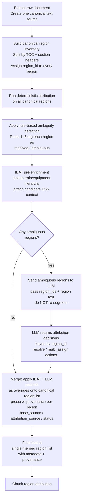

# LLM Preprocessor Design Notes

## Table of Contents

- [Context](#context)
- [Terminology: Section Header vs Boundary](#terminology-section-header-vs-boundary)
- [Recommended Flow](#recommended-flow)
- [Preferred Design](#preferred-design)
  - [1. Create one canonical text source](#1-create-one-canonical-text-source)
  - [2. Build canonical regions once](#2-build-canonical-regions-once)
  - [3. Run deterministic attribution on canonical regions](#3-run-deterministic-attribution-on-canonical-regions)
  - [4. IBAT pre-enrichment after deterministic attribution](#4-ibat-pre-enrichment-after-deterministic-attribution)
  - [5. Only send ambiguous regions to the LLM](#5-only-send-ambiguous-regions-to-the-llm)
  - [6. Have the LLM return decisions against existing region IDs](#6-have-the-llm-return-decisions-against-existing-region-ids)
- [Merge Contract](#merge-contract)
  - [What "preserve provenance per region" means](#what-preserve-provenance-per-region-means)
  - [Precedence Rules](#precedence-rules)
  - [Final Region Example](#final-region-example)
- [Suggested Flow Update](#suggested-flow-update)
- [Practical POC Scope](#practical-poc-scope)
- [Detailed Implementation Delta (Current Codebase)](#detailed-implementation-delta-current-codebase)
  - [Required deterministic changes](#required-deterministic-changes)
  - [Net effect](#net-effect)
- [Bottom Line](#bottom-line)

## Context

The proposed approach is a two-stage preprocessing flow for FSR documents:

1. Stage 1 (fast sort): Quickly inspect the TOC or full text extract and decide whether the document is clearly a simple case that can go through the normal deterministic metadata and chunking pipeline.
2. Stage 2 (smart LLM path): Only send ambiguous documents or ambiguous sections to an LLM-based preprocessor to resolve ESN and equipment attribution.

The main open design question is how to merge the LLM preprocessor output with the deterministic preprocessor output, especially when both paths emit region-level character offsets that overlap.

## Terminology: Section Header vs Boundary

In this proposal, these two terms are related but not identical.

### Section header

A **section header** is a text pattern in the document that signals the start of a logical section.

Typical examples:

- numbered headings (for example `3.2 Combustion Inspection`)
- unnumbered headings (for example `DC Leakage Test`, `Executive Summary`)
- TOC-backed headings that also appear in body text

In implementation terms, a section header is an observed marker with properties such as:

- `header_text`
- `header_start_offset`
- `header_level` (if detectable)
- `header_type` (for example GT, Generator, Summary, Appendix, Auxiliary, Unknown)

### Boundary

A **boundary** is a segmentation decision in the canonical region map. It is created from one or more detected section headers (plus structural rules) and defines where a region starts and ends.

In implementation terms, a boundary is not just a matched string. It is a committed cut in the authoritative region inventory:

- `region_id`
- `start` and `end`
- `opening_header_id` (the header that opened the region)
- optional `parent_region_id` for nested sections

### Relationship between them

- Header detection is evidence.
- Boundary creation is a decision.

So, not every detected header must create a new boundary immediately, and some boundaries may require normalization or stack logic before they are committed.

### Practical rule in this design

1. Deterministic path owns both header detection and boundary creation.
2. LLM path never creates new boundaries; it only resolves attribution for existing canonical regions.
3. If header quality is low (missing line breaks, parser noise), fix deterministic header/boundary logic first before expanding LLM routing.

## Recommended Flow



### Status glossary (plain words)

- `resolved`: We have enough clear evidence from rules and document text to assign ESN/equipment confidently.
- `ambiguous`: Evidence is mixed or incomplete, so deterministic rules are not enough; send this region to the LLM path.

Note: In this updated flow, deterministic output is intentionally limited to `resolved` and `ambiguous`. IBAT pre-enrichment runs after deterministic ambiguity tagging and before LLM routing, so hierarchy context is attached before ambiguous regions are sent to LLM.


Do not let both paths produce independent full document region maps and then try to merge them afterward by raw offsets.

Instead, use a single authoritative region map for the document and let the LLM path return attribution decisions against that shared region map.

In other words:

- deterministic path owns document segmentation
- LLM path owns ambiguity resolution
- final output is a single merged region list with provenance

This avoids the hardest merge problem: two processors disagreeing on region boundaries.

## Preferred Design

### 1. Create one canonical text source

Both Stage 1 and Stage 2 must use the same normalized extracted text. If the LLM path and deterministic path operate on slightly different text, character offsets will drift and merge logic becomes unreliable.

### 2. Build canonical regions once

Before attribution, run one structural splitter over the document and create a shared region inventory.

Why use TOC plus section headers instead of a single full-document region:

- TOC and section headers capture ownership boundaries where ESN/equipment context changes.
- A full-document span loses these transitions and forces attribution to over-inherit from early anchors.
- This is not a separate segmentation system from the current preprocessor. It is an upgrade of the same deterministic regioning responsibility so one canonical inventory is produced once and reused by IBAT and LLM stages.

What current preprocessor does now

1. It already creates section-like boundaries from body headers.

- It detects structured equipment headers and section headers in full text: [pw_sdg_ai_ser_repo/common/fsr_v2/preprocessor.py:22](pw_sdg_ai_ser_repo/common/fsr_v2/preprocessor.py#L22), [pw_sdg_ai_ser_repo/common/fsr_v2/preprocessor.py:226](pw_sdg_ai_ser_repo/common/fsr_v2/preprocessor.py#L226)
- It builds boundary points from those matches: [pw_sdg_ai_ser_repo/common/fsr_v2/preprocessor.py:308](pw_sdg_ai_ser_repo/common/fsr_v2/preprocessor.py#L308), [pw_sdg_ai_ser_repo/common/fsr_v2/preprocessor.py:312](pw_sdg_ai_ser_repo/common/fsr_v2/preprocessor.py#L312)
- It also adds numbered subsection boundaries (Generator/Turbine patterns), with TOC-area filtering: [pw_sdg_ai_ser_repo/common/fsr_v2/preprocessor.py:324](pw_sdg_ai_ser_repo/common/fsr_v2/preprocessor.py#L324), [pw_sdg_ai_ser_repo/common/fsr_v2/preprocessor.py:327](pw_sdg_ai_ser_repo/common/fsr_v2/preprocessor.py#L327)

2. It emits char-offset regions from those boundaries when mixed equipment types are detected.

- Region slicing by boundary start/end: [pw_sdg_ai_ser_repo/common/fsr_v2/preprocessor.py:405](pw_sdg_ai_ser_repo/common/fsr_v2/preprocessor.py#L405), [pw_sdg_ai_ser_repo/common/fsr_v2/preprocessor.py:410](pw_sdg_ai_ser_repo/common/fsr_v2/preprocessor.py#L410), [pw_sdg_ai_ser_repo/common/fsr_v2/preprocessor.py:413](pw_sdg_ai_ser_repo/common/fsr_v2/preprocessor.py#L413)

3. If boundaries are weak or only one dominant type is seen, it falls back to page-level assignment.

- Page-level signal assignment and contiguous merge: [pw_sdg_ai_ser_repo/common/fsr_v2/preprocessor.py:414](pw_sdg_ai_ser_repo/common/fsr_v2/preprocessor.py#L414), [pw_sdg_ai_ser_repo/common/fsr_v2/preprocessor.py:455](pw_sdg_ai_ser_repo/common/fsr_v2/preprocessor.py#L455), [pw_sdg_ai_ser_repo/common/fsr_v2/preprocessor.py:466](pw_sdg_ai_ser_repo/common/fsr_v2/preprocessor.py#L466)

Important gap vs the proposed canonical inventory

- Current regions are start/end plus metadata, no stable region_id key: [pw_sdg_ai_ser_repo/silver/src/etl/fsr_v2/metadata_processor_v2.py:163](pw_sdg_ai_ser_repo/silver/src/etl/fsr_v2/metadata_processor_v2.py#L163)
- TOC logic in Stage 3 is currently for document_summary extraction, not canonical segmentation for attribution: [pw_sdg_ai_ser_repo/silver/src/etl/fsr_v2/metadata_processor_v2.py:6](pw_sdg_ai_ser_repo/silver/src/etl/fsr_v2/metadata_processor_v2.py#L6), [pw_sdg_ai_ser_repo/silver/src/etl/fsr_v2/metadata_processor_v2.py:7](pw_sdg_ai_ser_repo/silver/src/etl/fsr_v2/metadata_processor_v2.py#L7), [pw_sdg_ai_ser_repo/silver/src/etl/fsr_v2/metadata_processor_v2.py:175](pw_sdg_ai_ser_repo/silver/src/etl/fsr_v2/metadata_processor_v2.py#L175)

So why TOC plus section headers in the new box

- Section headers give strong local boundaries where ownership flips.
- TOC gives global section order and helps when body heading quality is noisy or missing.
- Together they reduce wrong inheritance across long spans and make stable region_id assignment possible.
- This is an enhancement of current preprocessor behavior, not a totally different approach.

Example region record:

```json
{
  "region_id": "sec_017",
  "start": 1085,
  "end": 2000,
  "section_header": "DC Leakage Test",
  "region_type": "section"
}
```

These regions become the authoritative boundaries for the rest of the pipeline.

### 3. Run deterministic attribution on canonical regions

The deterministic processor should classify each canonical region with fields such as:

- `status`: resolved, ambiguous
- `candidate_esns`
- `candidate_asset_types`
- `confidence`
- `reason_codes`

### 4. IBAT pre-enrichment after deterministic attribution

Run IBAT lookup after deterministic attribution and before LLM routing so train/equipment hierarchy context is attached to the already-tagged regions.

Typical enrichment fields:

- `candidate_train_esns`
- `candidate_generator_esns`
- `candidate_gt_esns`
- `ibat_lookup_confidence`

This keeps deterministic attribution as a single pass while allowing hierarchy context to be attached before LLM receives ambiguous regions.

### 5. Only send ambiguous regions to the LLM

The LLM path should not re-segment the full document unless absolutely necessary. It should only receive regions that Stage 1 could not confidently resolve.

Examples:

- generator evidence present but generator ESN missing
- TOC says `DC leakage` but does not say `generator`
- appendix or auxiliary report that may belong to a generator subsection inside a GT section
- summary section that should be tagged to both GT and generator

#### Rule-based ambiguity detection

Ambiguous region classification should be rule-based. The deterministic processor emits a `status` field per region; any region that matches one of the rules below gets `status: ambiguous` and is forwarded accordingly.

These rules are grounded in failure cases identified from real FSR documents.

| # | Condition | Detection signal | Why | Output status |
|---|-----------|-----------------|-----|---------------|
| 1 | Multiple ESNs of same equipment type; section boundary detected with no ESN attached to its header | `len(doc_gt_esns) >= 2` or `len(doc_gen_esns) >= 2`, AND section header matched without a co-located ESN pattern | Current logic defaults to the first doc-level ESN of that type; a second same-type section with no inline ESN gets attributed to the wrong ESN from that point forward | `ambiguous` |
| 2 | Generator subsection nested inside a GT section (boundary entry and exit) | Section stack depth > 1 AND inner section type ≠ outer section type | On entry, the generator subsection should link to the GT ESN on the same train. On exit (the boundary exit bug), content after the generator subsection ends must reset to the parent GT, not stay attributed to the generator | `ambiguous` |
| 3 | Generator-specific test vocabulary present in region but no generator ESN matched in that region or its nearest enclosing section | Keyword match (`DC leakage`, `electrification`, `insulation resistance`, `megger`, `rotor winding`) AND `region.candidate_esns` is empty or contains only GT ESNs | These test types are generator-specific. Their presence strongly implies a generator section even if the word "generator" or a generator serial number does not appear | `ambiguous` |
| 4 | Section header is a summary or overview | Header text (normalized) matches: `summary`, `executive summary`, `overview`, `inspection summary`, `report summary` | Customer feedback requests summary sections be tagged to both GT and generator; they should default to `multi_assign` rather than inheriting a single parent ESN | `ambiguous` |
| 5 | Rule 3 vocabulary present in document but zero generator ESNs found anywhere in the body text (document-level signal) | `doc_gen_esns == []` AND at least one region contains Rule 3 vocabulary | Some reports are authored without the generator serial number in the body text. Even with IBAT context, semantic attribution may still be needed for the final assignment | `ambiguous` |
| 6 | Primary ESN is a non-GT equipment type (e.g., steam turbine) AND Rule 3 vocabulary is present | `doc_primary_equip_type not in {GT, Generator}` AND Rule 3 vocabulary present | The generator ESN is absent from the body text; run IBAT lookup before any LLM call so train hierarchy can recover missing ESN context | `ambiguous` |

Rule 6 regions remain `ambiguous` and should carry IBAT evidence fields into LLM routing.

### 6. Have the LLM return decisions against existing region IDs

This step applies only to regions that remain `ambiguous` after deterministic attribution with IBAT-enriched context.

Preferred LLM response shape:

```json
{
  "document_id": "270T483",
  "decisions": [
    {
      "region_id": "sec_017",
      "action": "resolve",
      "primary_esn": "316X914",
      "primary_equip_type": "Generator",
      "confidence": 0.88,
      "evidence": ["DC leakage test", "insulation resistance"]
    },
    {
      "region_id": "sec_003_summary",
      "action": "multi_assign",
      "esns": ["270T483", "290T483"],
      "scope": "shared_summary"
    }
  ]
}
```

This is better than asking the LLM to emit a second freeform list of `{start, end}` regions.

## Merge Contract

The merger should update the authoritative region list using a defined precedence model.

### What "preserve provenance per region" means

For each region, keep a trace of decision lineage from initial deterministic attribution to final merged attribution.

In practice, store at least:

- `base_source`: who produced the initial attribution (`deterministic`)
- `attribution_source`: who produced the final attribution (`deterministic`, `llm_override`, or `ibat_lookup`)
- `status`: routing/final state (`resolved`, `ambiguous`, `resolved_from_ambiguous`)
- `reason_codes` and/or evidence: why the change happened (rule hit, LLM evidence, external lookup)

Why this is required:

- auditability: explain how each region was assigned
- debugging: isolate whether errors came from rules, LLM, or IBAT
- safe tuning: compare behavior across versions without losing decision history

### Precedence Rules

1. Structural boundaries: deterministic path wins.
2. Ambiguous attribution inside a valid region: LLM path wins.
3. High-confidence explicit ESN pattern match: deterministic path wins unless LLM has stronger contradictory evidence.
4. Summary or overview sections: allow multi-assignment instead of forcing a single owner.
5. Appendix, sub-report, or auxiliary sections: default to `ambiguous` until resolved.

### Final Region Example

```json
{
  "region_id": "sec_017",
  "start": 1085,
  "end": 2000,
  "metadata": {
    "primary_esn": "316X914",
    "primary_equip_type": "Generator"
  },
  "base_source": "deterministic",
  "attribution_source": "llm_override",
  "status": "resolved_from_ambiguous"
}
```

This keeps the output in one final schema while still preserving provenance.

## Suggested Flow Update

In the current flowchart, the box for the LLM path should be adjusted.

Current idea:

- LLM preprocessor outputs certain document sections in region format

Recommended replacement:

- LLM preprocessor resolves ambiguous canonical regions
- LLM preprocessor returns attribution patches for ambiguous regions

That small change makes the merge story much cleaner because the deterministic path remains the owner of region creation.

## Practical POC Scope

For the first POC, the goal should be limited and explicit:

1. Persist the initial text extract so both stages use the same input.
2. Build a lightweight canonical region splitter from TOC and/or section headers.
3. Run IBAT pre-enrichment to add train/equipment hierarchy candidate context.
4. Add deterministic rules for obvious generator, GT, summary, appendix, and auxiliary cases.
5. Send only ambiguous regions to the LLM and return decisions keyed by `region_id`.
6. Merge with provenance into the final metadata-plus-regions output.

## Detailed Implementation Delta (Current Codebase)

Current state: only one deterministic path exists.

- Stage 3 entrypoint: `pw_sdg_ai_ser_repo/silver/src/etl/fsr_v2/metadata_processor_v2.py`
- Deterministic attribution core: `pw_sdg_ai_ser_repo/common/fsr_v2/preprocessor.py`

The proposed flow does not require a rewrite. It requires contract and output-shape upgrades in the existing deterministic processor so Stage 2 can be added cleanly later.

### Required deterministic changes

1. Canonical region ownership
  - Keep deterministic as the single owner of region segmentation for the full document.
  - Always emit one authoritative region list used by downstream merge.

2. Stable region IDs
  - Add a deterministic `region_id` per region (for example: ordered section id plus stable text-span key).
  - Keep `start` and `end`, but treat `region_id` as the merge key.

3. Per-region routing status
  - Emit `status` for each region: `resolved` or `ambiguous`.
  - This drives routing: ambiguous -> LLM path (with IBAT evidence attached from pre-enrichment).

4. Ambiguity payload for handoff
  - Emit per-region fields needed for routing and later merge:
    - `candidate_esns`
    - `candidate_asset_types`
    - `confidence`
    - `reason_codes` (rule hits)

5. IBAT evidence tagging
  - For Rule 6 type cases, keep `status=ambiguous` and include reason codes plus IBAT evidence fields.
  - Send these regions to LLM only after IBAT enrichment has been attached.

6. Provenance fields in deterministic output
  - Add `base_source=deterministic` and `attribution_source=deterministic` now.
  - This makes later LLM/IBAT overrides auditable without changing schema again.

7. Stage 3 pass-through contract update
  - Update the Stage 3 output contract to pass the new region fields through unchanged.
  - Include optional counters in metadata (for example: `ambiguous_region_count`, `resolved_region_count`) for monitoring.

8. Canonical text traceability
  - Persist or emit a normalized text fingerprint (for example `text_hash` or `text_version`) so all future paths can prove they used the same source text.

### Net effect

After these deterministic-only updates, adding the second (LLM) path later becomes a patch/override layer on top of the same canonical region list, not a second competing region map.

## Bottom Line

The cleanest approach is not to merge two competing region maps.

Instead:

- create one canonical region inventory
- let deterministic logic classify everything it can
- send only ambiguous regions to the LLM
- have the LLM return decisions against existing region IDs
- apply those decisions as overrides or multi-assignments in the final merged output

That removes most offset-overlap issues at the root, keeps the flow easier to reason about, and makes the POC simpler to validate.