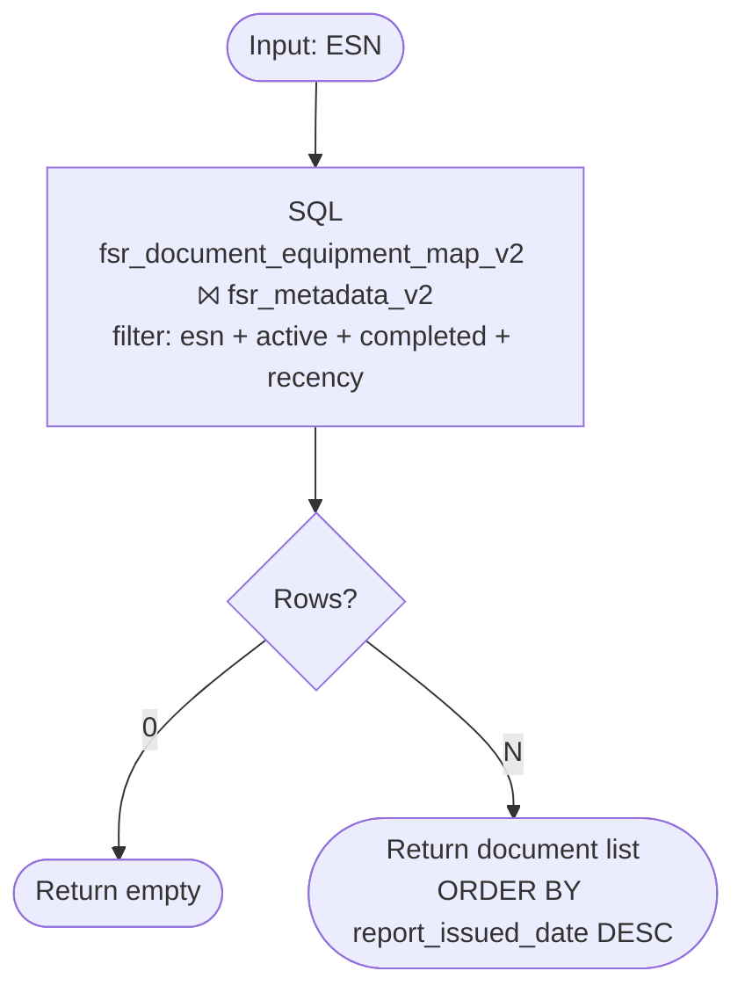
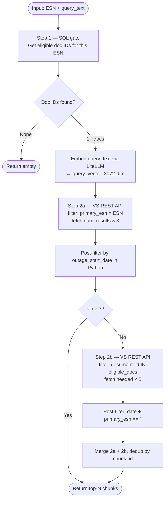

# FSR v2 Retrieval — Implementation Guide

Two API endpoints backed by the same three tables.

| API | Input | Output |
|---|---|---|
| **Data Readiness** `GET /equipment/{esn}` | ESN | All eligible FSR documents for that ESN |
| **FSR Retrieval** `POST /retrieve` | ESN + query text | Ranked relevant chunks |

---

## Tables & Config

| Name | Full path |
|---|---|
| `fsr_metadata_v2` | `vaid.ai_sot_field_service_report.fsr_metadata_v2` |
| `fsr_document_equipment_map_v2` | `vaid.ai_sot_field_service_report.fsr_document_equipment_map_v2` |
| `fsr_chunks_v2` | `vaid.ai_std_con_field_service_report.fsr_chunks_v2` |
| VS index | `vaid.ai_std_con_field_service_report.fsr_vs_index_v2` |
| VS endpoint | `pw-ser-sdg-vector-search` |
| Embedding model | `azure-text-embedding-3-large-1` (3072-dim, self-managed) |
| Recency window | 120 months |

---

## UC1 — Data Readiness API

**Input:** ESN  
**Output:** Document list ordered by recency



**SQL:**

```sql
SELECT
    m.document_id,
    m.pdf_name,
    m.primary_esn,
    m.primary_equip_type,
    d.esn                     AS matched_esn,
    d.equip_type              AS matched_equip_type,
    d.is_primary_esn,
    m.report_issued_date,
    m.outage_start_date,
    m.outage_end_date,
    m.outage_type,
    m.customer,
    m.event_type,
    m.fsr_number,
    m.technology_type
FROM vaid.ai_sot_field_service_report.fsr_document_equipment_map_v2 d
INNER JOIN vaid.ai_sot_field_service_report.fsr_metadata_v2         m ON d.document_id = m.document_id
WHERE UPPER(d.esn)        = UPPER('<requested_esn>')
  AND d.is_active         = true
  AND m.metadata_status   = 'completed'
  AND m.chunk_status      = 'completed'
  AND m.outage_start_date >= DATE_FORMAT(ADD_MONTHS(CURRENT_DATE(), -120), 'yyyy-MM-dd')
ORDER BY m.report_issued_date DESC
```

Filter notes:
- `fsr_document_equipment_map_v2.esn` covers all ESNs in a doc — both primary and secondary are queryable
- `is_active = true` excludes ESNs marked inactive for this outage
- `metadata_status + chunk_status = 'completed'` — fully processed docs only

---

## UC2 — FSR Retrieval API

**Input:** ESN + query text  
**Output:** Ranked chunks (chunk_text + attribution metadata)



> Step 2b picks up chunks that were not attributed to a specific ESN (boundary/intro text)
> but belong to an eligible document for this ESN. Only runs when Step 2a returns fewer than 3 results.

---

### Step 1 — SQL eligibility gate

Returns `candidate_doc_ids` used in Step 2b. If empty, skip VS entirely.

```sql
SELECT DISTINCT d.document_id
FROM vaid.ai_sot_field_service_report.fsr_document_equipment_map_v2 d
INNER JOIN vaid.ai_sot_field_service_report.fsr_metadata_v2         m ON d.document_id = m.document_id
WHERE UPPER(d.esn)        = UPPER('<requested_esn>')
  AND d.is_active         = true
  AND m.chunk_status      = 'completed'
  AND m.outage_start_date >= DATE_FORMAT(ADD_MONTHS(CURRENT_DATE(), -120), 'yyyy-MM-dd')
```

---

### Embed query text

```python
import requests

resp = requests.post(
    "https://dev-gateway.apps.gevernova.net/embeddings",
    headers={
        "Authorization": "Bearer <litellm_api_key>",
        "Content-Type":  "application/json",
    },
    json={"model": "azure-text-embedding-3-large-1", "input": query_text},
    timeout=30,
)
resp.raise_for_status()
query_vector = resp.json()["data"][0]["embedding"]   # 3072-dim list of floats
```

---

### Step 2a — Primary VS search

Filters to chunks directly attributed to the requested ESN.

> The VS REST API does not support nested range filters like `{"outage_start_date": {"gte": "..."}}`.
> Apply the date filter in Python after fetching.
> Also restrict to `candidate_doc_ids` from Step 1 — this enforces the `is_active = true` constraint
> at the chunk level (Step 1 SQL gates eligibility; Step 2a VS query doesn't know about it).

```python
import json

VS_INDEX   = "vaid.ai_std_con_field_service_report.fsr_vs_index_v2"
COLS       = ["chunk_id", "document_id", "pdf_name", "chunk_text",
              "region_primary_esn", "region_primary_equip_type", "outage_start_date", "metadata"]
NUM_RESULTS = 5

host  = spark.conf.get("spark.databricks.workspaceUrl")
token = dbutils.notebook.entry_point.getDbutils().notebook().getContext().apiToken().get()

def vs_query(filters, num_results):
    r = requests.post(
        f"https://{host}/api/2.0/vector-search/indexes/{VS_INDEX}/query",
        headers={"Authorization": f"Bearer {token}", "Content-Type": "application/json"},
        json={
            "dataframe_records": [{"query_vector": query_vector}],
            "columns":           COLS,
            "filters_json":      json.dumps(filters),
            "num_results":       num_results,
        },
        timeout=30,
    )
    r.raise_for_status()
    return r.json().get("result", {}).get("data_array", [])


threshold_date = "2016-07-25"   # today - 120 months, formatted YYYY-MM-DD

candidate_doc_id_set = set(candidate_doc_ids)  # from Step 1

raw = vs_query(
    filters={"region_primary_esn": requested_esn},
    num_results=NUM_RESULTS * 3,            # over-fetch; post-filters will trim
)

# Post-filter: date recency + restrict to is_active docs from Step 1
primary_results = [
    r for r in raw
    if dict(zip(COLS, r)).get("outage_start_date", "") >= threshold_date
    and dict(zip(COLS, r)).get("document_id") in candidate_doc_id_set
][:NUM_RESULTS]
```

---

### Step 2b — Fallback search (run only if `len(primary_results) < 3`)

Picks up chunks from eligible docs where `primary_esn` is empty (unattributed spans).

> VS REST API rejects `{"primary_esn": ""}` (empty string filter).
> Use `document_id IN [...]` instead and post-filter for empty `primary_esn` in Python.

```python
results = list(primary_results)

if len(results) < 3 and candidate_doc_ids:
    needed = NUM_RESULTS - len(results)

    raw_fb = vs_query(
        filters={"document_id": candidate_doc_ids},   # list value → IN semantics
        num_results=min(needed * 5, 50),
    )

    fallback = [
        r for r in raw_fb
        if dict(zip(COLS, r)).get("outage_start_date", "") >= threshold_date
        and dict(zip(COLS, r)).get("primary_esn", "") == ""
    ][:needed]

    # Merge: Step 2a results first, then fallback, dedup by chunk_id
    seen = {dict(zip(COLS, r))["chunk_id"] for r in results}
    for r in fallback:
        cid = dict(zip(COLS, r))["chunk_id"]
        if cid not in seen:
            results.append(r)
            seen.add(cid)
```

---

## Fields to surface to the LLM

Each chunk's `metadata` column is a JSON blob. Extract these for context:

| Field | Description |
|---|---|
| `chunk_text` | The text to pass to the LLM |
| `metadata.doc.customer` | Customer name |
| `metadata.doc.event_type` | Outage event type |
| `metadata.doc.outage_type` | Planned / forced / etc. |
| `metadata.doc.technology_type` | Gas turbine, steam turbine, etc. |
| `metadata.region.primary_esn` | Chunk-level ESN attribution |
| `metadata.region.primary_equip_type` | Equipment type for this chunk |
| `metadata.section.section_title` | Section heading |

---

## Future simplification

Once the P1 preprocessor emits a fallback region for every char span, all chunks will have a non-empty `primary_esn`. At that point, **Step 2b can be removed entirely**. The Step 2a query stays unchanged — no retrieval logic change needed, just a data quality improvement in the pipeline.
