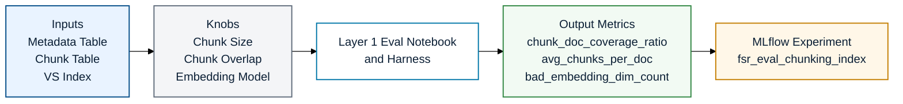
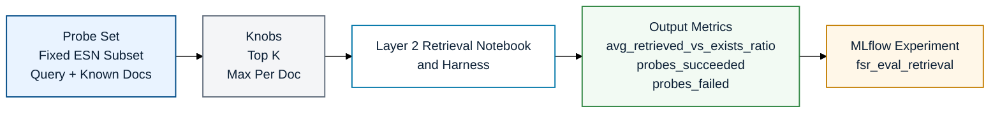
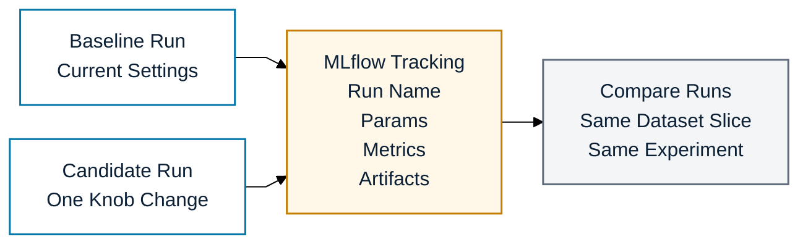

# FSR Eval Blueprint (Slide Friendly)

These diagrams are meant to answer one question quickly: what is this experiment doing?

Arrow note:
- The arrows are only there to help the audience read left to right.
- They do not mean this is a deep runtime flow or end-to-end orchestration diagram.

## Layer 1: Chunking and Index Eval

What this experiment is doing:
- Checks whether chunking and indexing outputs look healthy after a pipeline change.
- Logs a comparable Layer 1 scorecard to MLflow.

Important knobs:
- `chunk_size`: larger chunks can improve context but may reduce retrieval precision.
- `chunk_overlap`: higher overlap can improve recall but increases chunk volume.
- `embedding_model`: changing model or dimension can shift index quality and coverage.

Quick readout:
- Higher `chunk_doc_coverage_ratio` with stable embedding quality means Layer 1 is healthy.

Metric note:
- `chunk_doc_coverage_ratio` = distinct `document_id` values found in the chunk table divided by completed metadata documents.
- Example: if 950 completed metadata docs exist and 900 of them appear in the chunk table, `chunk_doc_coverage_ratio = 900 / 950 = 0.947`.
- This is the clearest Layer 1 health metric because it tells us how much of the completed document set actually made it into chunked output.

## Layer 2: Retrieval Eval

What this experiment is doing:
- Uses a fixed saved probe set instead of the full corpus.
- Measures whether retrieval settings surface the known FSR documents for those ESNs.

Important knobs:
- `top_k`: how many chunks are retrieved before post-filtering.
- `max_per_doc`: cap to avoid one document dominating all retrieved chunks.
- `probe_set_table`: fixed ESN subset for fair baseline vs candidate comparison.

Quick readout:
- Higher `avg_retrieved_vs_exists_ratio` with `probes_failed = 0` is the target outcome.

Metric note:
- `avg_retrieved_vs_exists_ratio` = average share of known FSR documents retrieved for each probe ESN.
- `probes_succeeded` and `probes_failed` show whether the run itself was stable while testing retrieval settings.

Latest Layer 2 result (same probe set):
- Probe table: `vaid.ai_sot_field_service_report.fsr_eval_probe_set_v1`
- Probe size: `45`
- Knob change: `max_per_doc` from `None` to `3` (`top_k=10` unchanged)

| Metric | Baseline (`max_per_doc=None`) | Candidate (`max_per_doc=3`) | Delta |
|---|---:|---:|---:|
| avg_retrieved_vs_exists_ratio | 0.721 | 0.744 | +0.023 |
| avg_retrieved_known_fsr_count | 2.778 | 2.889 | +0.111 |
| probes_failed | 0 | 0 | 0 |
| probes_succeeded | 45 | 45 | 0 |

Interpretation:
- Candidate improved retrieval coverage on the same probe set with no stability regression.
- Current best setting from this comparison: `max_per_doc=3`.

## Operating Model

Operating notes:
- Baseline and candidate must use the same probe set or same Layer 1 tables.
- One run should change one knob set only.
- MLflow is the experiment record and comparison surface.

Automation note:
- This blueprint runs as notebook-based MLflow experiments today; it can be scheduled later as a Databricks job for periodic regression checks.
