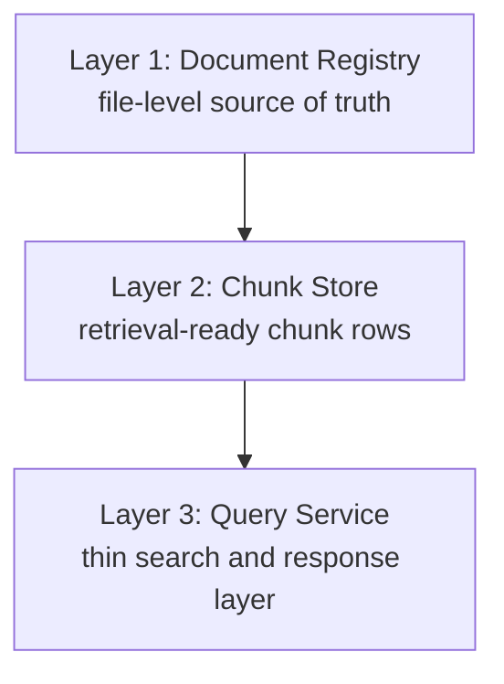

# Recommended Architecture: FSR Data Pipeline & Retrieval Service

## Consulting Perspective

This is written as an architecture recommendation for GE architects, based on the constraints observed so far:

- ~20,000 FSR PDFs
- mixed document types in the same source volumes
- multiple enrichment sources
- incremental processing needs
- a 20+ hour full-run baseline today
- downstream agents that need fast, metadata-rich chunk retrieval

## Core Principle: Three Clean Layers

The fundamental problem today is that the scraping pipeline, chunk pipeline, and retrieval service are disconnected. Metadata is resolved at query time through brittle 3-way joins. The system should instead be organized as three clean layers where each layer fully resolves its responsibilities before handing off to the next.

The key insight is: push resolution upstream, not downstream. Every join you eliminate from the query path removes latency, failure modes, and consistency risk.



## End-to-End Target Flow

```mermaid
flowchart LR
	V[VIUD Volumes<br/>FSR PDFs] --> C0[Classify document type]
	C0 --> M1[Extract first-page metadata]
	M1 --> M2[Normalize via LLM]
	M2 --> M3[Enrich with IBAT and Event Vision]
	M3 --> R1[Document Registry<br/>biz_metadata_field_service_report]
	R1 --> C1[Chunk PDFs for rows with chunk_status = pending]
	C1 --> C2[Materialize metadata onto chunk rows]
	C2 --> D[Chunk Delta table<br/>vec_field_service_report]
	D --> VS[Vector Search sync]
	VS --> Q[query_fsr service]
```



## Layer 1: Document Registry

One row per document. This is the source of truth for all file-level metadata.

### What It Does

1. Scans volumes incrementally using a watermark on `ingestion_timestamp`
2. Classifies document type (`FSR`, `TIL`, `MANUAL`, `ER`, `UNKNOWN`)
3. Extracts first-page metadata fields via `pdfplumber`
4. Normalizes fields via LLM (`gemini-3-flash` or equivalent)
5. Enriches from IBAT (`equipment type`, `equipment code`) and Event Vision (`event type`, `project IDs`)
6. Resolves ESN with a clear precedence chain
7. Writes one canonical row per document

### Table

- Table: `biz_metadata_field_service_report`
- Catalog: `vaid.ai_sot_field_service_report`

### Recommended Schema

| Column | Type | Purpose |
|---|---|---|
| `document_id` | `STRING` | PK, deterministic hash of `volume_path`, stable across re-uploads |
| `pdf_name` | `STRING` | Bare filename or GUID, join key to legacy views |
| `volume_path` | `STRING` | Full volume path, used by Layer 2 to load the file |
| `document_type` | `STRING` | `FSR`, `TIL`, `MANUAL`, `ER`, `UNKNOWN` |
| `title` | `STRING` | Normalized report title |
| `customer` | `STRING` | Customer or site name |
| `esn` | `STRING` | Primary ESN |
| `esn_source` | `STRING` | `SOT`, `LLM`, `REGEX`, `NONE` |
| `equipment_sys_id` | `STRING` | From IBAT |
| `equipment_type` | `STRING` | From IBAT |
| `equipment_code` | `STRING` | From IBAT |
| `event_type` | `STRING` | From Event Vision |
| `ev_project_id` | `STRING` | From Event Vision |
| `ev_equipment_event_id` | `STRING` | From Event Vision |
| `ofs_event_id` | `STRING` | From Event Vision |
| `fsp_project_id` | `STRING` | From extraction |
| `fsr_number` | `STRING` | From extraction |
| `report_issued_date` | `DATE` | Normalized `YYYY-MM-DD` |
| `outage_start_date` | `DATE` | Normalized `YYYY-MM-DD` |
| `outage_end_date` | `DATE` | Normalized `YYYY-MM-DD` |
| `prepared_by` | `STRING` | From extraction |
| `approved_by` | `STRING` | From extraction |
| `page_count` | `INT` | Useful for classification and debugging |
| `chunk_status` | `STRING` | `pending`, `completed`, `failed` |
| `chunk_error` | `STRING` | Error message if chunking failed |
| `metadata_version` | `INT` | Bumped when enrichment logic changes |
| `ingestion_timestamp` | `TIMESTAMP` | Watermark for next scan |

### ESN Precedence

Resolve ESN once, not at query time.

1. `fsr_pdf_ref` SOT
2. LLM extraction
3. Regex extraction
4. `null`

Record which source won in `esn_source`. This removes the current ambiguity where the chunk pipeline, query service, and scraping pipeline each resolve ESN differently.

### Document Type Classification

Add this as Step 0 before metadata extraction.

Two practical options:

1. LLM classification
   Send first-page text plus title to the LLM with a prompt such as: classify this document as one of `FSR`, `TIL`, `MANUAL`, `ER`, `OTHER`. Return only the label.

2. Structural heuristics fallback
   FSRs usually have customer, ESN, and outage dates on page 1. TILs are often shorter and structurally different. Use this as a low-cost fallback.

Store the result in `document_type`. Downstream layers filter on it.

### Incremental Logic

Pranesh's watermark approach is the right design.

```sql
watermark = MAX(ingestion_timestamp)
new_files = files WHERE last_modified > watermark
```

For re-uploaded files with the same filename and newer timestamp, use upsert by `volume_path`. This overwrites the old row, resets `chunk_status = 'pending'`, and lets Layer 2 automatically pick it up.

Avoid append mode because it creates stale duplicates.

`FORCE_RESET` should truncate and reprocess everything only for schema changes or enrichment logic updates.

## Layer 2: Chunk Store

One row per chunk per ESN. Retrieval-ready and self-describing.

### What It Does

1. Reads Layer 1 rows where `chunk_status IN ('pending', 'failed')` and `document_type = 'FSR'`
2. Loads the PDF from `volume_path`
3. Applies recursive hierarchical chunking (V3, 4000 chars, 200 overlap, up to 5 section levels)
4. Resolves ESNs at the document level for multi-ESN fan-out
5. Materializes metadata from Layer 1 onto every chunk row
6. Writes to Delta
7. Syncs to Vector Search
8. Updates Layer 1 to `completed` or `failed`

### Table

- Table: `vec_field_service_report`
- Catalog: `vaid.ai_std_con_field_service_report`

### Recommended Schema

| Column | Type | Purpose |
|---|---|---|
| `chunk_id` | `STRING` | PK, `{document_id}_{chunk_index}` or `{document_id}_{chunk_index}__{esn}` |
| `document_id` | `STRING` | FK to Layer 1 |
| `pdf_name` | `STRING` | Bare GUID, retained for backward compatibility |
| `chunk_text` | `STRING` | Raw chunk text, Vector Search auto-embeds from this |
| `page_start` | `INT` | First page of the chunk |
| `page_end` | `INT` | Last page of the chunk |
| `section_path` | `STRING` | Hierarchical section path |
| `esn` | `STRING` | From Layer 1 or fan-out ESN |
| `equipment_type` | `STRING` | From Layer 1 |
| `event_type` | `STRING` | From Layer 1 |
| `title` | `STRING` | From Layer 1 |
| `customer` | `STRING` | From Layer 1 |
| `report_issued_date` | `DATE` | From Layer 1 |
| `outage_start_date` | `DATE` | From Layer 1 |
| `outage_end_date` | `DATE` | From Layer 1 |
| `ev_project_id` | `STRING` | From Layer 1 |
| `fsr_number` | `STRING` | From Layer 1 |
| `document_type` | `STRING` | Always `FSR` here, still useful for filtering |
| `metadata_version` | `INT` | Copied from Layer 1 |
| `chunk_metadata` | `STRING` | JSON blob for structural and diagnostic detail |
| `created_at` | `TIMESTAMP` | Row creation time |

### Why Top-Level Columns Instead of a JSON Blob

This is the single most impactful change from the current design.

1. Vector Search filters work on columns, not JSON fields
2. Delta statistics and Z-ordering work on columns
3. SQL stays simpler and cheaper

Example:

```sql
SELECT title, esn, event_type
FROM chunks
WHERE esn = ?
```

Instead of:

```sql
SELECT json_extract(metadata, '$.title'), json_extract(metadata, '$.esn')
FROM chunks
WHERE json_extract(metadata, '$.esn') = ?
```

Keep the JSON blob only for fields that do not need filtering or indexing, such as section hierarchy arrays, chunk statistics, and diagnostics.

### Multi-ESN Fan-Out

When a document covers multiple ESNs:

1. Layer 1 stores the primary ESN
2. Layer 2 fans out one chunk row per ESN per chunk
3. `chunk_id` gets the `__{esn}` suffix for multi-ESN rows
4. All fan-out rows share the same `document_id`, `chunk_text`, and metadata except for `esn` and `chunk_id`

This matches the existing DS behavior and is the correct retrieval model.

### Incremental Logic

Layer 2 does not scan volumes. It reads Layer 1.

```sql
SELECT *
FROM biz_metadata_field_service_report
WHERE chunk_status IN ('pending', 'failed')
  AND document_type = 'FSR'
```

No watermark is needed here. The `chunk_status` column is the contract between the two layers.

### Re-Materialization Path

When metadata in Layer 1 changes:

1. Bump `metadata_version` on affected Layer 1 rows
2. Update Layer 2 rows where `Layer2.metadata_version < Layer1.metadata_version`
3. Overwrite only the materialized metadata columns
4. Trigger Vector Search sync

This avoids re-chunking and preserves stable chunk identities.

## Layer 3: Query Service

Thin. No default join-heavy path. Search, rerank, return.

### What It Does

1. Receives `{ esn, query, top_k }` from the data-service
2. Embeds the query via LiteLLM with LRU cache
3. Calls HYBRID Vector Search with `esn` filter
4. Optionally reranks with `DatabricksReranker`
5. Returns chunk rows directly

### What Changes from Today

Current flow:

```text
VS search -> hydrate Delta -> join fsr_pdf_ref -> join fsr_scraped_mapping -> join fsr_psot -> assemble response
```

Recommended flow:

```text
VS search -> return retrieval-ready rows
```

Optional Delta hydration is still acceptable if you need fields not exposed on the Vector Search response, such as full `chunk_metadata`.

Optional enrichment joins should be limited to real-time operational data that should not be materialized into the chunk table.

### Hosting

FastAPI on Databricks Apps is the preferred option.

Example endpoint:

```http
POST /query_fsr
```

The response should include chunk text plus all materialized metadata with no client-side assembly.

## Orchestration

### Databricks Workflow Model

Use a single multi-task Databricks workflow. Airflow triggers it through Jobs API `run-now`.


### Runtime Model

- Compute: Serverless
- Schedule: Manual initially, then weekly batch in production
- Trigger: Airflow plus ad-hoc manual runs when needed

The two core tasks should remain independently re-runnable:

1. Re-run Layer 1 alone to pick up new files
2. Re-run Layer 2 alone to pick up `pending` or `failed` rows

This keeps the system operationally flexible and avoids hard DAG coupling.

## Runtime Estimates

| Step | First Run (~20K files) | Incremental (10-50 files) |
|---|---|---|
| Layer 1: Metadata extraction | ~4-6 hours | Minutes |
| Layer 2: Chunking and write | ~15-20 hours | Minutes |
| Vector Search sync | ~1-2 hours | Minutes |

For the initial backfill, batch Layer 2 in segments of 2,000 to 5,000 documents with checkpointing.

## Extensibility

This architecture is designed so that adding new document types does not require redesign.

### Adding Engineering Reports (ERs)

1. Layer 1 keeps the same document registry and stores `document_type = 'ER'`
2. Layer 2 adds a new chunk table such as `vec_engineering_report`
3. Layer 3 adds `POST /query_er` or a unified `POST /query_documents` with `document_type`
4. Vector Search can use either a separate index per type or a single index with `document_type` as a filterable column

Recommendation: start with separate indexes per document type.

### Adding New Metadata Sources

1. Add the source as a new enrichment step in Layer 1
2. Add the resolved field to the Layer 1 schema
3. Promote it to a top-level Layer 2 column only if retrieval actually needs it
4. Bump `metadata_version` and re-materialize

## What This Design Eliminates

| Current Problem | How It Is Solved |
|---|---|
| 3-way query-time join (`pdf_ref` + `scraped_mapping` + `psot`) | Resolve metadata at ingestion and materialize into chunk rows |
| Disconnected scraping and chunk pipelines | Use Layer 1 to Layer 2 handoff via `chunk_status` |
| Mixed document types in chunk table | Classify document type in Layer 1 and keep type-filtered chunk tables |
| No incremental processing | Use watermark in Layer 1 and status-driven pickup in Layer 2 |
| JSON blob metadata cannot be filtered in Vector Search | Promote high-value fields to top-level columns |
| ESN resolution inconsistency | Use one precedence chain in Layer 1 |
| No re-enrichment path | Use `metadata_version` and targeted re-materialization |
| Full 20-hour reruns for small changes | Keep both layers incremental by default |
| Catalog mismatch | Use a clean flow from `VIUD` source to `VAID` AI-ready tables |

## What I Would Explicitly Not Do

1. Do not build a hard DAG dependency between the two Airflow tasks
2. Do not write embeddings into Delta at ingestion time
3. Do not add `document_summary` in v1
4. Do not unify all document types into one Vector Search index initially
5. Do not remove the canonical metadata table

## Final Recommendation

This is the architecture I would present in the Monday regroup with Pranesh, Abhijit, and Tao.

Pranesh's current design is directionally correct, but the major changes needed are:

1. Promote retrieval-critical metadata to top-level chunk columns
2. Add document type classification in Layer 1
3. Define explicit field precedence rules
4. Add a re-materialization path through `metadata_version`